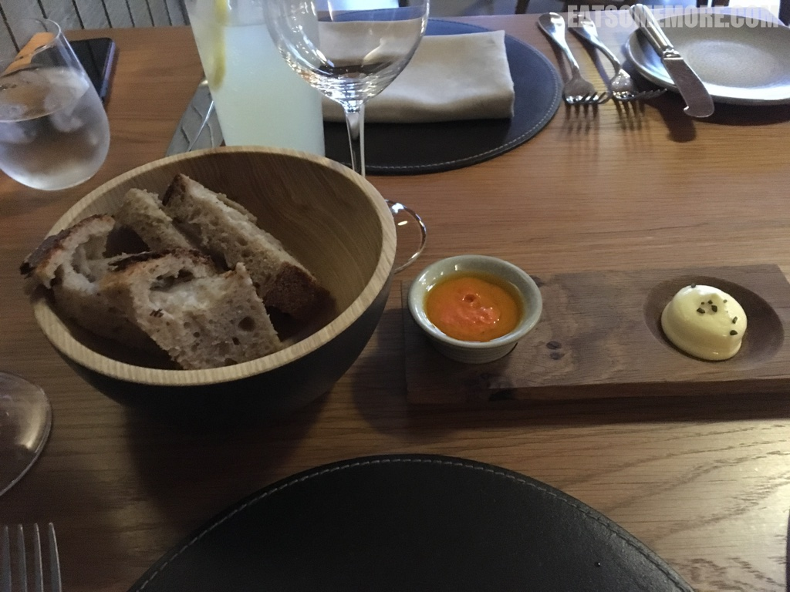
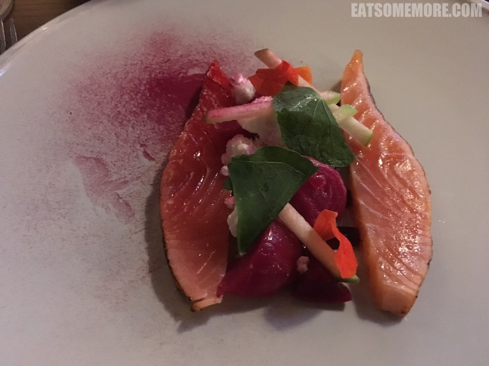
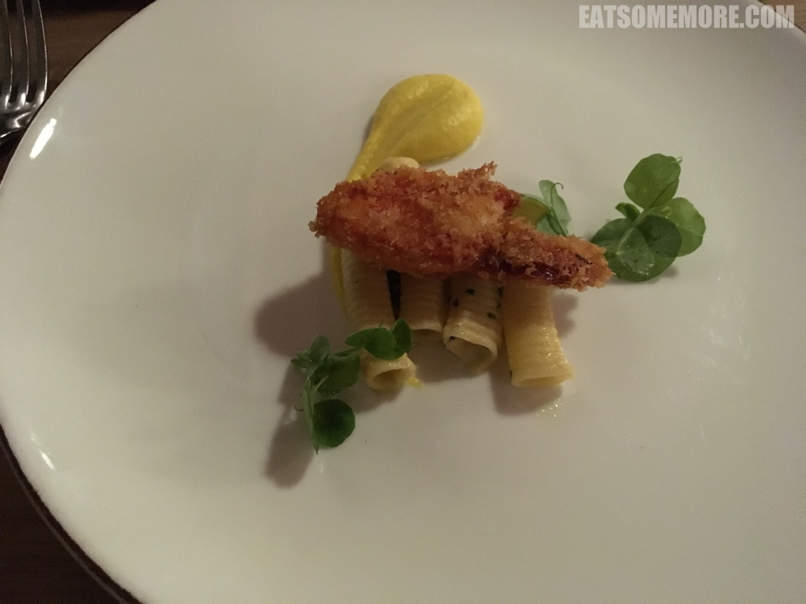
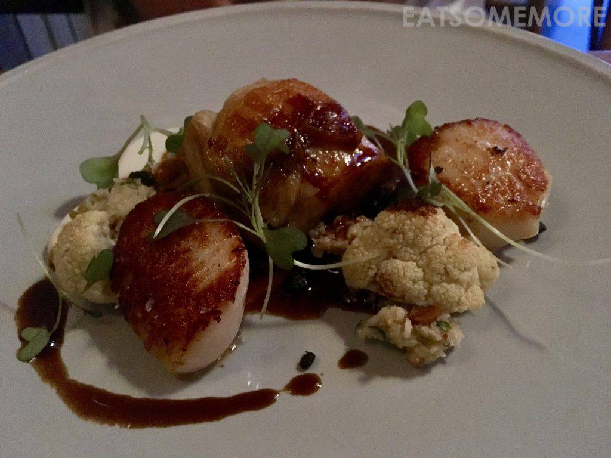
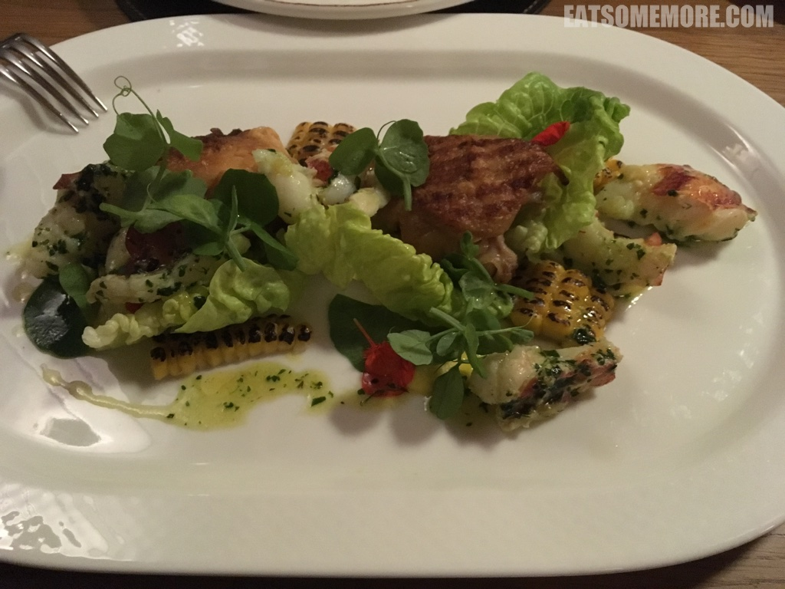

>伯克郡纽伯里附近有间看起来很可爱的米其林一星餐厅。

>将半生熟的三文鱼和红菜头做了有趣的搭配。

>油炸龙虾钳，食材优秀。

>餐馆之众竞相树美味其帜，总有新奇的味道、特别的搭配、奇异的质地，而有一类是赢在了起跑线上，并令人心服口服——食材质优。这项特质对于海鲜来说尤为重要。例如扇贝扒鸡中的这两枚扇贝，体积硕大如牛眼，香脆滑嫩弹鲜甜。再见调味料！

>龙虾鸡肉烤玉米的搭配也很奇妙，可是鸡肉对我来说实在是太老了，有点令人失望。

>溏心鹌鹑蛋、龙虾肉和生菜沙拉上洒着酥炸面包糠和酸甜沙拉酱。

网站：[https://www.thewoodspeen.com/](https://www.thewoodspeen.com/)

地址：Lambourn Road, Woodspeen, Newbury, RG20 8BN

