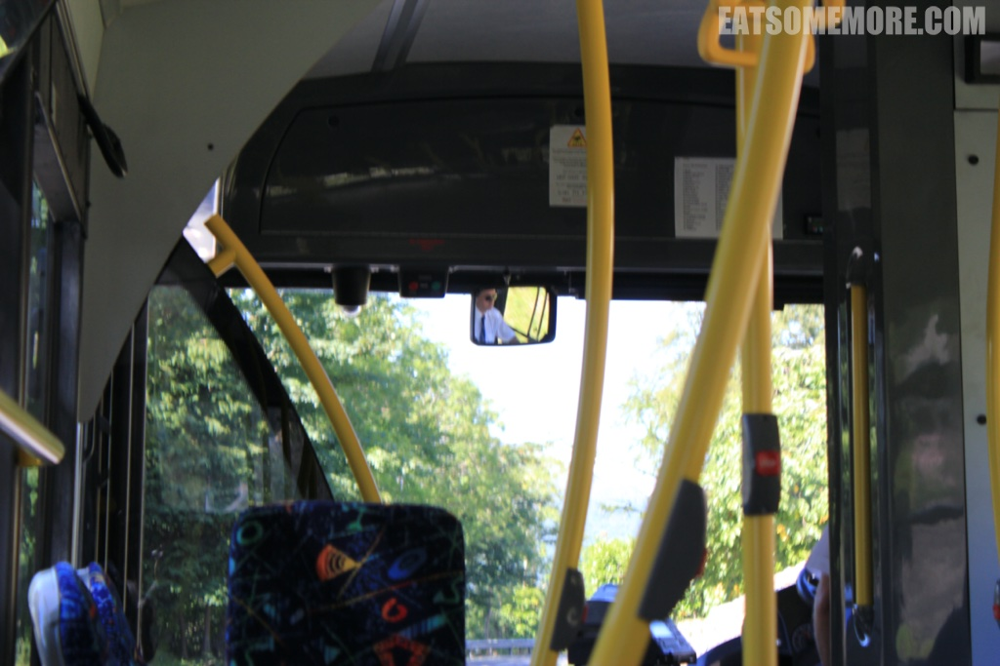
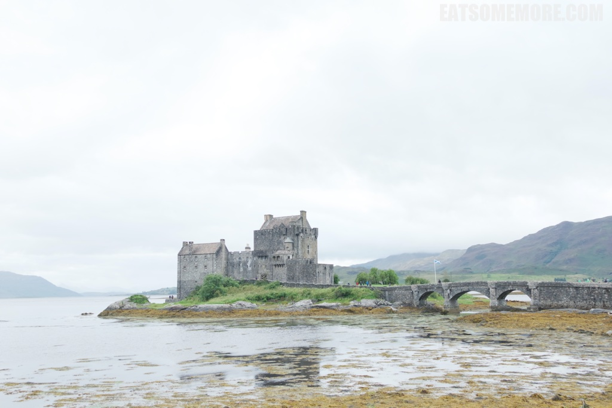
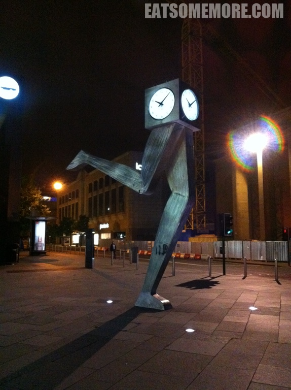

>英伦小岛上我深爱高地。即使是寒冬的冰天雪地也让我迷上，决心要在夏天再去一次。高地是玩什么的呢？高地是个山清水秀天明地净的地方。冬天的时候很多人去高地滑雪，夏天更适合泛舟湖上陶冶性情。如果我没见过高地夜晚的星空，我一定无法想象它的美。

>从格拉斯哥到Blairmore巴士会上渡轮通过一个小海湾。天气好的时候，可以在渡轮的甲板上吹吹风。船上的假猫头鹰，也不知道是不是跟稻田里的稻草人是一个作用的。

>

>下车的这个地方是Kirn，路牌上写着苏格兰美乡村当之无愧。

>阳光洒在湖水上波光粼粼.

>总觉得高地是离天空特别近的地方，云朵也是各具形态。

>与民宿的房主在正对着湖的阳光房一番相谈甚欢。 

>Duncreggan House 绿植若干

>Duncreggan House 陶瓷小台灯和叶文DVD

>接着就去门前坐坐看看湖，散散步。

>第二天清晨就醒了，湖上朝霞无限好呢。

>青草上沾了露珠儿，在阳光下五光十色的闪耀着（技术太差拍不出来）

>一边是姹紫嫣红的花儿，一边是波光粼粼映碧空的湖水。

>。

>。

>。

>。

>。

>。

>到了格拉斯哥，喝了杯有朵花的茶

>还有漂亮的夕阳

>最后到达了格拉斯哥车站的标志 在时间面前我们都特别渺小，总在拼命的追赶。 而旅行，让时间更珍贵。

