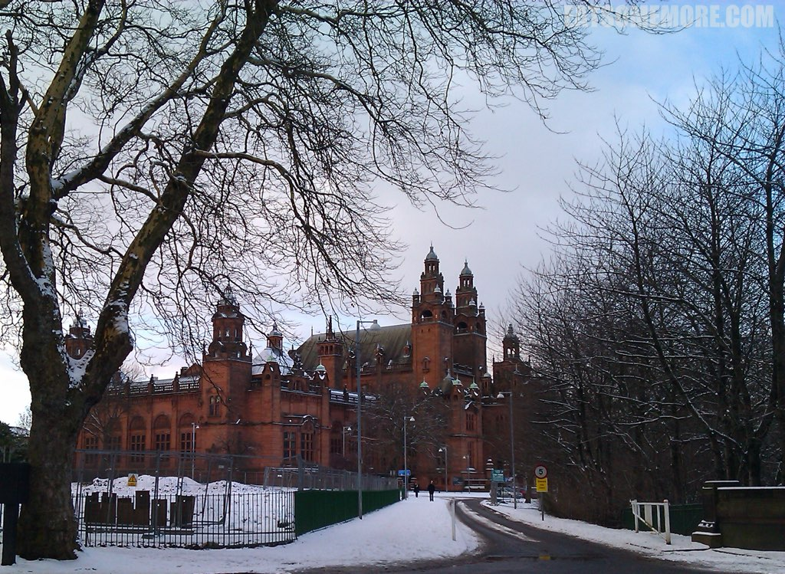
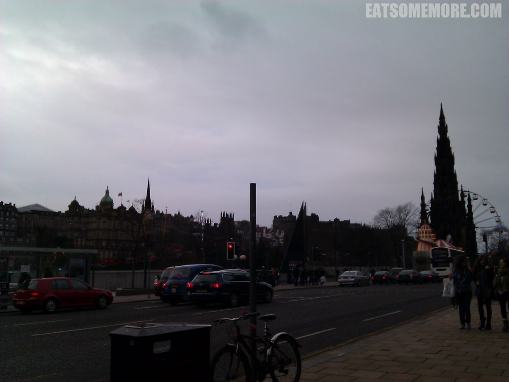
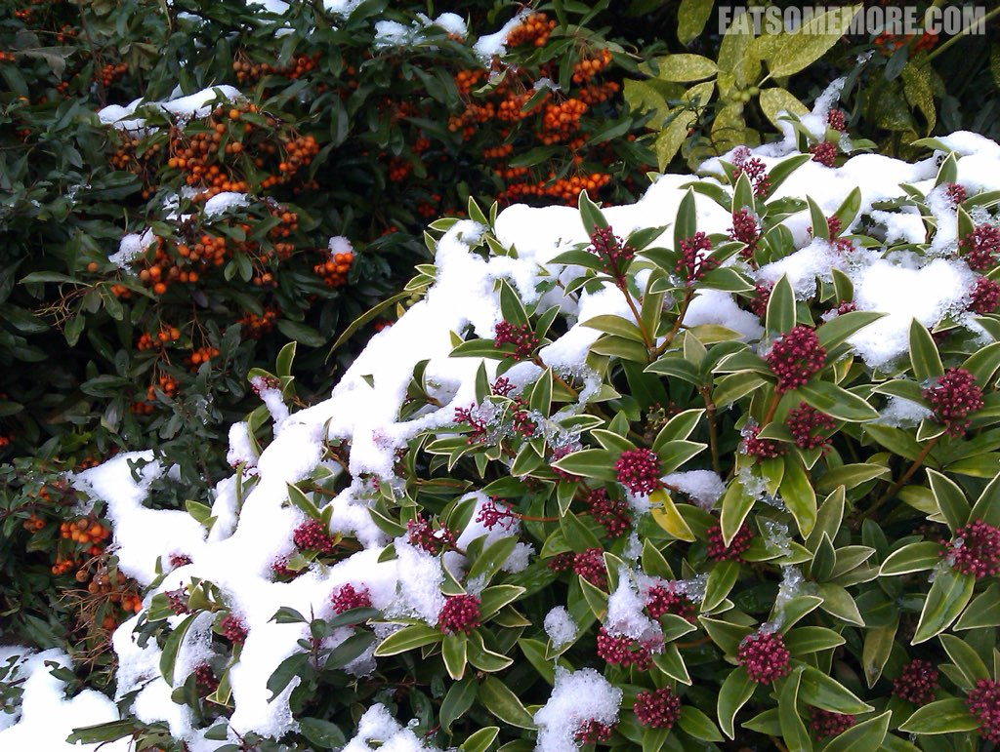
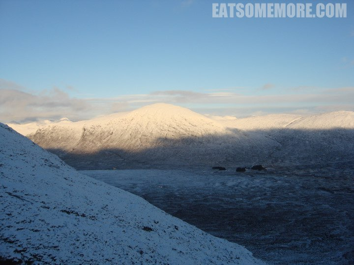
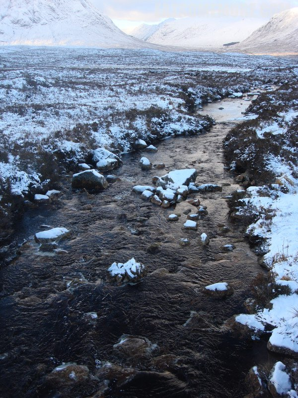
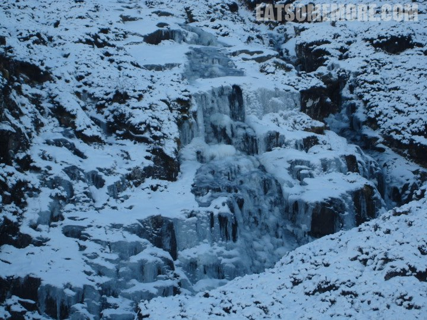
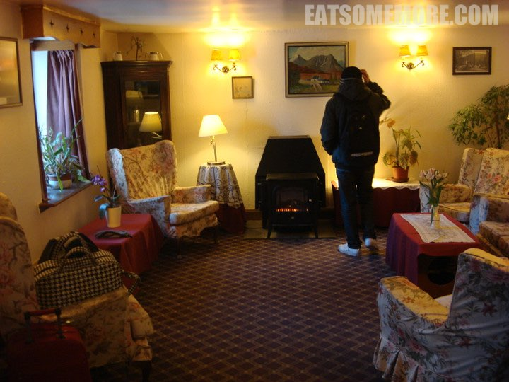
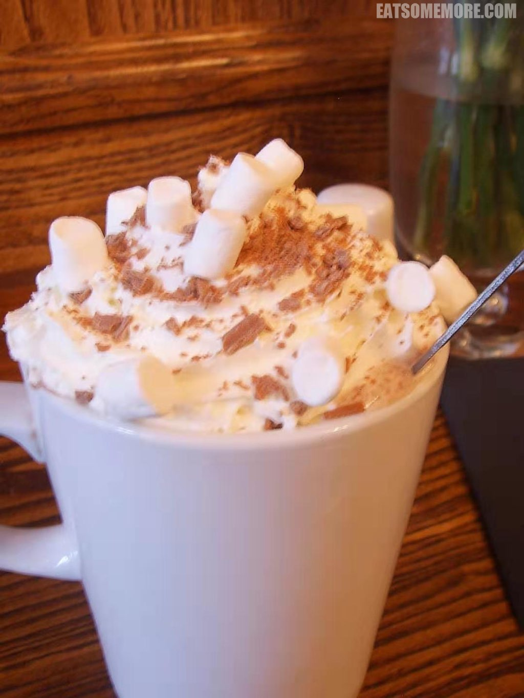
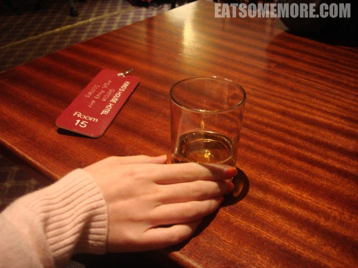
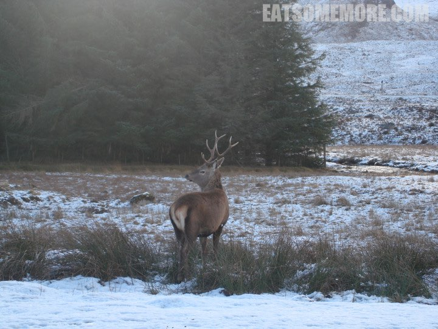

> 大冬天的去了一趟苏格兰，怕冷的我行前表示“鸭梨比西瓜还大”。可是苏格兰真是可爱，冷也可爱，刮风下雪也可爱。

> 苏格兰爱丁堡满眼满街满城都是文艺复兴哥特维多利亚那些棕黄土黄的建筑。游乐场与摩天轮嵌在层层叠叠的古建筑当中显得更加可爱。我们的住处靠着一座山，它有一个拉风的名字叫做“亚瑟王座”。它的山腰上躺着一汪天鹅湖，到了山顶能东望大海。有山有水的地方总让我觉得很幸福！

> 从爱丁堡前往高地时，正是北风吹雁，万里雪飘。

> 在许多英姿飒爽的滑雪身影当中穿梭着几个像模像样的穿着湖蓝色连体滑雪衫的小孩，真是可爱，也显得雪山格外可亲可近。

> 有些融雪仍叮咚流淌

> 有些溪涧已结冰。 

> 我们在高地的房间向南，阳光透过苏格兰典型的大窗户晒进来，照在印着田园花卉图案的被子上，乐坏我了！我们坐在维多利亚风的椅子里，喝着红茶，看着太阳下了山，一弯新月挂上来。那时我们不知道，在我们头顶上的天空爬满了星星，美得不得了！

> 这儿的tea house十分有爱。它跟苏格兰的许多其他地方一样，有古旧的陈设，墙上挂着讲述过往的画作相片，桌上铺了奶白色的蕾丝桌布，上面有几个泛着温柔光泽的茶点架子。操着苏格兰口音的老妪同其他苏格兰人民一样，对我们“如阳光一般温暖”，她的大吉岭都比咖啡店的香浓，让人感觉温馨。然而与冰雪苏格兰最搭的当属棉花糖奶油热可可。哦，我还发现了scones的苏格兰蛋糕版姐妹，victoria sponge，我就是爱cream & jam啊！

> 在冰天雪地的高地，除了暖气毛裤羽绒衣，单一麦芽威士忌Glengoyne是最令人开心的保暖利器。

> 现在想想还真怀念在那荒村野店的两天一夜。那里有灰蓝色的湖水，有苍茫的雪山，有蓝天，有阳光，还有长着角的美丽赤鹿。

