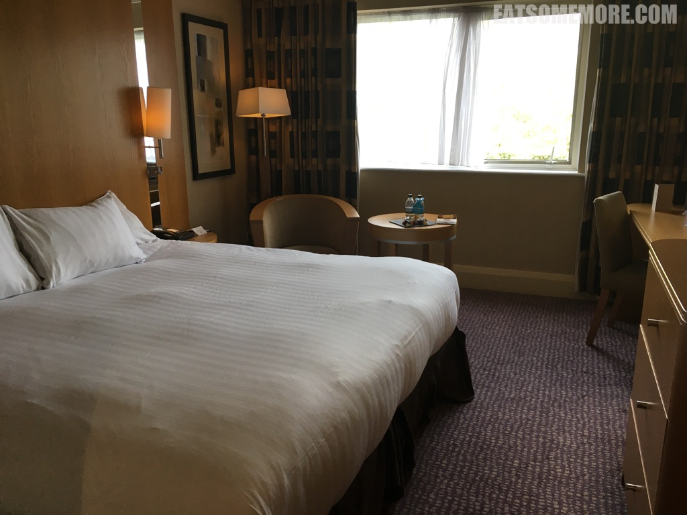
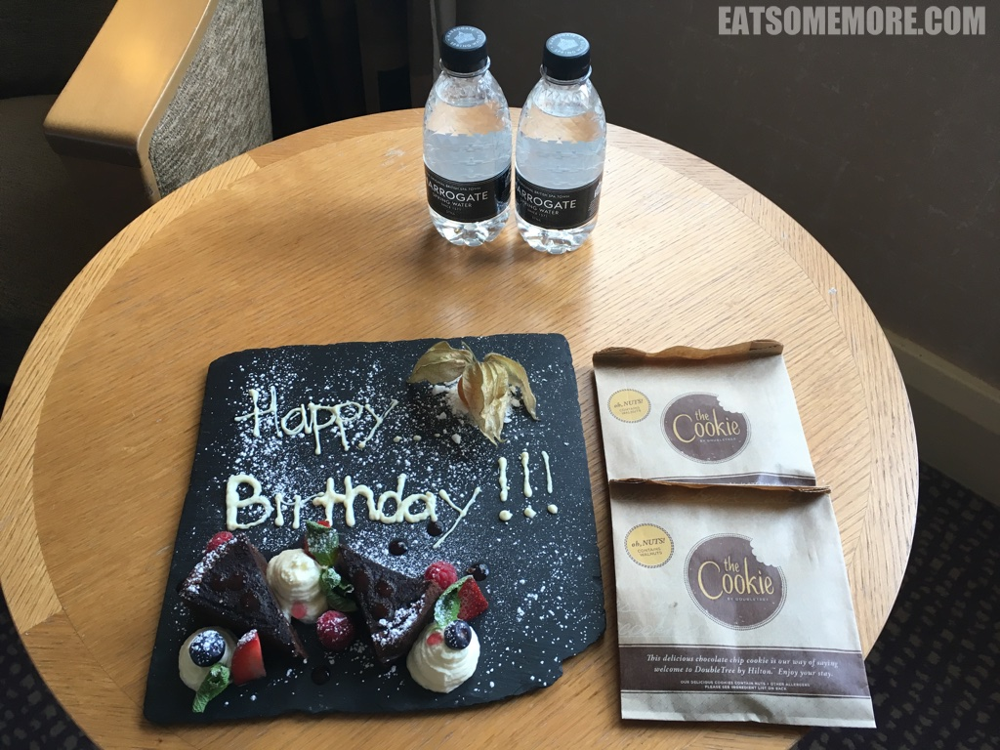
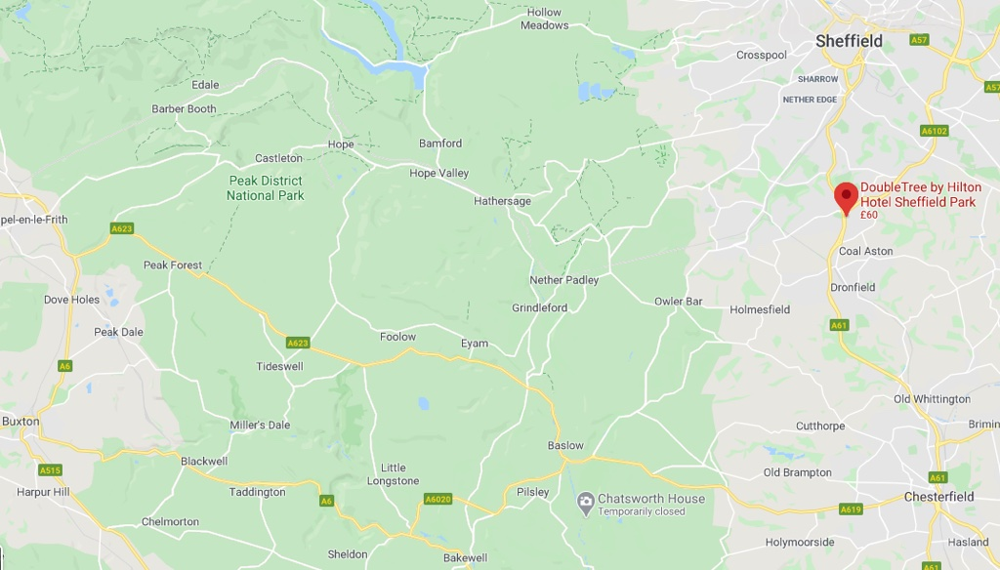

>谢菲尔德公园希尔顿逸林酒店地理位置优越，离峰区国家公园约五英里，去谢菲尔德或者切斯菲尔德也都很方便，然而闹中取静，并且停车免费。酒店设施一应俱全，例如空调、电视机、写字台、小冰箱、保险箱、咖啡和茶套装，床垫软硬适中，窗外绿叶成荫。套房和豪华房型还会提供浴袍、拖鞋和瓶装饮用水。

>除了逸林酒店的招牌现烤巧克力片曲奇，他们还贴心地为住客的生日准备了摆盘十分漂亮的巧克力蛋糕。

>酒店的早餐除了平常的英式早餐，各色水果奶昔更加出彩，可能是因为我的低龄品味吧！

网站：[https://doubletree3.hilton.com/en/hotels/united-kingdom/doubletree-by-hilton-hotel-sheffield-park-SZDCRDI/index.html](https://doubletree3.hilton.com/en/hotels/united-kingdom/doubletree-by-hilton-hotel-sheffield-park-SZDCRDI/index.html)

地址：Chesterfield Road South, Sheffield, S8 8BW

