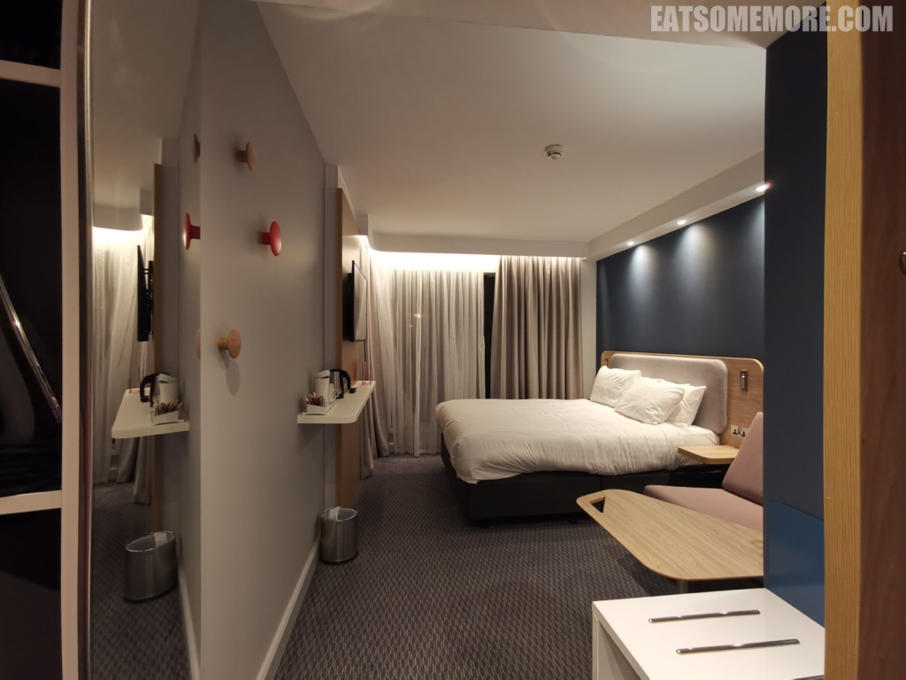
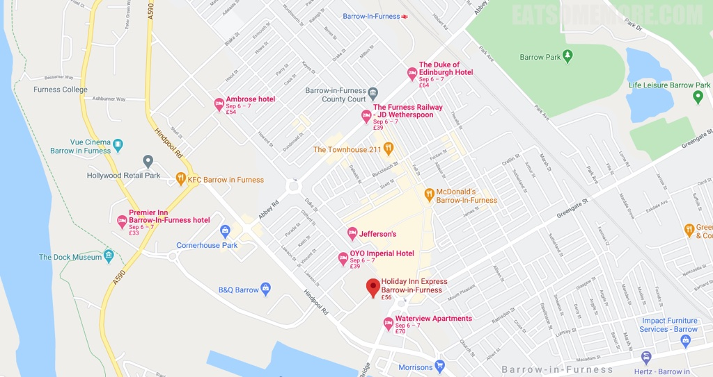

>巴罗因弗内斯智选假日酒店位于坎布里亚郡最西南的半岛上，三分钟车程可以到达英国最大的航空航天企业和最大的导弹制造企业——英国宇航系统，二十分钟内即可到达湖区的知名景点。酒店的停车位非常有限，不过街对面有一个很大的付费停车场。洲际酒店金卡会员入住可以获得欢迎饮料。

>酒店整体都非常的新，电视茶几沙发烧水壶一应俱全。不过一楼的房间临近马路，落地窗的设计意味着这里整天都要拉着窗帘。选择这间酒店作为一个歇脚住处的话，性价比良好，但是放松休闲就谈不上了。

网站：[https://www.ihg.com/holidayinnexpress/hotels/gb/en/barrow-in-furness/bwfuk/hoteldetail](https://www.ihg.com/holidayinnexpress/hotels/gb/en/barrow-in-furness/bwfuk/hoteldetail)

地址：Market Street, Barrow-in-Furness LA14 2LE

