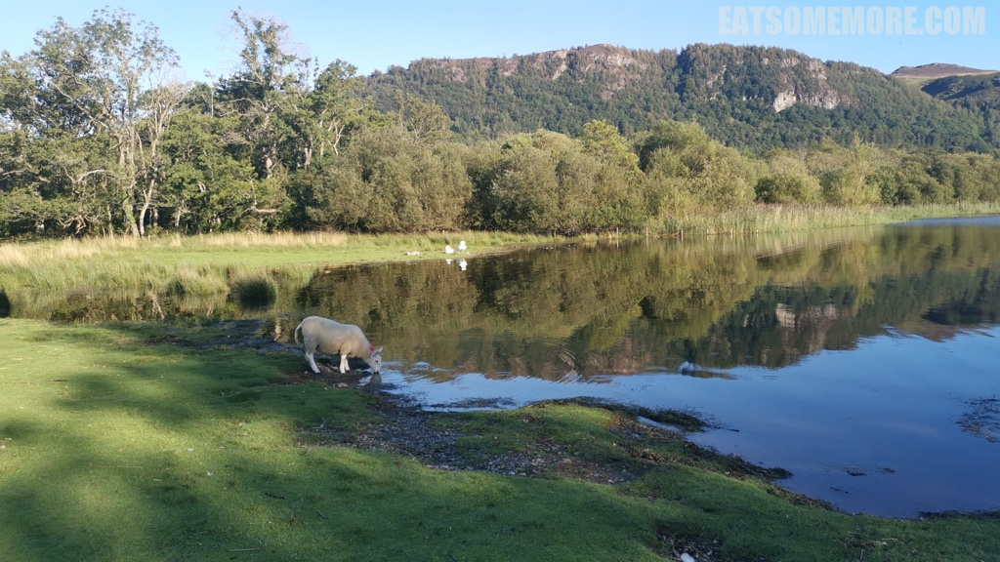
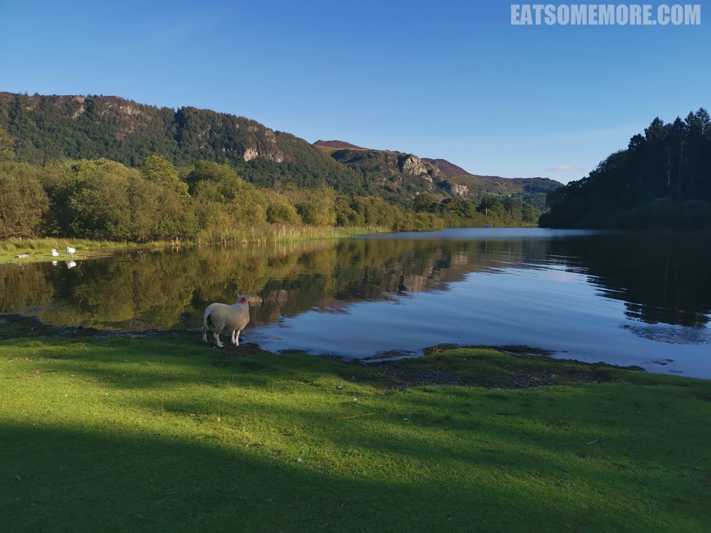
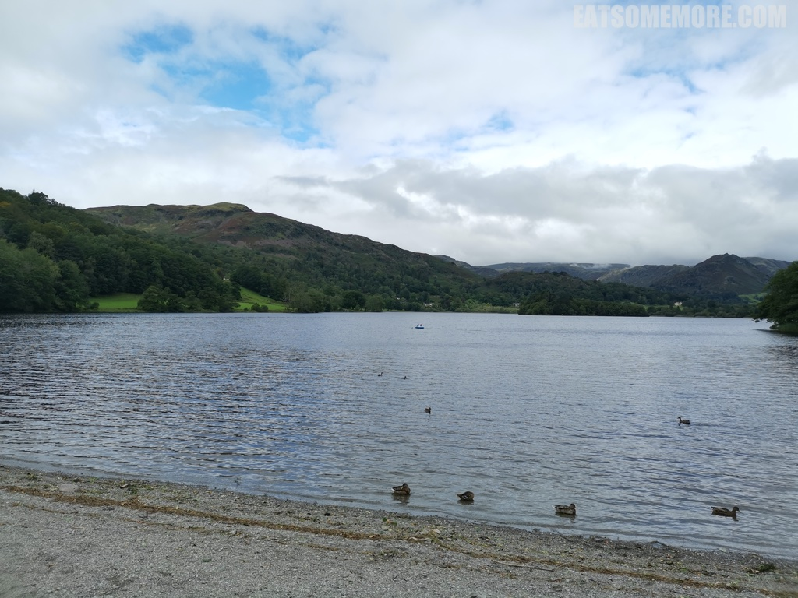
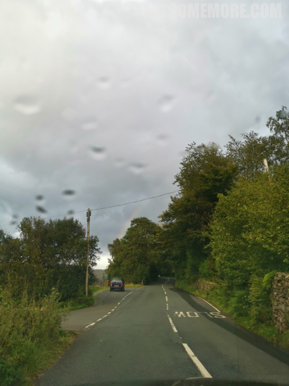
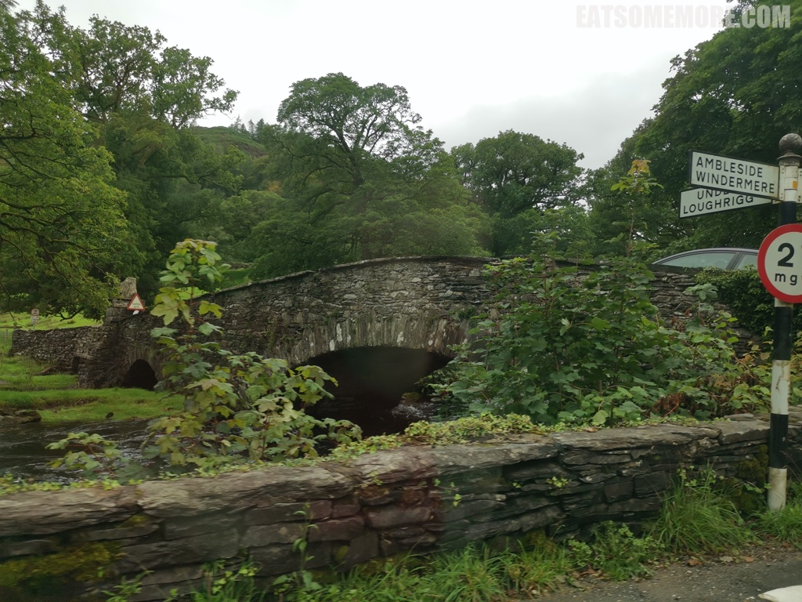
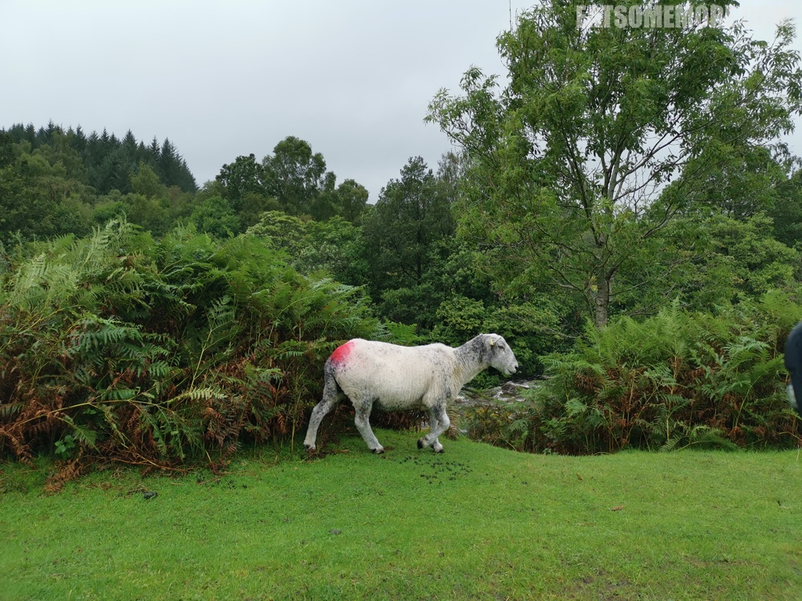
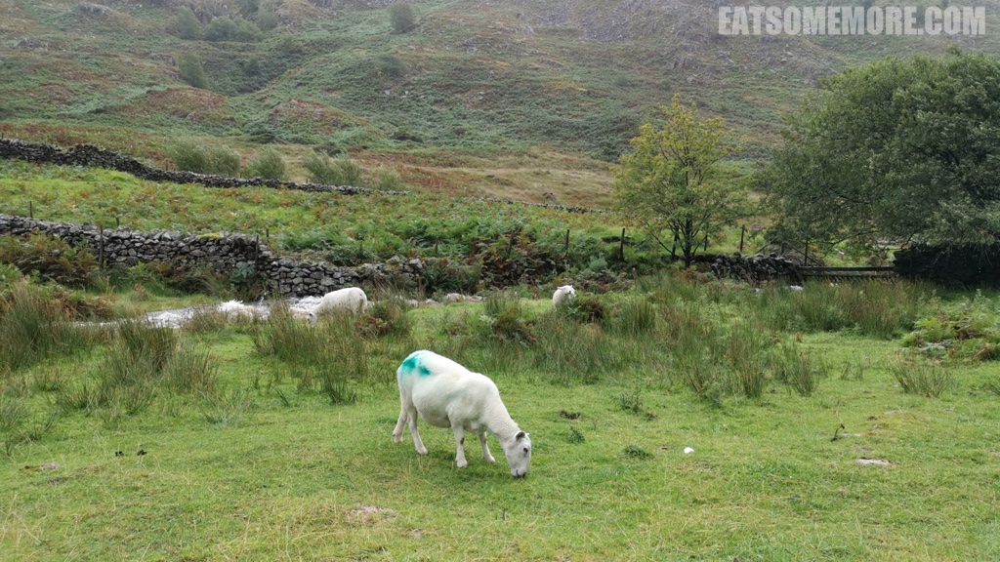
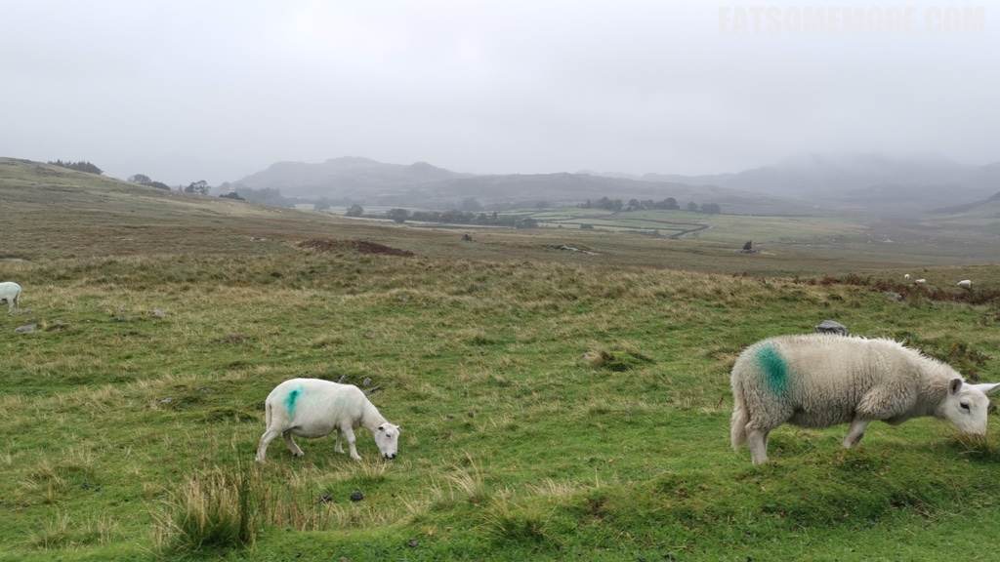

>英格兰西北部坎布里亚郡的乡村地区，多湖泊群山，被称为湖区，不仅是英国十四个国家公园之一，也被列为了世界自然遗产。不仅英格兰最高的山峰坐落于此，英格兰最大的天然湖泊温德米尔湖也在这里。


>湖区成型于一万五千年的冰河时代，加之丰沛的降水，形成了大大小小的湖泊和沼泽，不但滋养着这里的树林田野，而且养育了漫山遍野的牛羊马匹。



>甚至当绵羊凭湖抬头的一刻，竟然莫名有些诗意。



>英国诗人华兹华斯生于湖区，隐于湖区，葬于湖区，他的许多作品围绕乡村生活，表达对大自然的喜爱，被称为“湖畔派”诗人，并在1843年被任命为“桂冠诗人”。他最著名的一句诗是，“我好似一朵孤独的流云”。



>植被无疑很享受这里充足的降水，但是人类可能并不能苟同。然而华兹华斯似乎非常能够欣赏这种阴晴不定、风雨交加的天气。我想，当他说这里涌动的密云简直让埃及的晴空万里和意大利的碧空如洗都显得了无生趣的时候，也许也在某个灰色的天空看见了倏忽即逝的七彩霓虹吧。



>即使没有彩虹，山涧河流上不时出现的古老石桥也很可爱。



>即使没有彩虹也没有石桥，随处可见的羊羔也很欢脱。



>它们在湍急的河边吃草。



>它们在漫山的迷雾中吃草。



>它们也许正像华兹华斯一样地想象：
```
我好似一朵孤独的流云，高高地飘游在山谷之上。
……
我久久凝视却未领悟，这景象所给我的精神至宝。
……
这景象在脑海中闪现，多少次安慰过我的寂寞。
```


[点击就看湖区吃什么](/posts/categories/%E7%BE%8E%E9%A3%9F?pagetype=uk-food&tags=%E8%8B%B1%E5%9B%BD,湖区&extags=)

[点击就看湖区玩什么](/posts/categories/攻略?pagetype=uk-play&tags=英国,湖区&extags=)

[点击就看湖区住哪里](/posts/categories/预定?pagetype=uk-play&tags=英国,湖区&extags=)

[点击就看全部上述内容](/posts?tags=湖区)