人生若只如初见，将会多么可惜。因为往往在初见之时，我们不会知道自己来日对其将会有多少喜欢、感怀和思念。 所以我想将所有初见，变成久别重逢，希望像王家卫导演在一代宗师里面说的，世间所有的相遇，都是久别重逢。我和伦敦的相遇，在二十二岁。九月尾的伦敦，天早早就黑了。我和我的两个行李箱在希思罗着陆，乘着预订的出租车到达了罗素广场附近的学校宿舍街口。我仍记得我的两个箱子在石子路上踟蹰着挪不开步子。从下车的地方到宿舍门口只有大约十米，我可能走了大概有十分钟，这期间我决定了一完成学业就要回国！回家去！第二天去学校报到的路上，随着一阵萧瑟的秋风扑来，我面前的一棵大树应声抖落下仿佛无尽的黄叶。就这样秋去冬来，春深夏浅，我考完了所有的试，回到了国内，却发现原来我在不知不觉间，对伦敦已有了许许多多密密麻麻的眷恋和难舍难离。多年后想来，人生若只如初见，将会多么可惜。
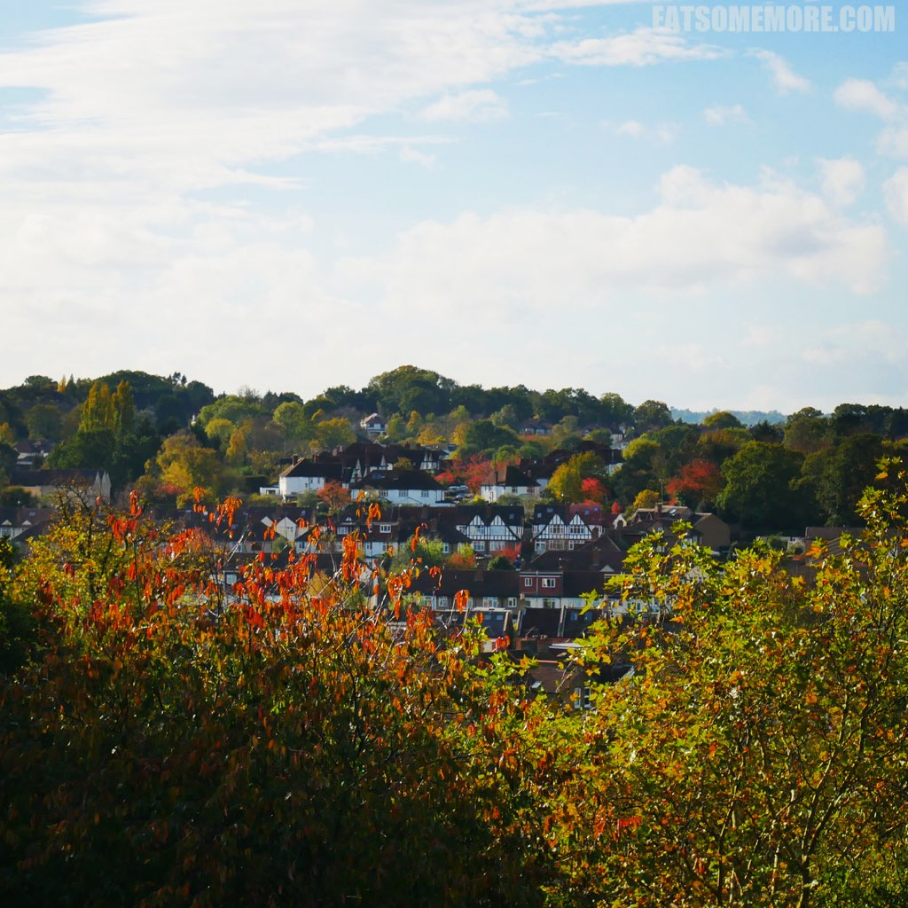

伦敦很旧，街旧、楼旧、交通旧，但旧不代表不好用。
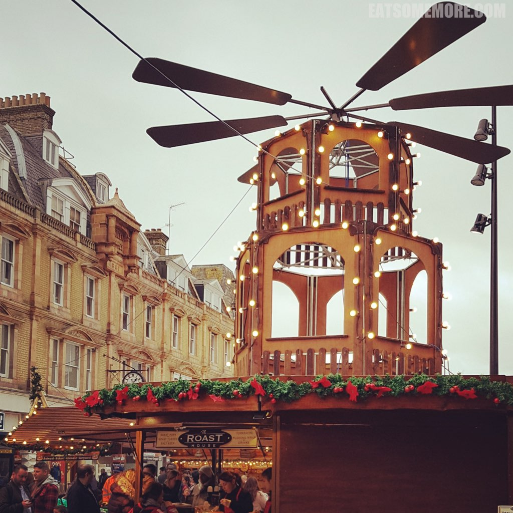

伦敦很忙，地铁拥挤、行人匆匆，但人与人之间不缺礼貌客气和助人为乐。
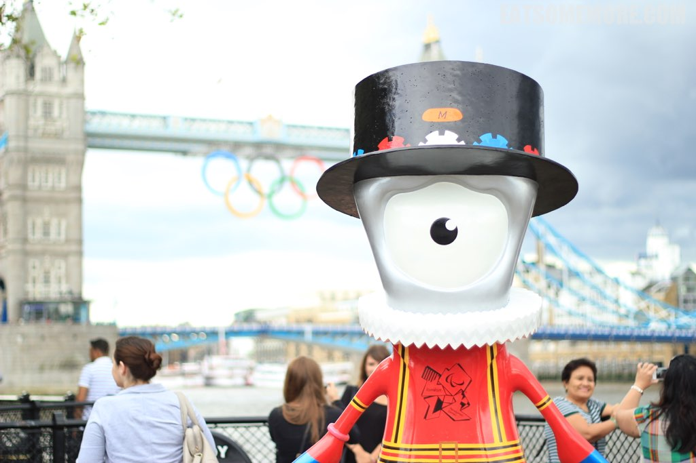

伦敦很高级，这里聚集着皇室、贵族、有钱人和各种各样的专业人士，而这里也不乏跳蚤市场、街边小吃和藏品丰厚却免费进场的博物馆、美术馆。
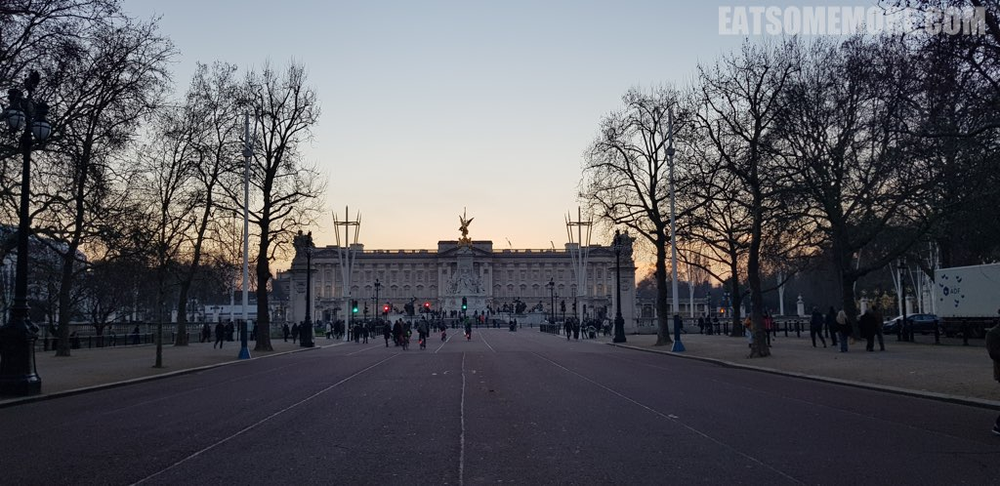

伦敦很摩登，而在市中心一区车流滚滚的大马路的v另一边，就是静谧悠闲的大公园。
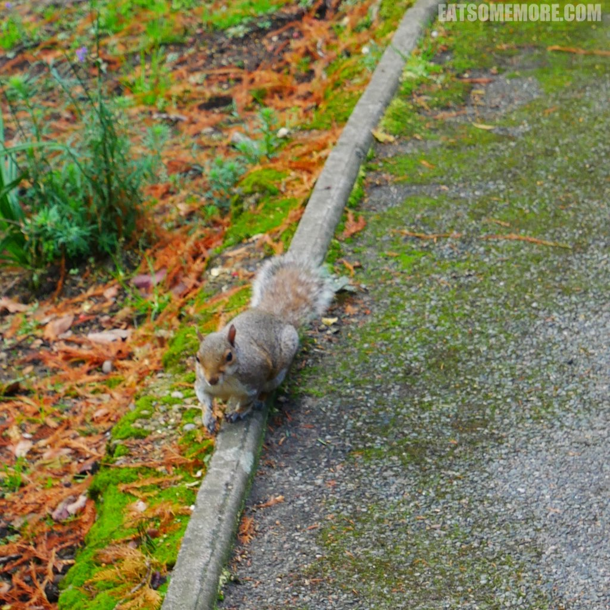

伦敦有形形色色的人、宗教、职业、爱好，走在街上有时觉得光怪陆离，却也了解了何谓有容乃大。
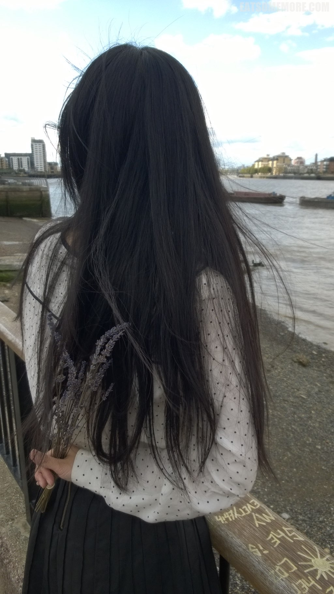

伦敦是一个包罗万象的大都市、一个五光十色的城、一个大家说厌倦了它就是厌倦全世界的所在。 
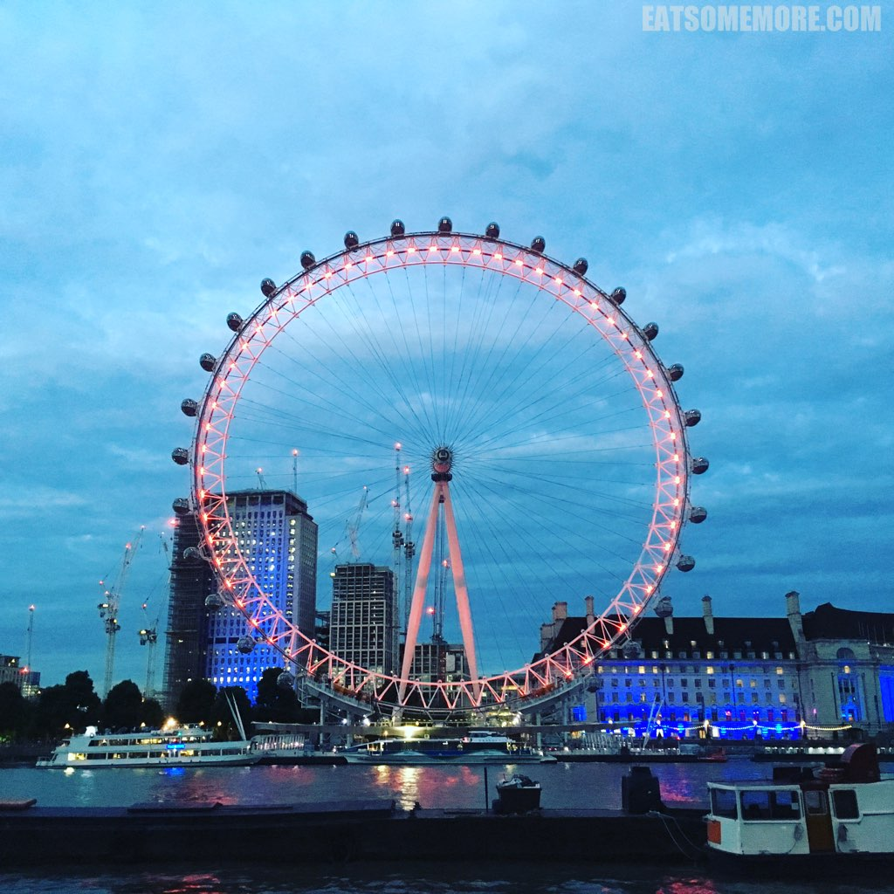

如何去总览伦敦的美？你有一个选择，不用排队也可以俯瞰伦敦景色，还可以悠然从容地喝一杯、吃一顿，只需要轻轻松松预约一家餐厅。推荐伦敦市中心两个有餐厅的高楼：Shard和Heron Tower。 
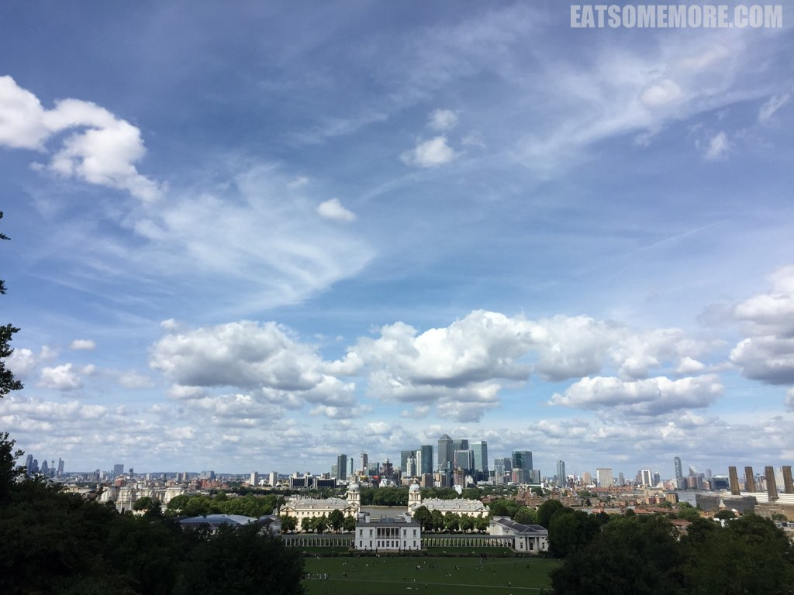

如何去体会大英文化？你有一个选择既可以参观西方文化古物，同时可以在异国他乡进行爱国主义教育。其中，自然历史博物馆。见到在门口排队的长龙，就能体会英国人民对这个博物馆的喜爱；维多利亚女王及阿尔伯特亲王博物馆。第一次去就被大堂当中的水晶吊灯美呆了。在里面逛一天也不会无聊。
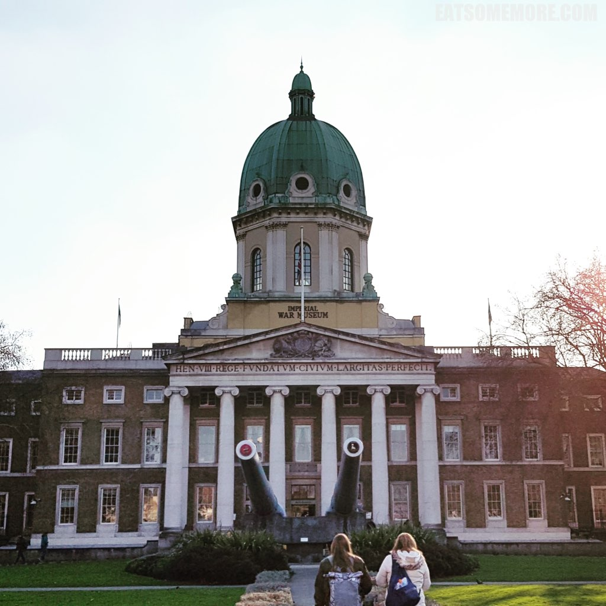

如何享受伦敦独有的购物体验？你有一个选择在买买买的同时，可以走走看看、可以了解 英国故事、也可以惬意悠闲地体会一下英国下午茶时光。夜晚远远就能看见整个房子在发光的就是传说中的哈罗德百货。在这个百货公司里面设有戴安娜和她的男朋友的纪念碑。哈罗德百货的乔治餐厅Geogian Restaurant的下午茶也是鼎鼎大名的。我看过许多介绍下午茶的文章和节目，可不可以容我严肃地跟大家说一说，英式下午茶，没有错是三层的，但是顺序是由下至上：三明治、司空饼、各式甜点。
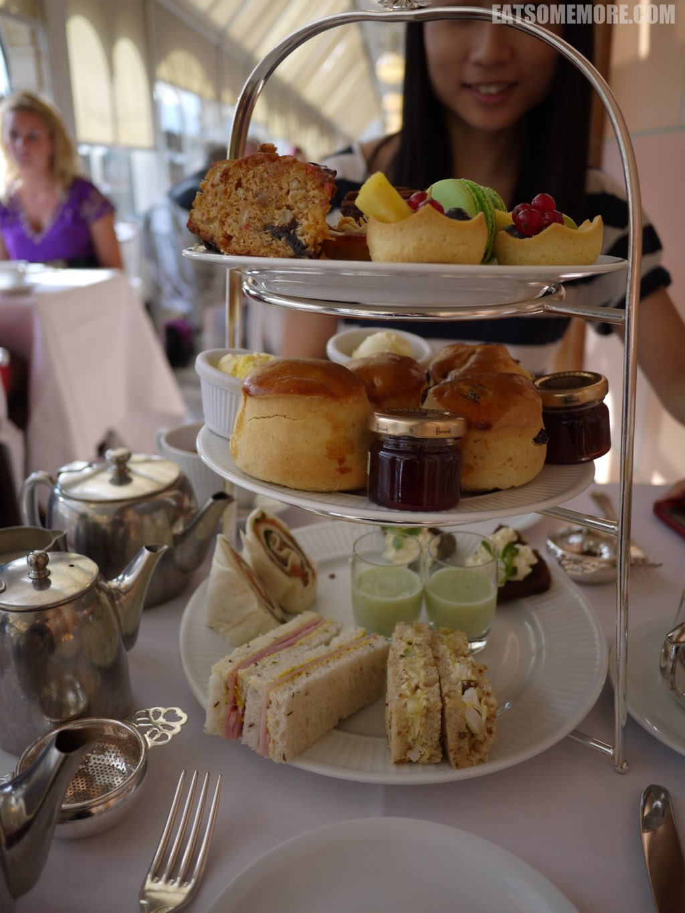

伦敦最可爱的地方是，在拥有以上这些光鲜得不要不要的地方的同时，这个城市里还有三个环境优美的大公园，即Hyde Park，Regent's Park和Green Park。
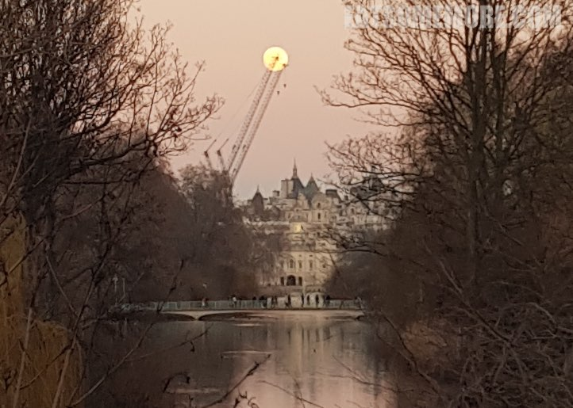

伦敦就是，离开了会想念。屡试不爽。 
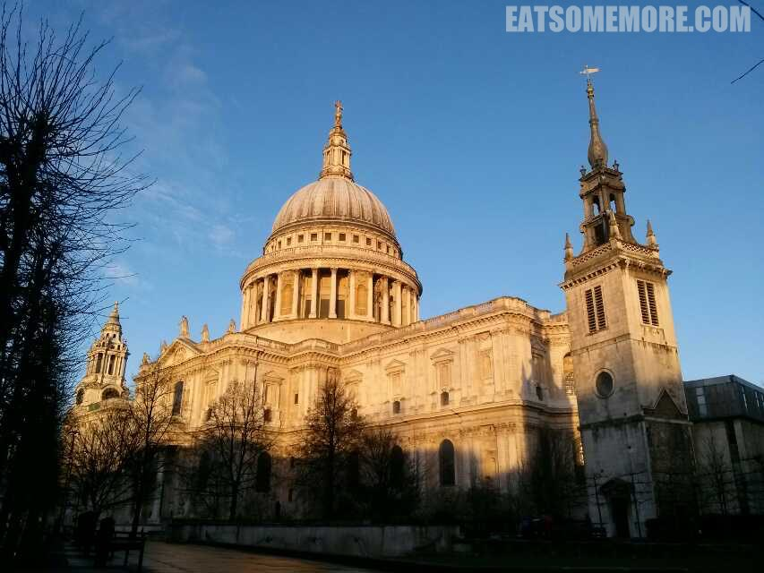

点击就看伦敦吃什么

点击就看伦敦玩什么

点击就看全部上述内容