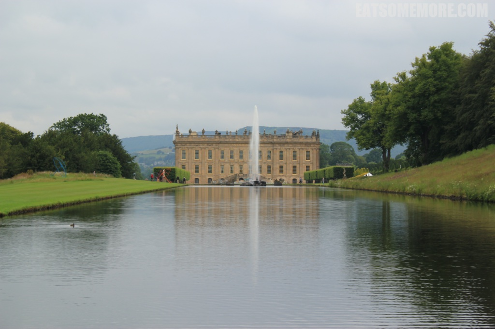
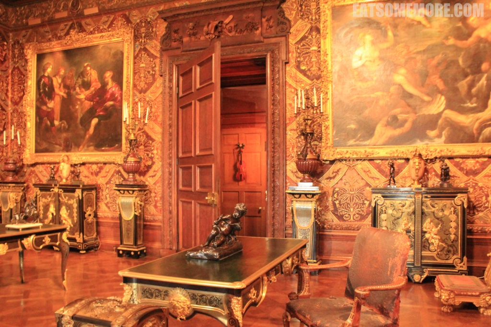

>自十六世纪中叶以来，位于德文特河东岸和连绵植被当中的查茨沃斯庄园，一直被用作德比郡公爵的庄园。

>查茨沃斯庄园是英国最受欢迎的庄园之一，也是2005年版傲慢与偏见里面达西庄园的取景地。

>庄园内珍贵的家具和绘画可以追溯到十七世纪左右。

>由名家大将打造的图书馆，奢华得很有深度。

>走道上的吊灯由四个鹿头组成。

>即使是在不起眼的角落，也有美得不真实的画作。

>新古典主义的雕塑灵动飘逸，栩栩如生。

网站：[https://www.chatsworth.org/](https://www.chatsworth.org/)

地址：Chatsworth, Bakewell, Derbyshire DE45 1PP

