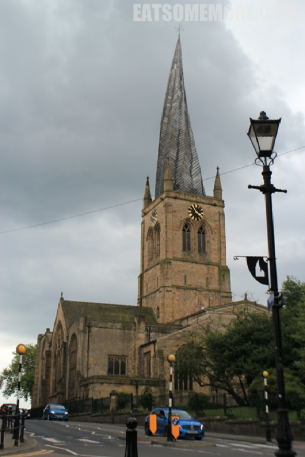
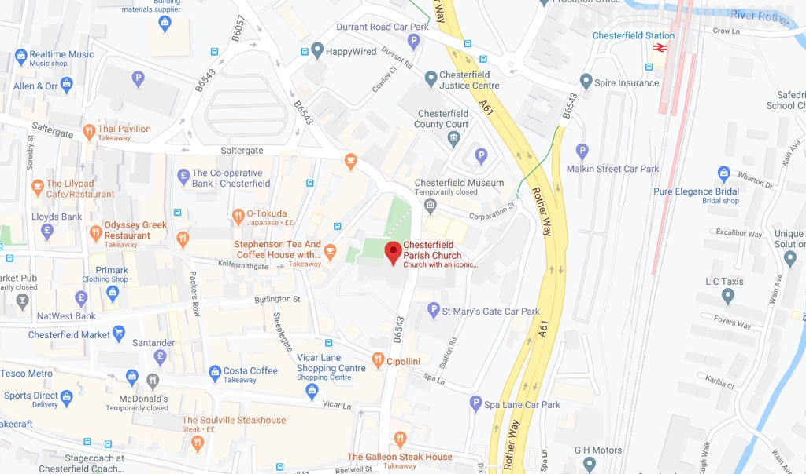

>切斯菲尔德切斯特菲尔德教区教堂是英国圣公会教堂，位于英格兰德比郡的切斯特菲尔德镇，致力于圣玛丽和诸圣日。该教堂主要建于14世纪，是一级保护建筑，以其扭曲而倾斜的尖顶而闻名，这种建筑现象使教堂被冠以“弯曲尖塔”的俗称。它是德比郡最大的教堂，位于德比教区之内，是切斯特菲尔德大主教区的一部分。

网站：[https://crookedspire.org/](https://crookedspire.org/)

地址：Church Way, Chesterfield S40 1XJ

