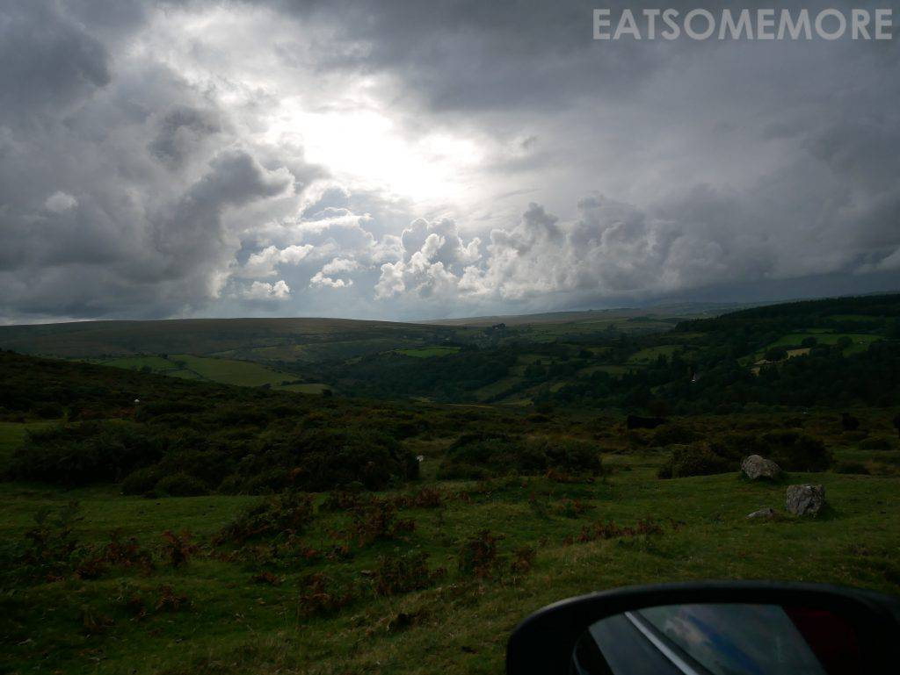
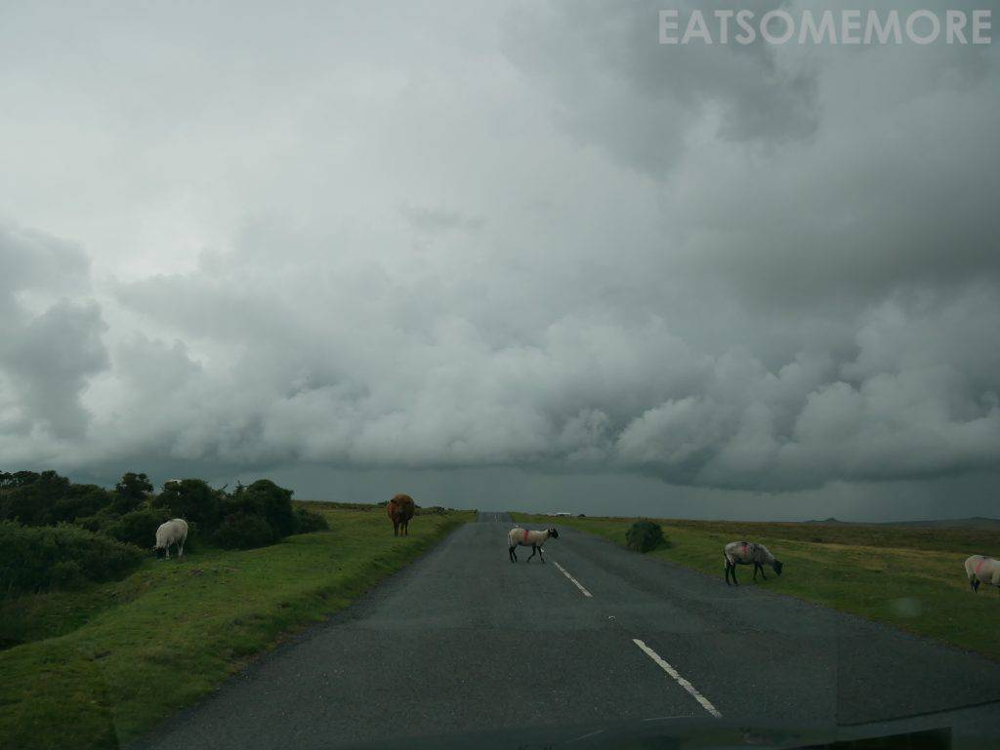
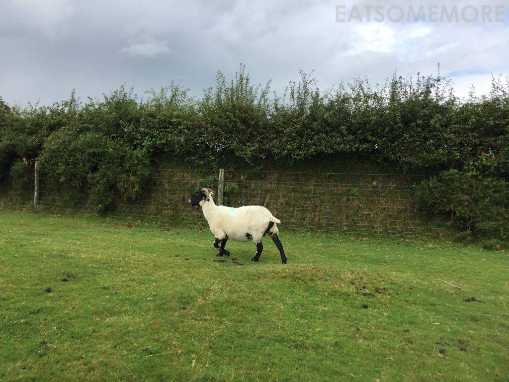
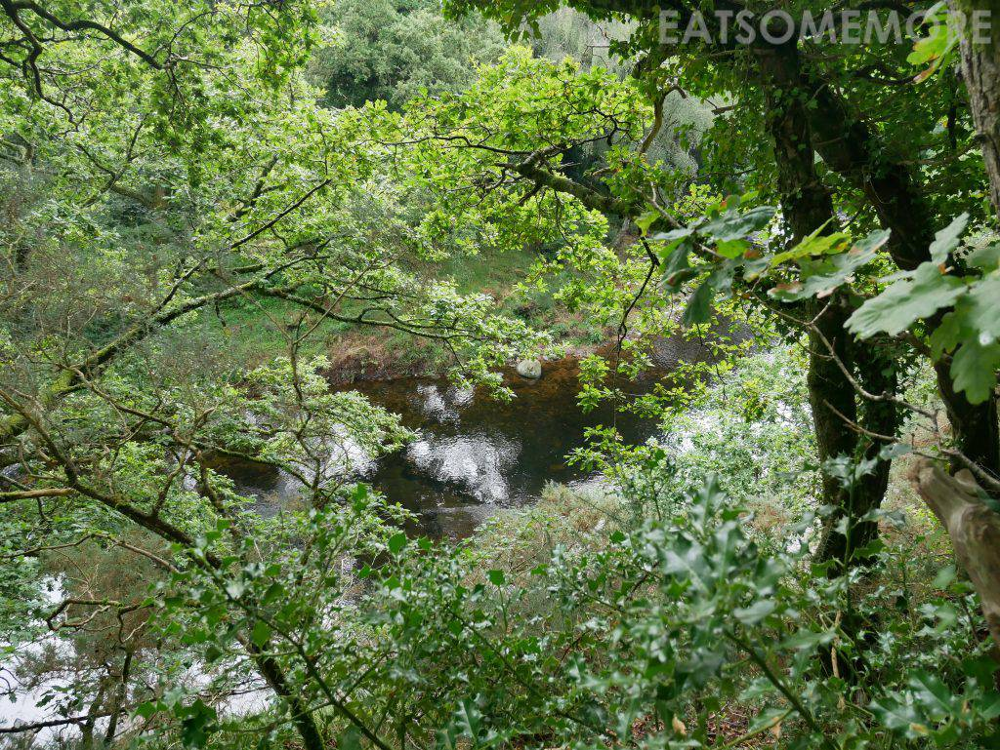
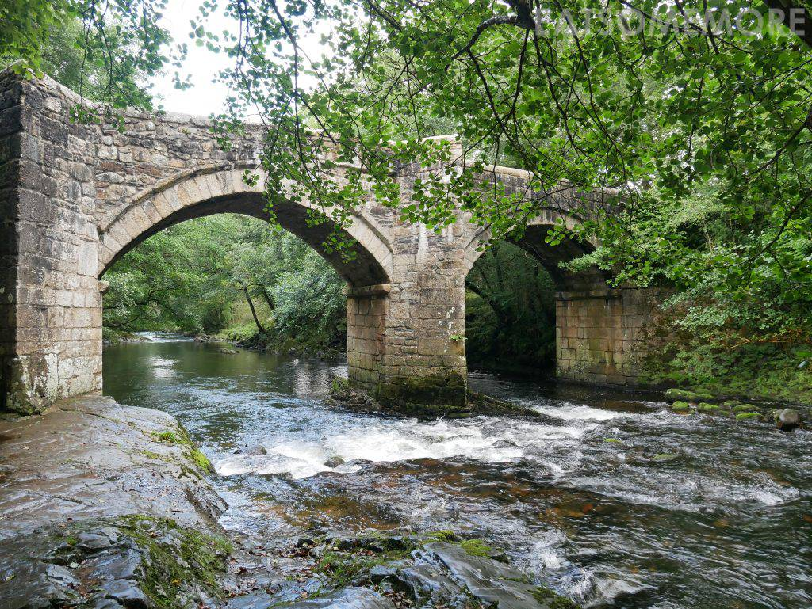
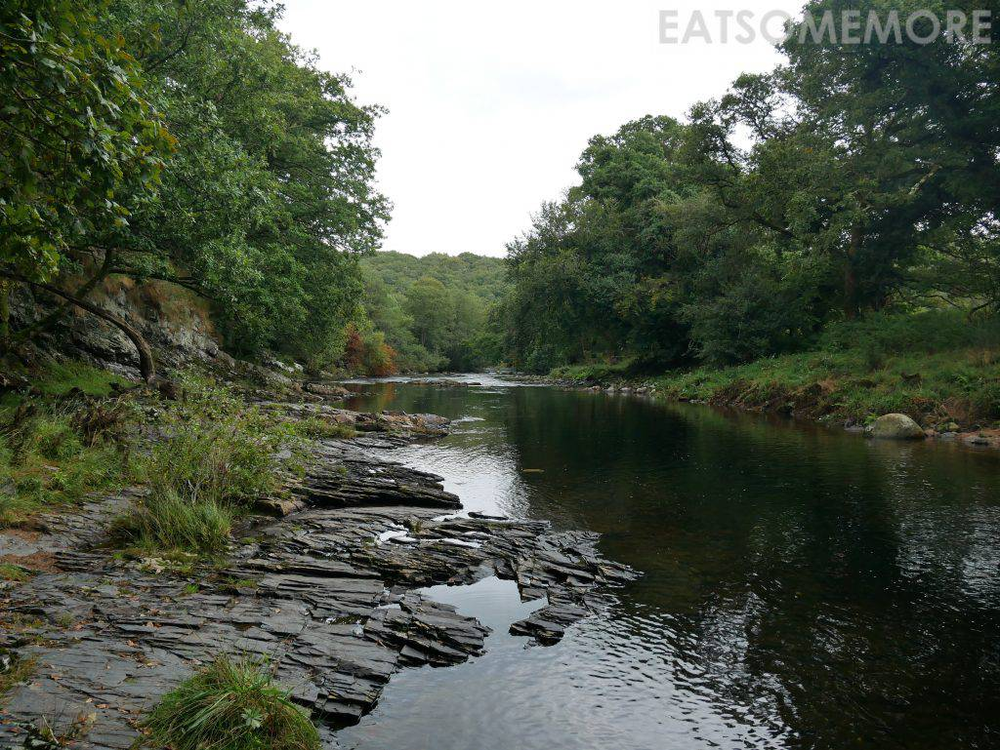
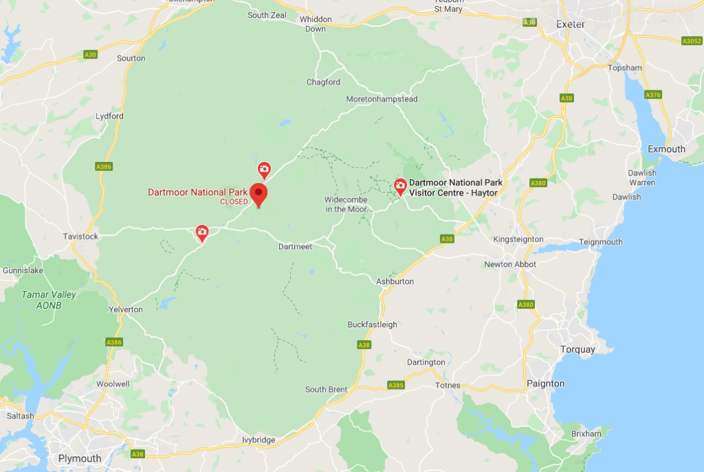

>爱乡野的我来到了德文郡的大荒原。

>前两日才跟奶牛近距离打了照面，这天又在大路上偶遇了一伙黑脸的羊群。

>黑脸黑腿黑屁股还长着角的白羊就这样从面前跑过，我的心情竟有些激动！乡野的可爱之处也许就在于这些未知而又温馨的不期而遇。

>林间一潭碧水，清澈透亮。

>峰回路转来到河边，绿叶掩映，石桥巍巍，水流潺潺。

>而另一边豁然开朗，河面宽阔起来，倒映着岸边的林木。

网站：[https://www.dartmoor.gov.uk/](https://www.dartmoor.gov.uk/)

地址：Parke, Bovey Tracey, Newton Abbot, Devon TQ13 9JQ

