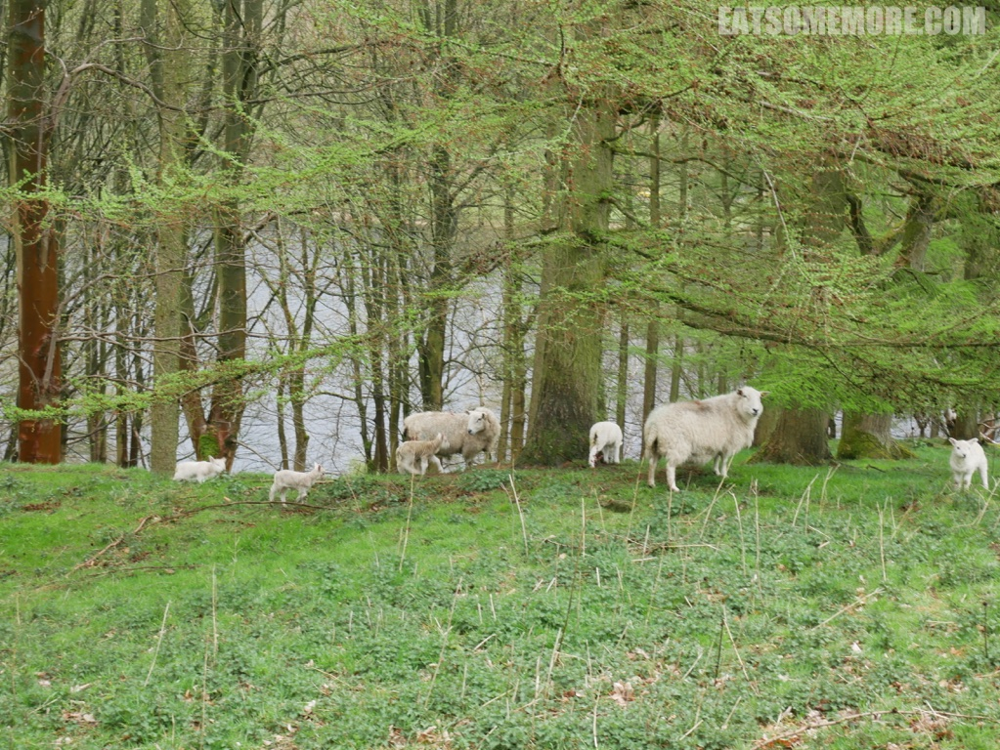
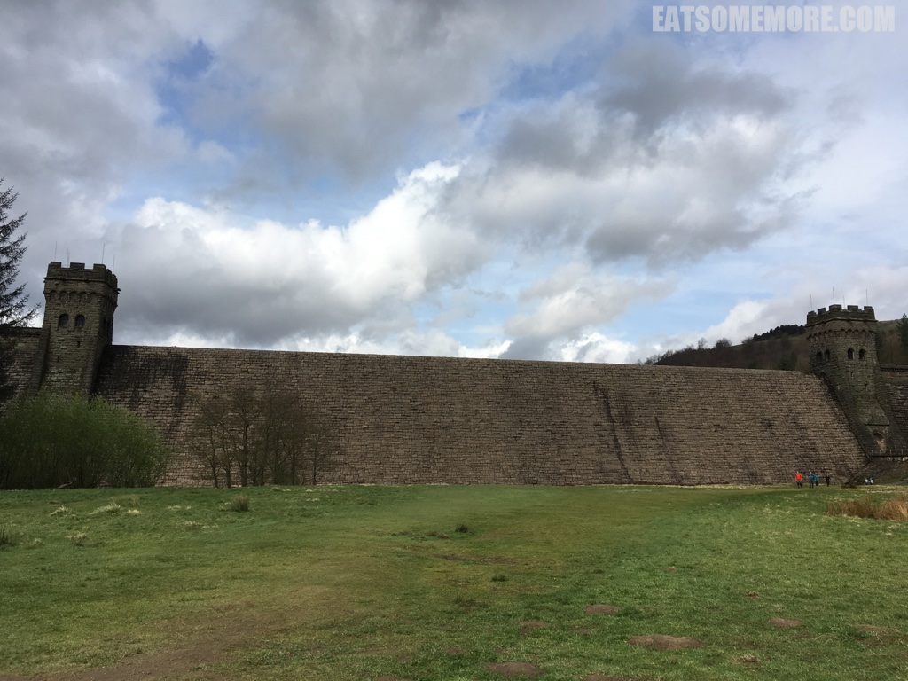
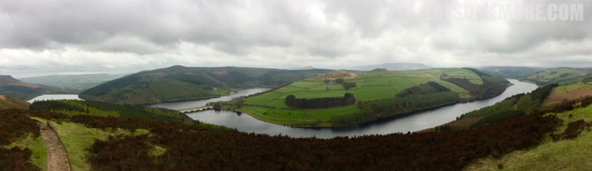

>英格兰中北部主要灌溉河流特伦特河的支流德文特河上有三个水库，供给着整个德比郡、甚至南约克郡广大地区的用水。Ladybower 水库是其中地势最低的。一座高架桥横跨“Y”字形的水库。 

>蓝天和白云不仅在水面映上了它们的颜色，更在田野和山间投下了斑驳的光影。

>北上途中，羊家长带着羊宝宝，寄情山水之间，好不惬意。

>再走不多远，出现了更多的羊。其中一只面部黝黑。

>树林里的羊成群结队，一派母慈子孝。

>面前的双塔大坝是德文特大坝。据说在河水倾泻而下时最为壮观。

>参观了大坝后，沿着水库东沿南返。有了松柏和曲径，大坝看起来竟然有点像个城堡。

>到了海拔更高些的地方，树木还没来得及发芽，一只毛茸茸的美羊羊竟然“平易近人”地来到了路边，用它乌溜溜的黑眼睛真挚地看着我的镜头。

>回望来时路，山峦起伏和缓，植被茂密多样，河流蜿蜒曲折。

>到达最高处，“Y”字形的 Ladybower 水库尽收眼底。

网站：[https://www.visitpeakdistrict.com/things-to-do/ladybower-reservoir-p682661](https://www.visitpeakdistrict.com/things-to-do/ladybower-reservoir-p682661)

地址：Derbyshire, Peak District, S33 0AX

