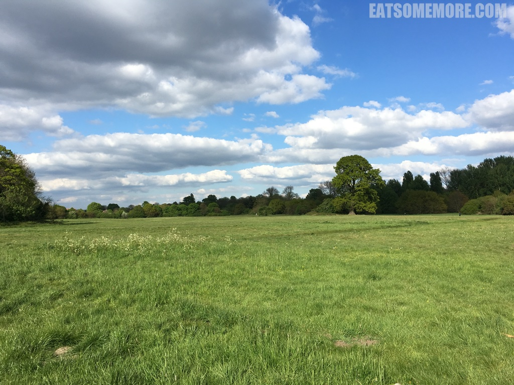
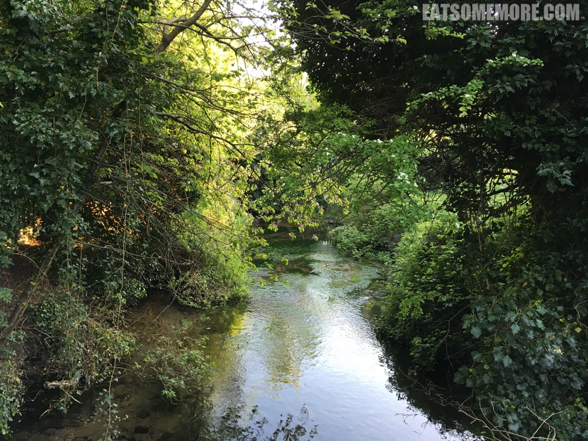
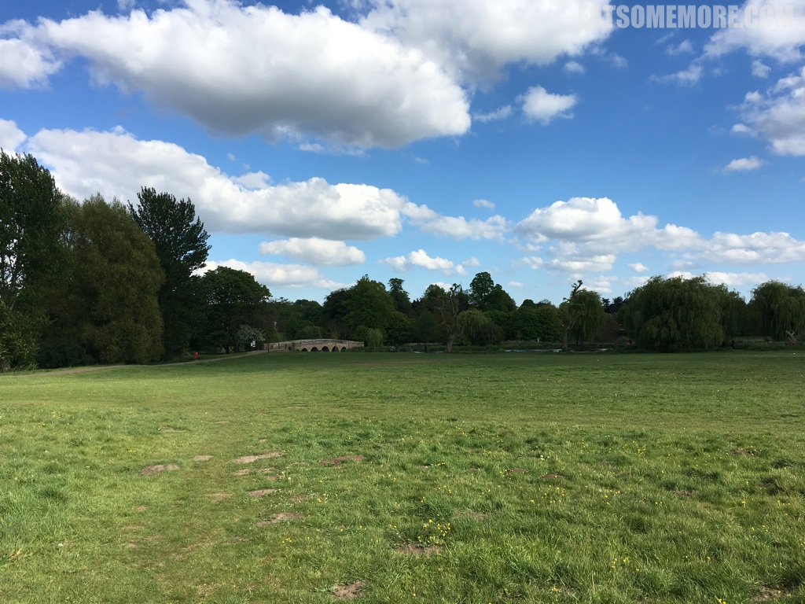
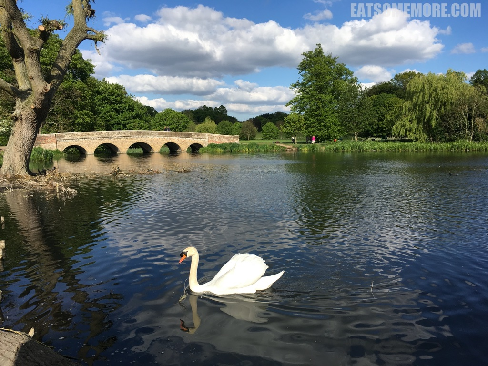
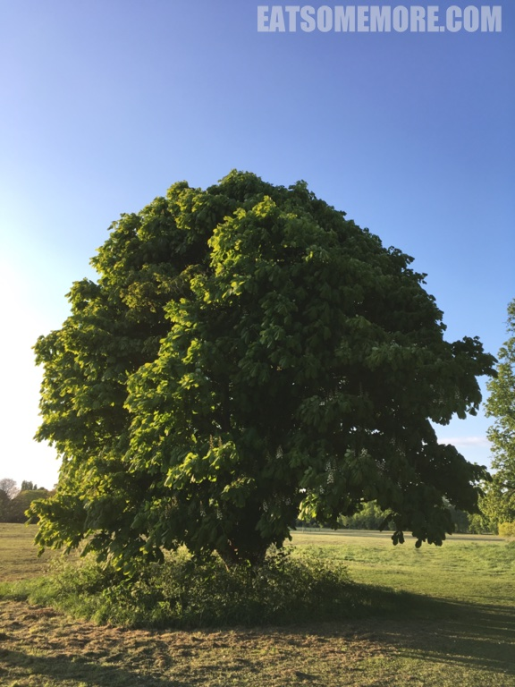
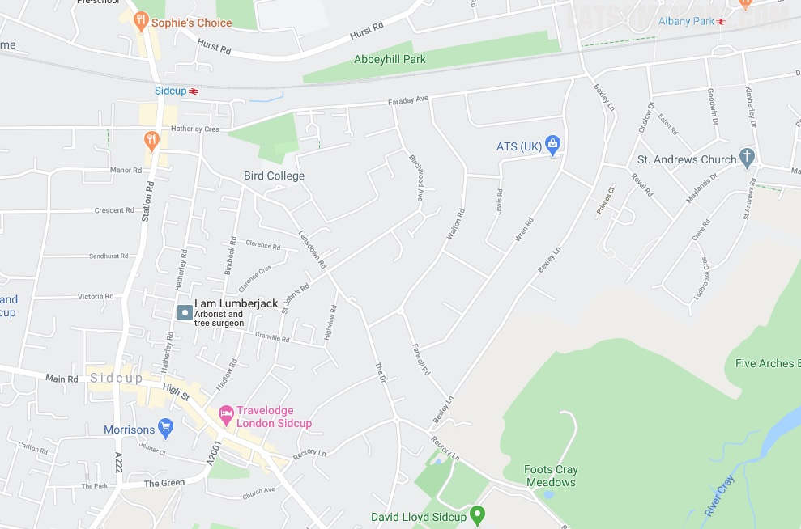

>伦敦最吸引我的地方无疑是它的兼容并蓄，也是那些毗邻繁忙都市的温婉公园。伦敦东南的 Foots Cray Meadows 是我最喜欢的公园之一。

>树荫茂密处，克雷河流水潺潺。

>宽阔草坪另一端的石拱桥若隐若现。

>桥下的河面舒展开来，河上的天鹅曲项飞羽。

>到了这里时间仿佛过得特别慢，让我可以静下心来观赏一棵树的姿态。

网站：[http://www.footscraymeadows.org/](http://www.footscraymeadows.org/)

地址：N Cray Rd, Sidcup DA14 5AG

