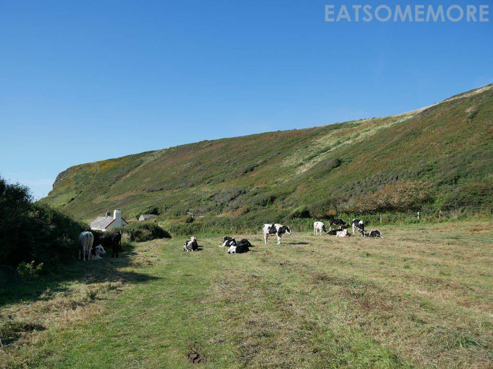
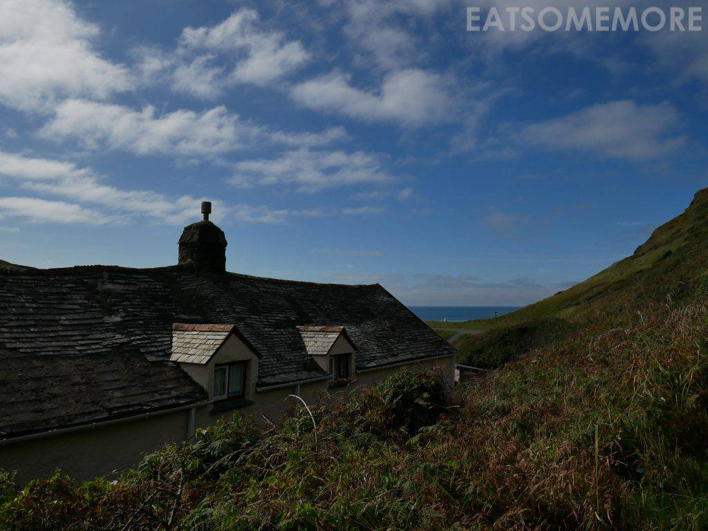
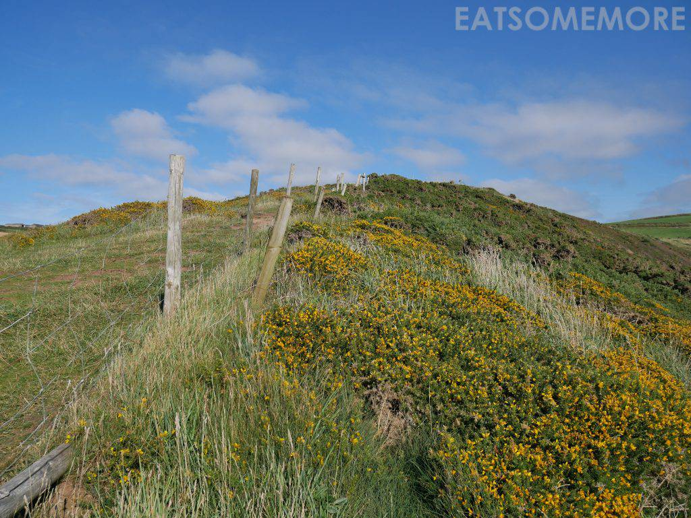
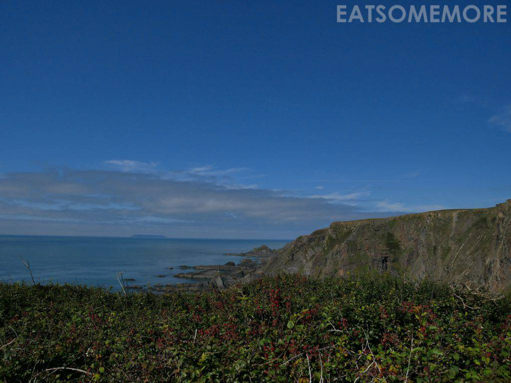
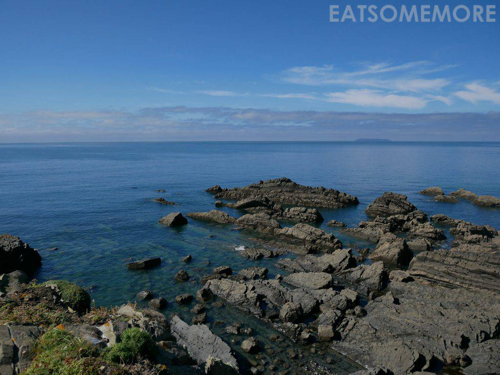
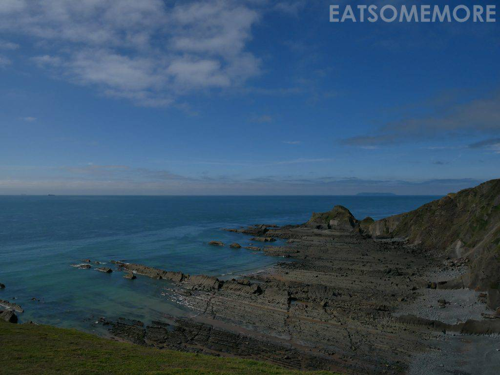
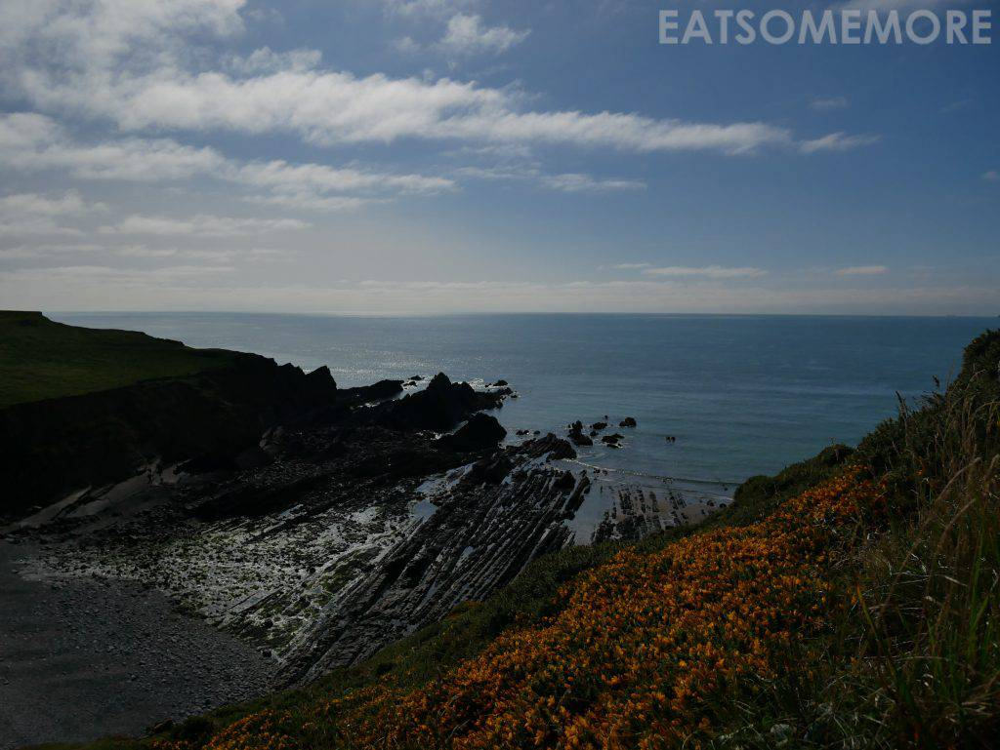
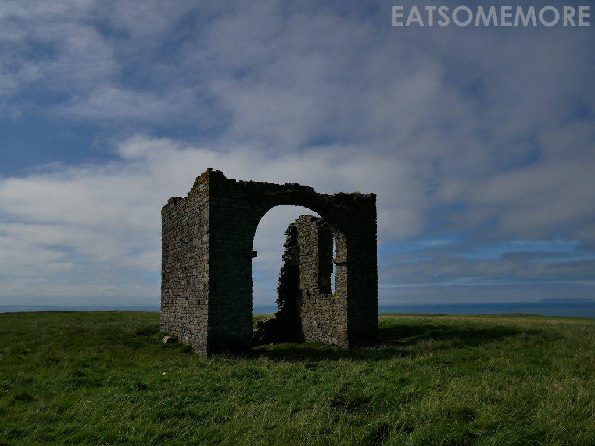
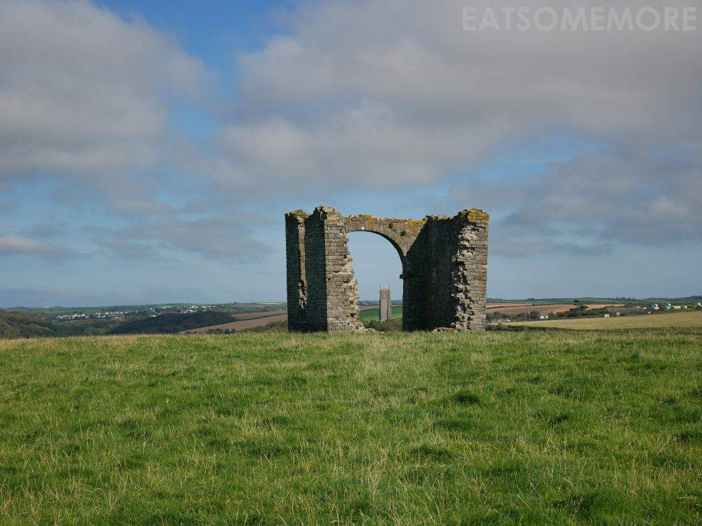
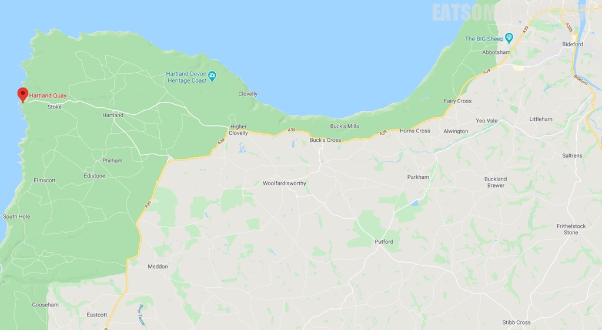

>万万没有想到健行的第一步是要穿过一个牛圏……

>从没有那么近距离地观察过奶牛，气味刺激、飞蝇缭绕。

>上行至屋顶高度，就能渐渐望见蔚蓝的大西洋了。

>再往上，山野里冒出了黄色粉色的小花。

>远远地还能眺望不知名的快乐小岛。

>海水清澈，沿海岩石呈柱状节理，是大自然和时间的杰作。

>在阳光和蓝天映衬下的大西洋现出了深浅不一的好多种蓝色——宝蓝、靛蓝、天蓝、湖蓝、松石蓝，不胜枚举。

>逆光处的海面珠光宝气，波光粼粼。

>山坡上的废墟隐约透露着这户临海靠山人家昔日门高地广的情景。

>透过废墟还能望见远处的教堂。

网站：[https://www.hartlandpeninsula.co.uk/beaches-beauty-spots/hartland-quay.html](https://www.hartlandpeninsula.co.uk/beaches-beauty-spots/hartland-quay.html)

地址：Bideford EX39 6DB

