>在 Blea Tarn 步行的五公里、上升海拔三百米的两小时四十分钟，是我这次在湖区最喜欢的一个行程，没有之一。

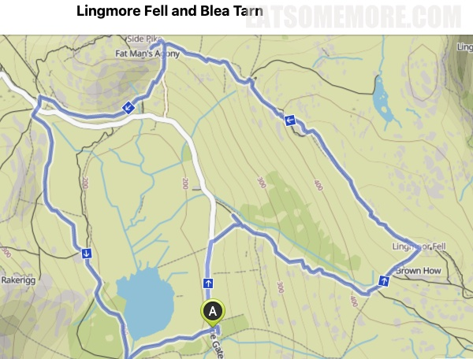

>在 Blea Tarn 和侧峰 (Side Pike) 之间有一段地势平缓的区域。

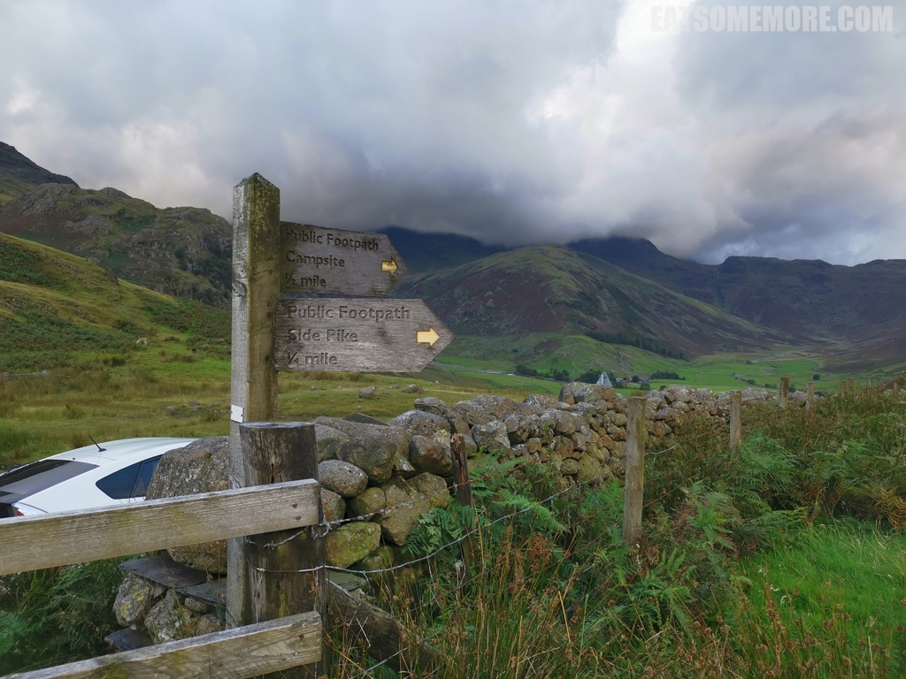

>我们就从这里出发，向着 Wrynose 山口的方向前进。

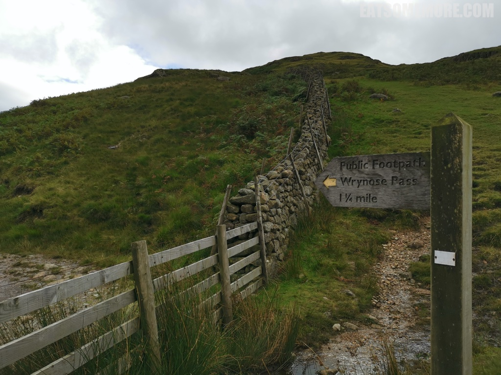

>没一会就看见了 Blea Tarn。天气阴阴的，水里好像也装满了密云。

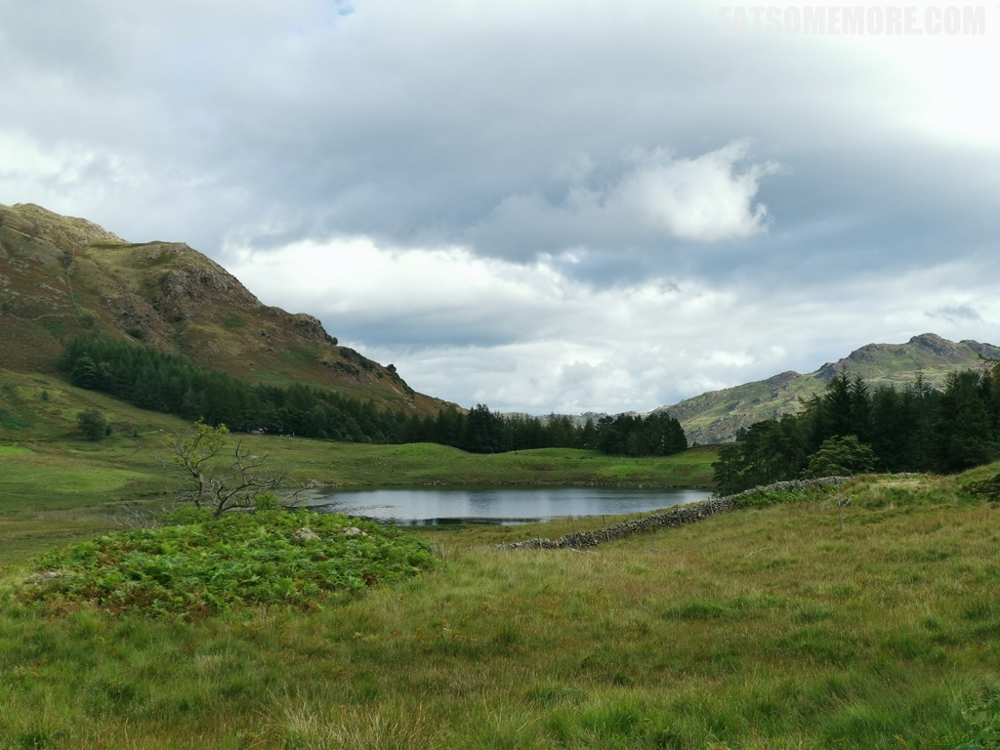

>还好蓝天渐渐地展露出来，使得路边的野花也鲜艳了起来。

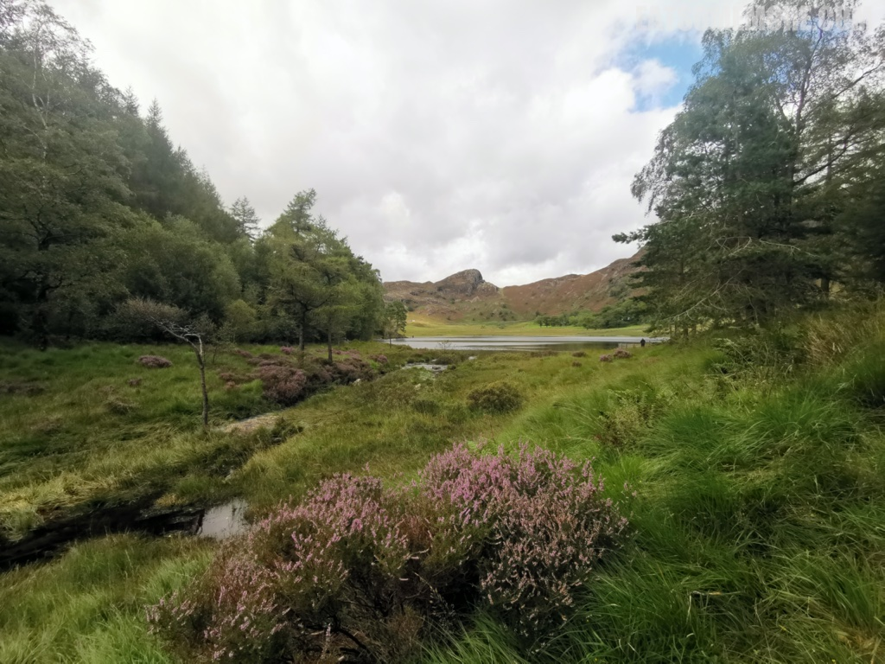

>在吃饭的时候听服务生说起湖区有不少 tarns，我就在想 tarn 难道是水塘的意思，过一个山头就会有个水塘？于是我特地上网搜索了一下，原来 tarn 是冰斗湖的意思，是指由山地冰川侵蚀而形成的三面环山的凹地湖泊。

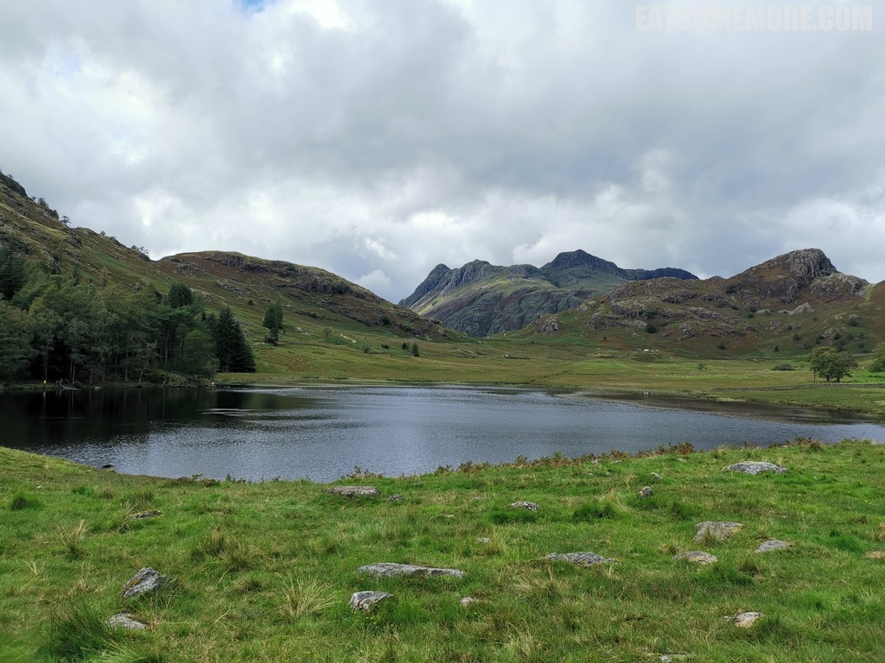

>潺潺流水上的木栈小桥恬然质朴，又像是有着许多的故事。

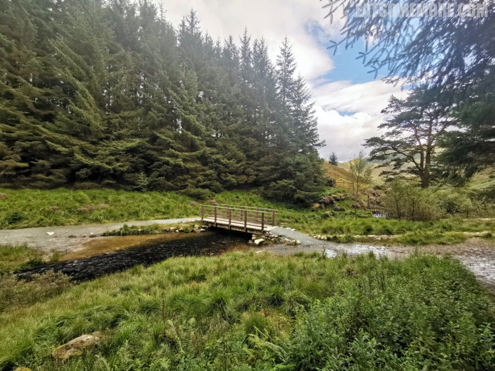

>走过了 Blea Tarn 后，就要开始攀登灵泊峰 (Lingmoor Fell) 了。不远处的绵羊正专注地吃草，健行装备齐全的人类正专心地赶路。

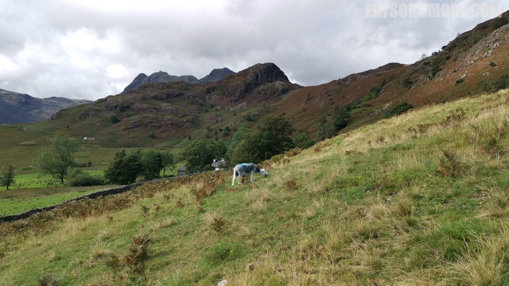

>

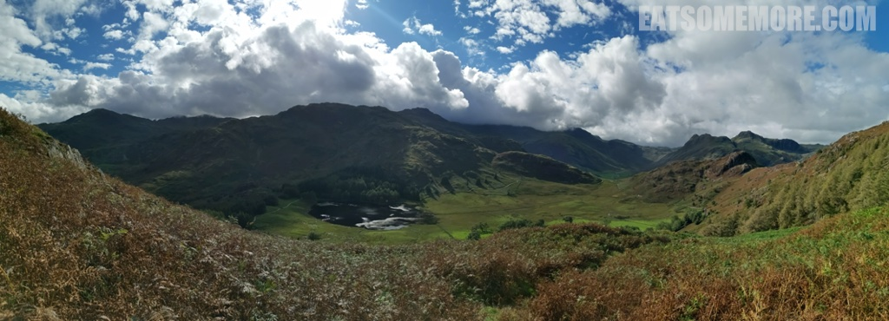

>

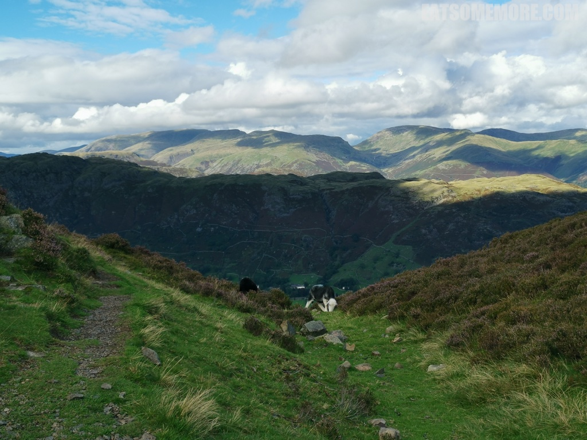

>

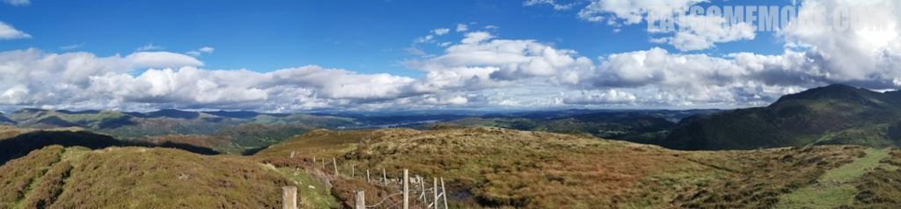

>

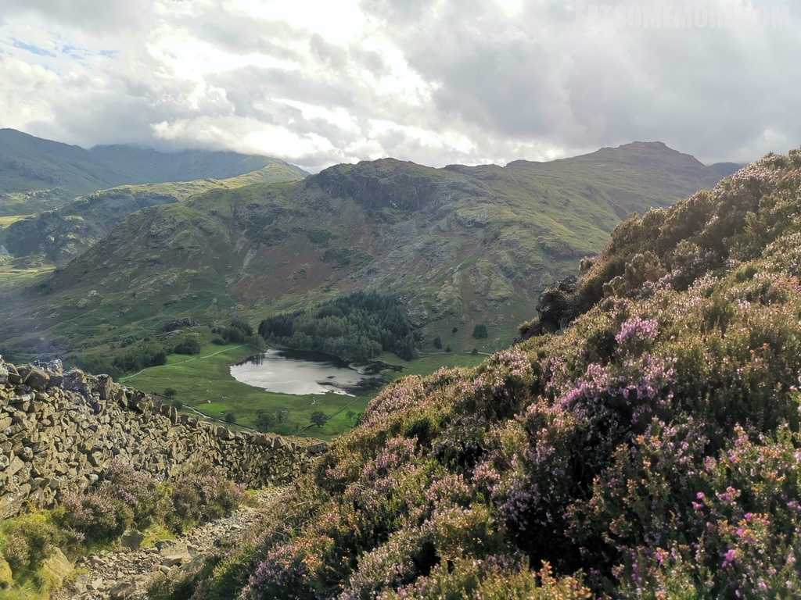

>

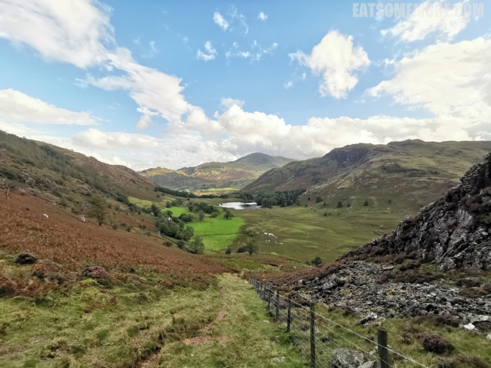

网站：[https://www.nationaltrust.org.uk/sticklebarn-and-the-langdales/trails/sticklebarn-blea-tarn-trail](https://www.nationaltrust.org.uk/sticklebarn-and-the-langdales/trails/sticklebarn-blea-tarn-trail)

地址：Ambleside LA22 9PG

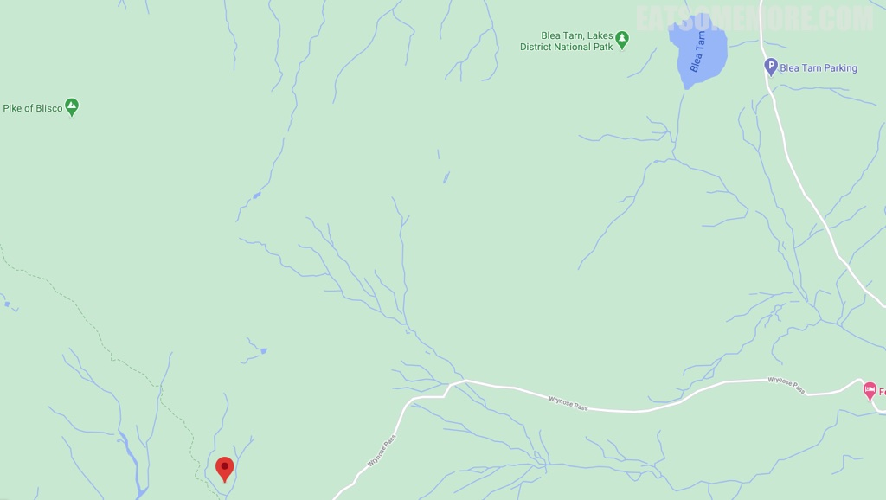