>红河 (River Rothay) 是湖区腹地的一条主要河流，串起了美丽的格拉斯湖和莱达尔湖。两湖之间的河岸地区坐落着植被茂密的白沼林 (White Moss Woods)。

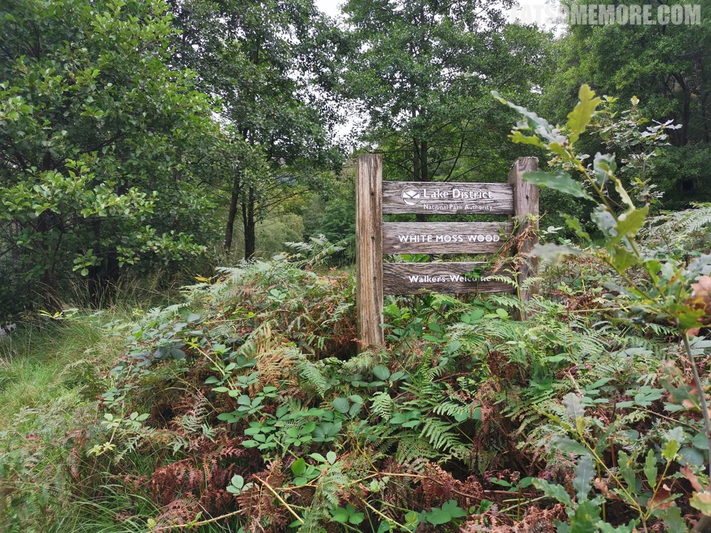

>白沼林当中有许多不同种类的树木，例如古橡树、山毛榉、古欧椴、桦树、杨树和柳树等等。

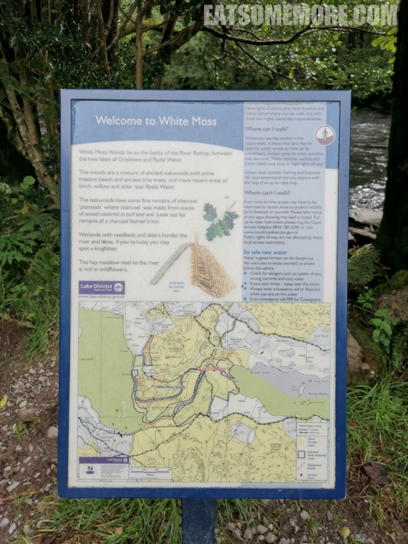

>这里河水湍急，河面几乎与河岸齐高。

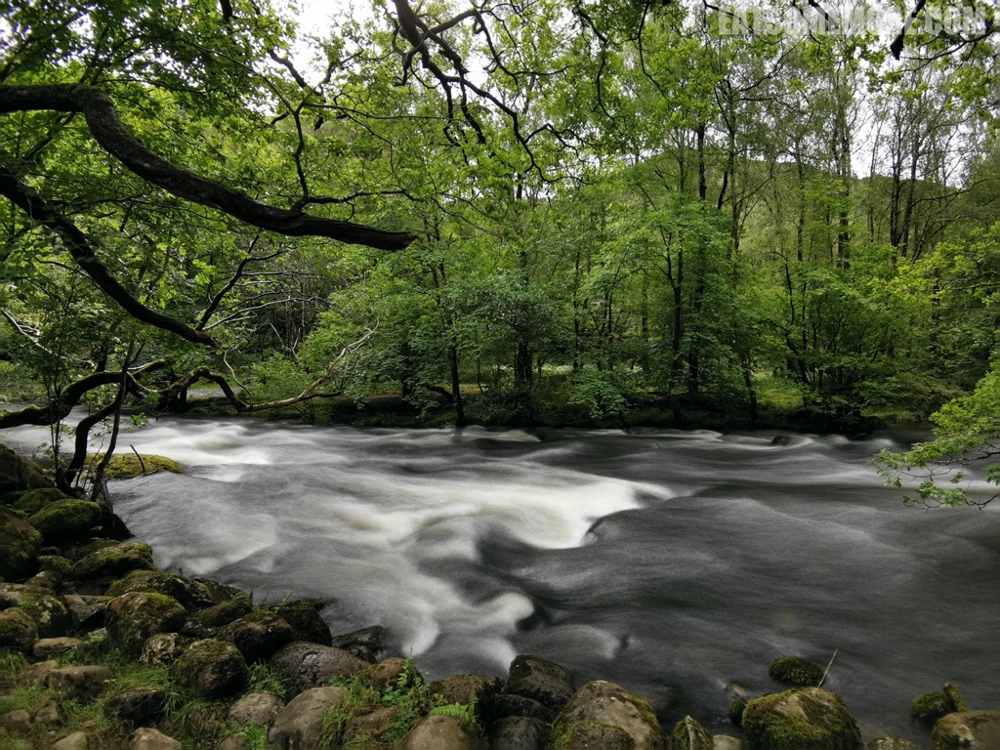

>从莱达尔湖沿着红河步行一英里左右就能到达格拉斯湖。

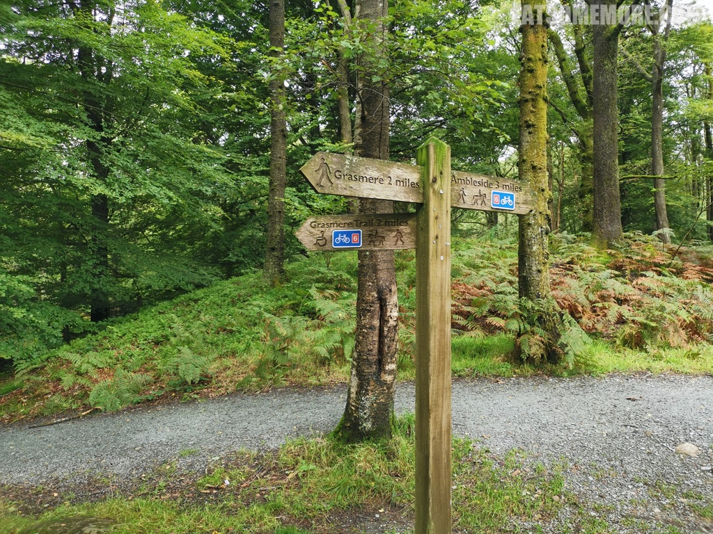

>除了种类繁多的植被，你还有可能会像我一样遇上站在树枝上东张西望的英国国鸟知更鸟。

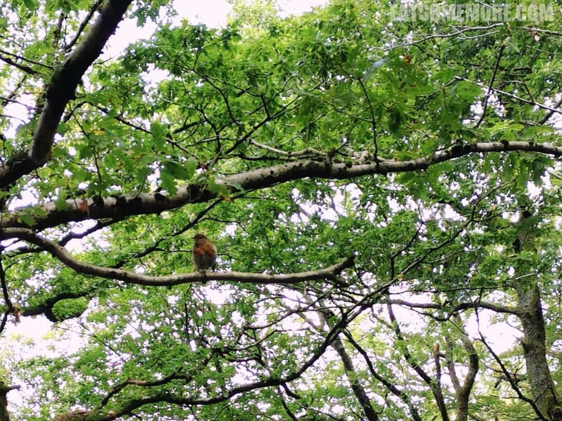

>树林中仙气袅袅的小瀑布时不我待地汇入红河。

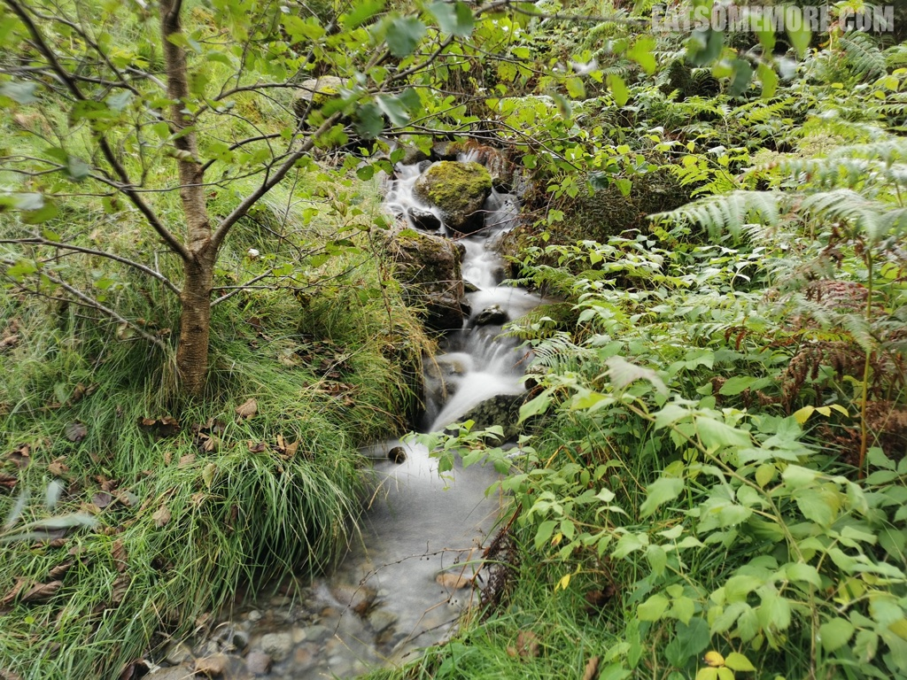

>走到接近格拉斯湖的位置就进入了便士石林 (Penny Rock Wood)。

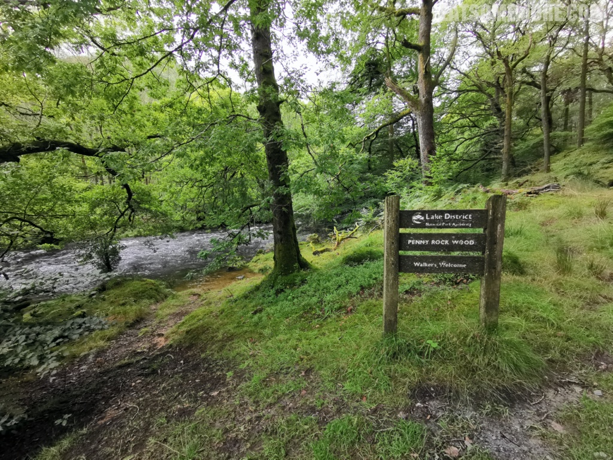

>红河河面宽阔了起来，但依然清澈得可以看见河底的石头。两岸的树木经年累月，竟然在河中央实现了会师。

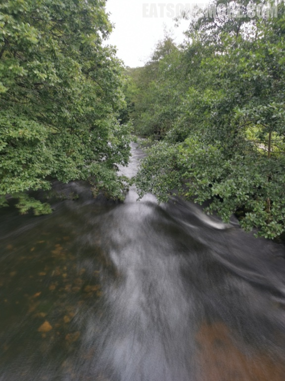

>溯流而上就能见到格拉斯湖了，河床上长着随风摆动的芦苇。

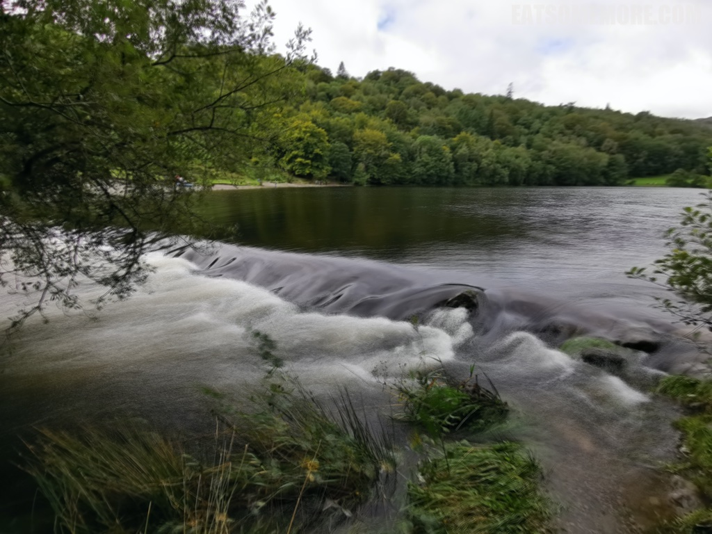

>蓝天从渐渐舒展的云层后面露了出来，在青山绿树之间，映得格拉斯湖也呈现出天蓝色，缱绻仙凡间。

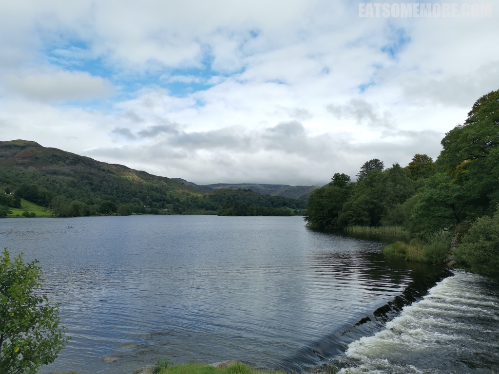

网站：[https://www.lakedistrict.gov.uk/visiting/places-to-go/explore-grasmere-and-rydal](https://www.lakedistrict.gov.uk/visiting/places-to-go/explore-grasmere-and-rydal)

地址：A591, Ambleside LA22 9SE

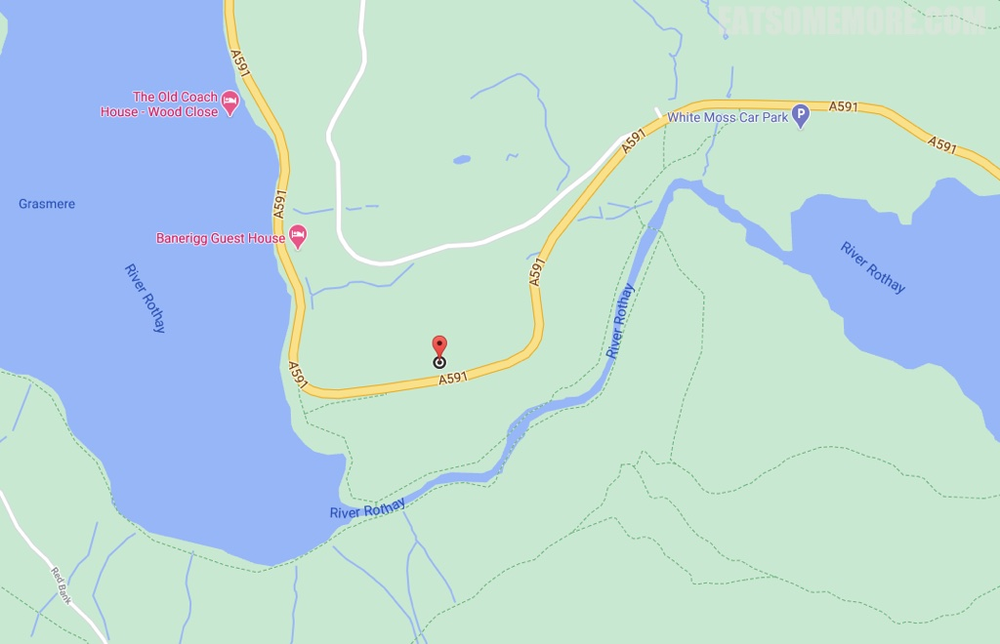