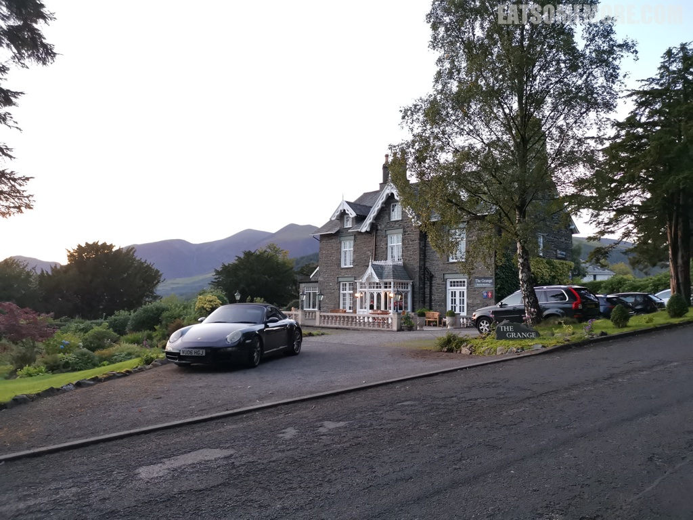
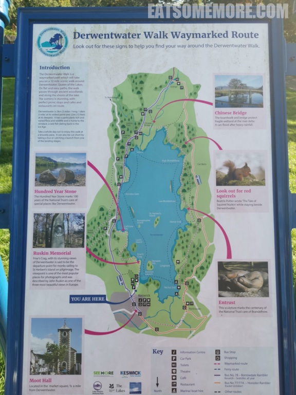
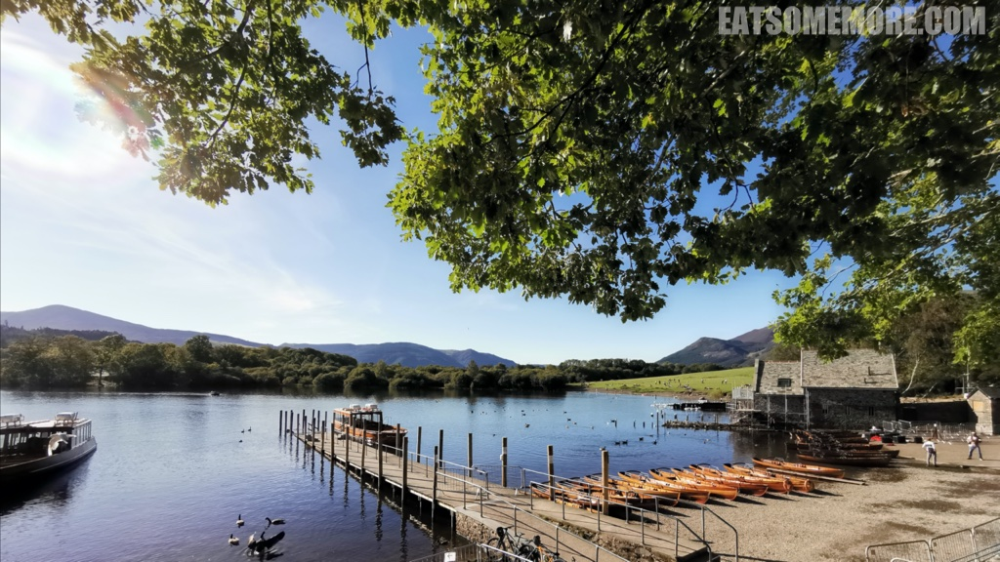
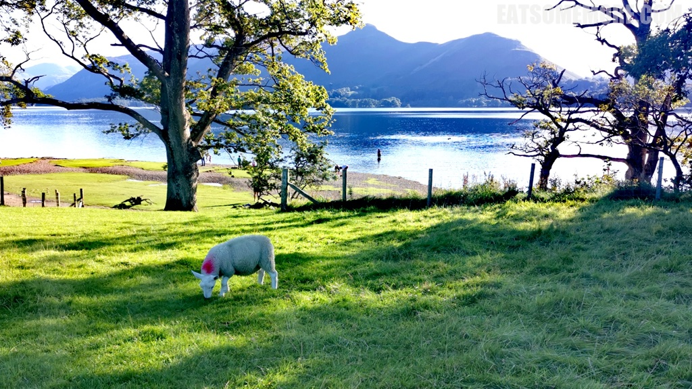
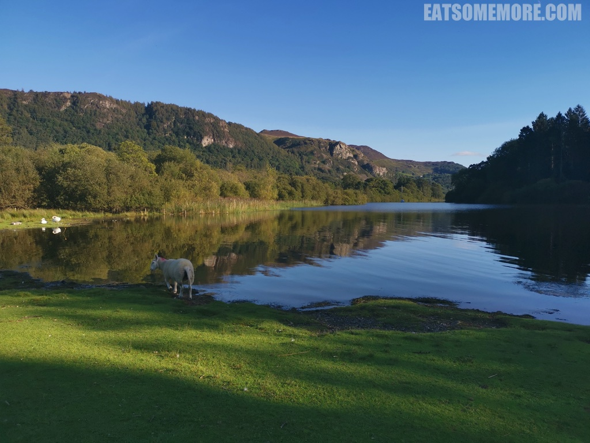
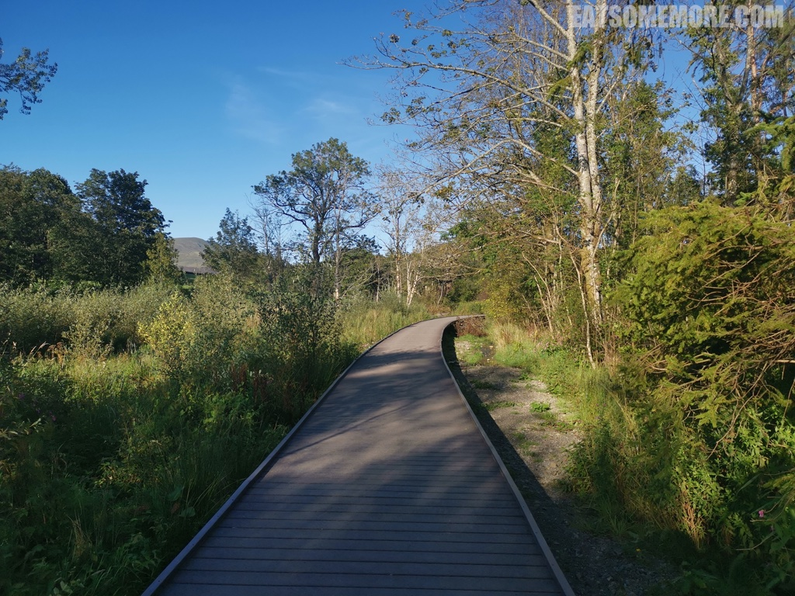
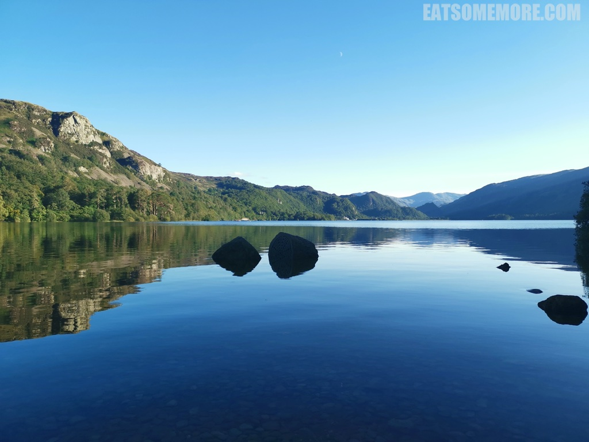
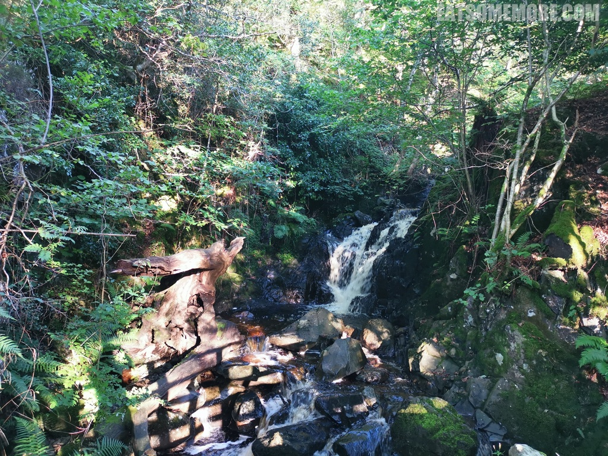
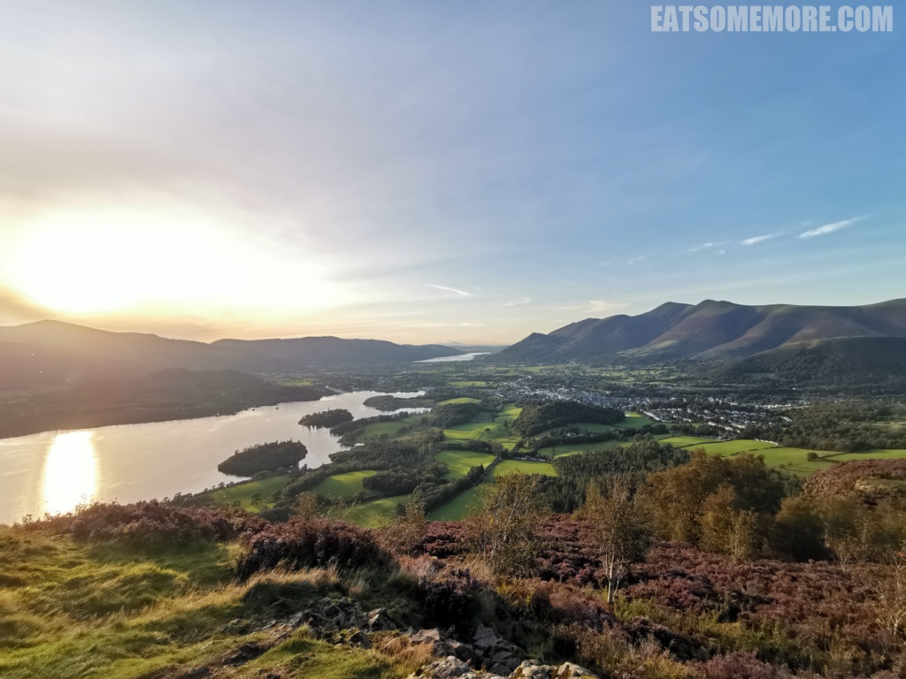
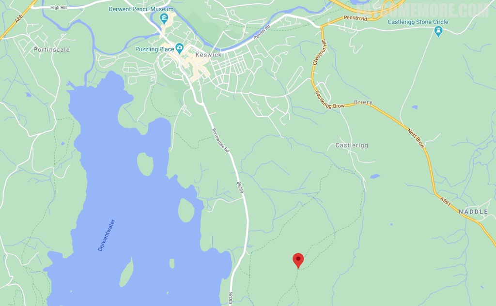

>凯西克 (Keswick) 位于湖区的中心地带。


>据说，从中世纪开始就是个繁荣的小镇



>德文特湖离镇中心只有步行十分钟的路程，湖的西边是猫铃高地 (the fells of Cat Bells)，东边是景色宜人的修士岩 (Friar's Crag)，南边则是美丽的博罗山谷的入口。



>德文特湖湖面宽阔，面积约有五平方公里，有游船活动。



>走不多久，就来到了被英国维多利亚时代著名的艺术家约翰罗斯金誉为欧洲三大美景的修士岩。湖光山色之间，绿树在草地上投下阴影，牛羊成群结队。它们不仅闲散地走到哪吃到哪，排泄也非常地随意。



>作为一头幸福的羊，自然也可以颇具诗意地凭湖远眺，思考“羊”生。



>德文特湖对人类也很友好，比如说健行的步道修得很出色。



>从 Calfclose 湾可以看到湖中的百年石，纪念的是国家信托组织一百年来对于英国自然和人文名胜古迹的保护。



>转到瓦拉岩步道时，路变得陡峭起来，并且见到了一个小瀑布。



>然而当我们看到山顶如此美景的时候，真心实意地觉得辛苦地攀登是值得的。
```
长湖落日圆，群山起伏绵。
山野有人家，牛羊懒流连。
```



网站：[https://www.lakedistrict.gov.uk/visiting/places-to-go/explore-derwent-water-and-keswick](https://www.lakedistrict.gov.uk/visiting/places-to-go/explore-derwent-water-and-keswick)

