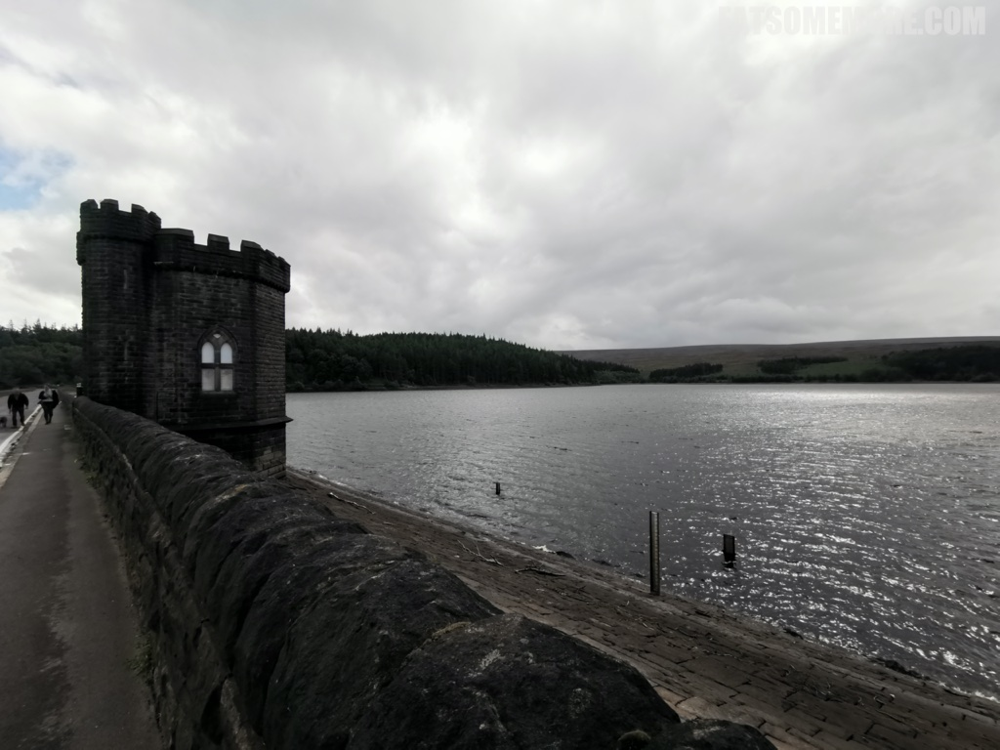
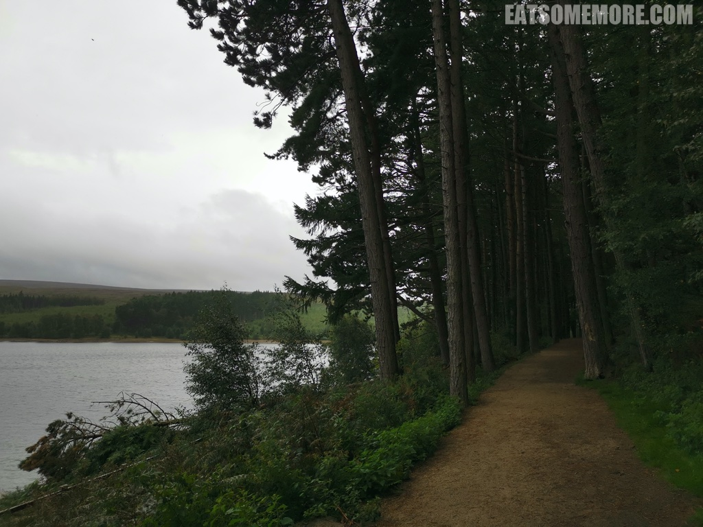
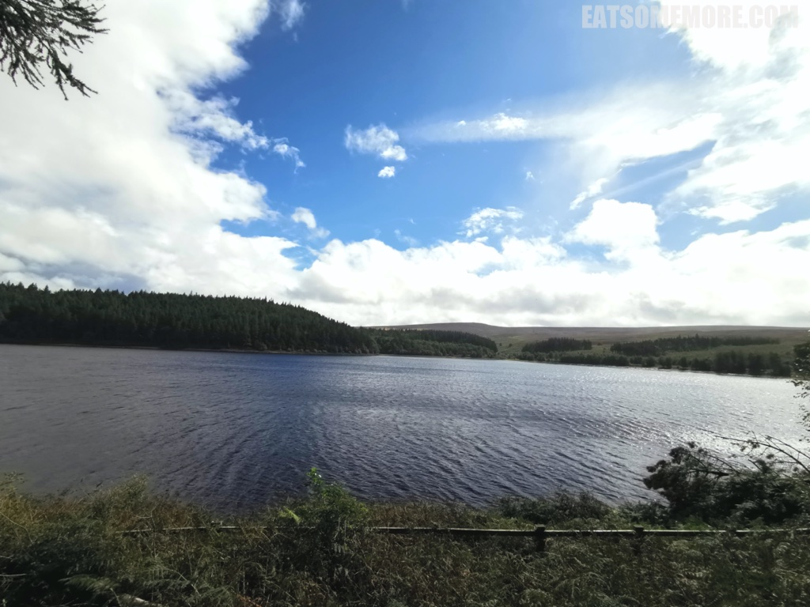
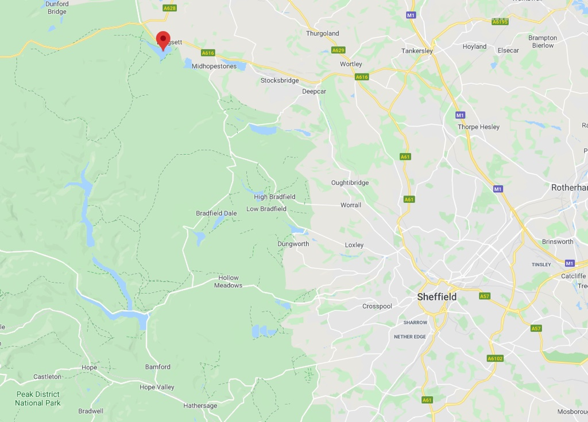

>Langsett 水库坐落于峰区国家公园的东北边缘，Reservoir sits at the north eastern edge of the Peak District National Park, less than 5 miles south west of Penistone. With a capacity of over 1,400 million gallons, it is the biggest supply reservoir in the Sheffield district and also has one of the largest earth embankments in the UK.。

>Not only is it important in providing a supply of water for Sheffield and Barnsley; it additionally offers fantastic recreation opportunities for visitors from the local area and beyond. Walking routes weave through majestic woodlands, offer stunning vistas across the water and boast breath-taking views from a higher vantage point on Midhope Moors. Bird watchers may spot interesting species including treecreepers, owls and woodpeckers. Cyclists and horse riders are also welcome to enjoy the area following the bridleway network.。

>。

网站：[https://www.peakdistrict.gov.uk/visiting/miles-without-stiles/langsett](https://www.peakdistrict.gov.uk/visiting/miles-without-stiles/langsett)

