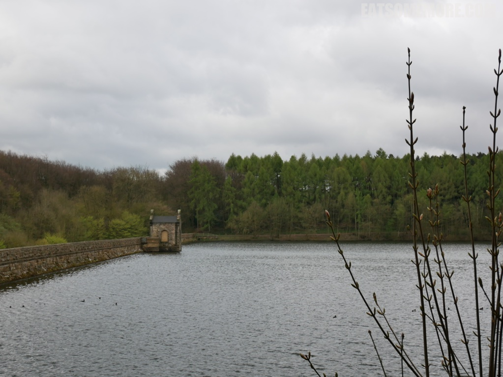
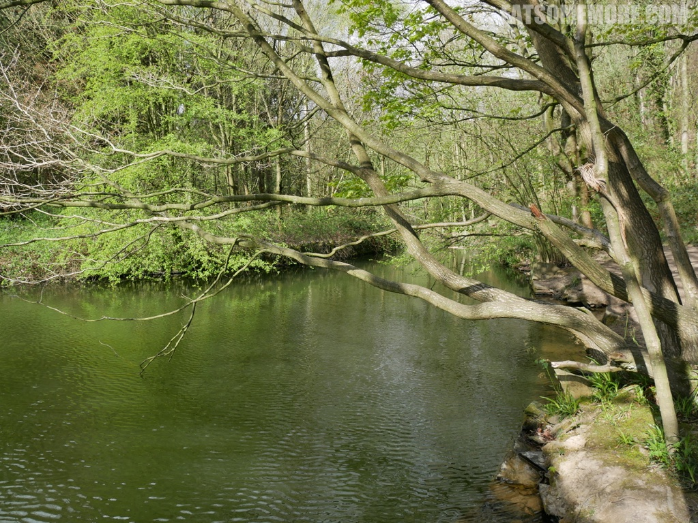
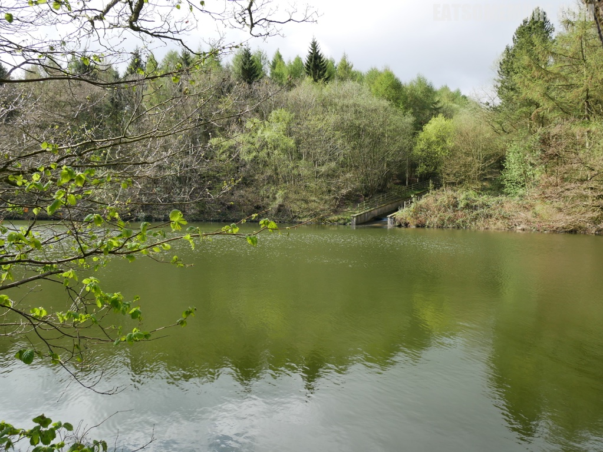
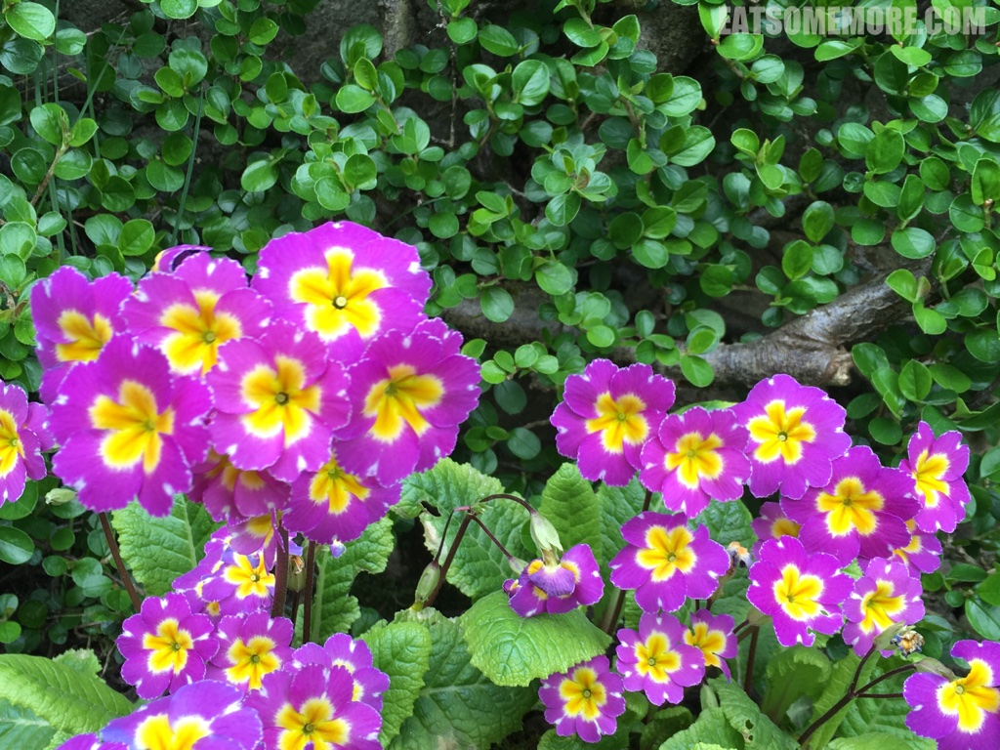
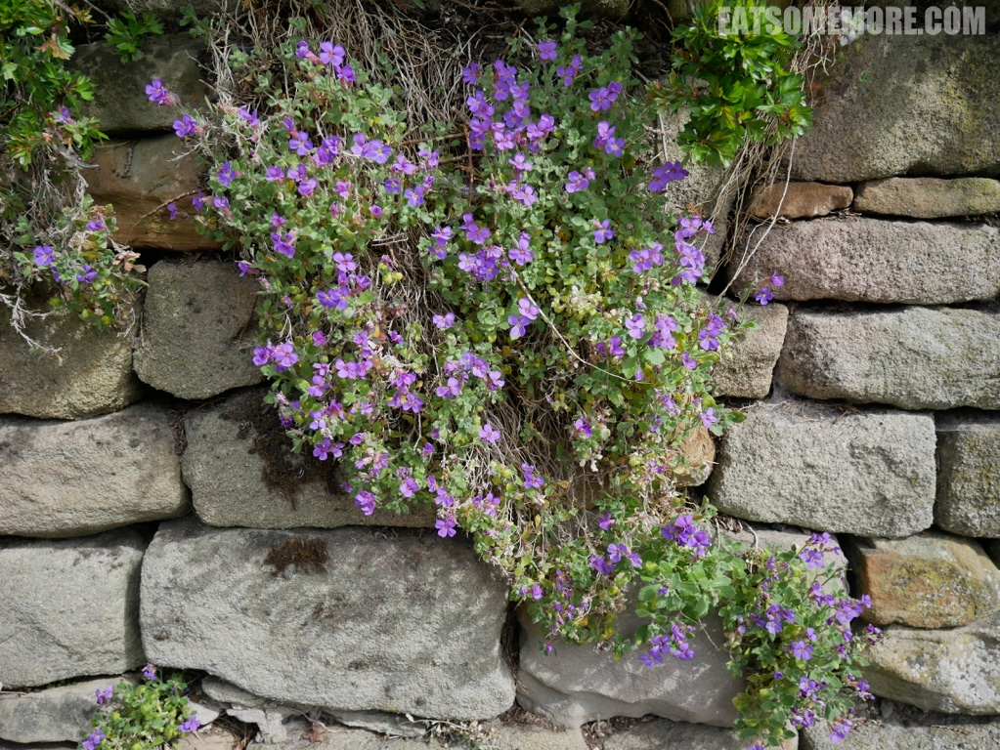
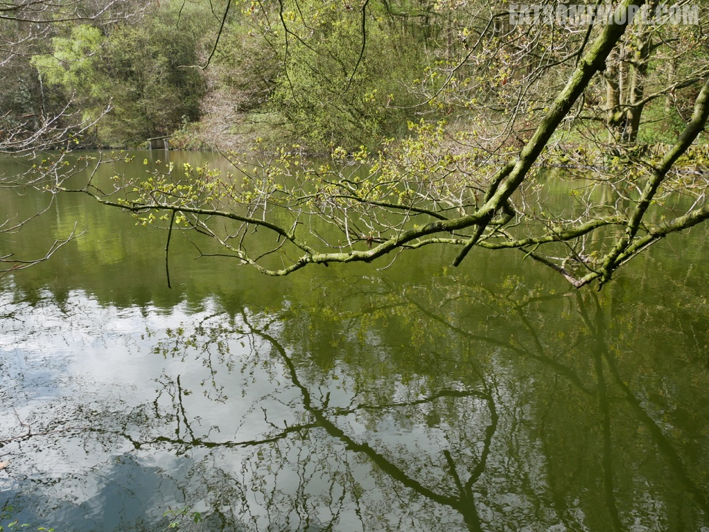
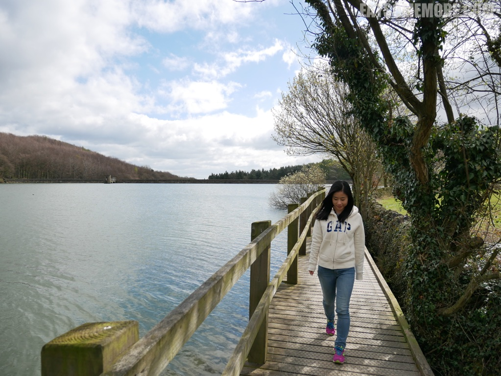
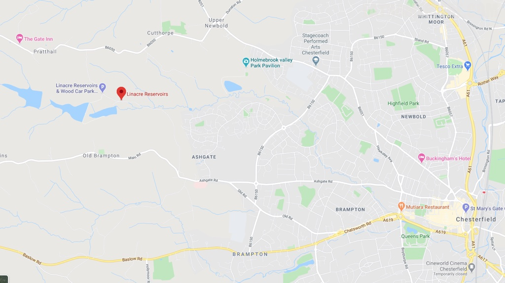

>峰区的 Linacre 水库由三个水库组成，在1995年前曾供水给附近的切斯菲尔德。

>如今成为了许多野生动物的栖息地。

>春天的绿色在树梢上、在湖水里，是四季中最最生动活泼的绿色。

>而春天又岂止绿色，姹紫明黄也毫不逊色。

>即使是不起眼的小花，在灰色石墙的映衬下，也在诉说着春意盎然。

>这棵树不知道是不是被自己的水中倒影所吸引呢？

>水库周边的健行设施也维护得很好，非常推荐大家春游来走走。

网站：[https://www.stwater.co.uk/wonderful-on-tap/our-visitor-sites/come-visit-us/linacre/](https://www.stwater.co.uk/wonderful-on-tap/our-visitor-sites/come-visit-us/linacre/)

地址：Woodnook Lane, Cutthorpe, Chesterfield, S42 7JN

