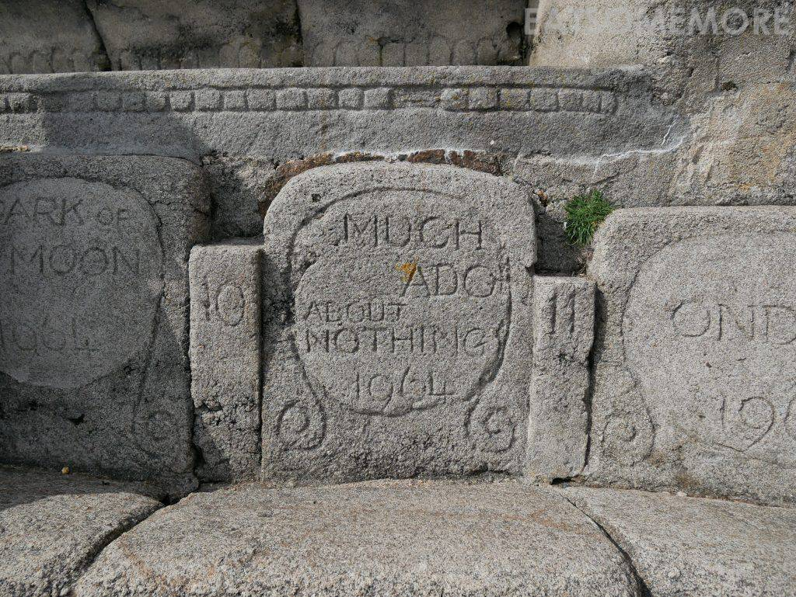
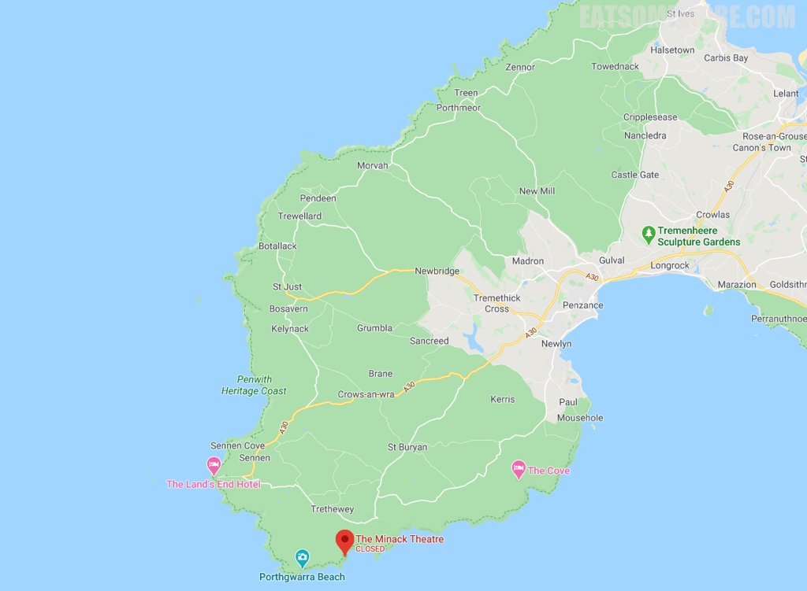

>此行最期待的景点就是这海边剧场。Minack在康沃语当中是“多石之地”的意思。它的筹建得益于一名伟大的女性Rowena Cade。二十世纪初，戏剧表演在康沃盛行。1929年在Minack附近上演的仲夏夜之梦取得了重大的成功，剧团随即开始寻找下一场演出——暴风雨的场地。

>那时居住在Minack的Rowena觉得自家花园下的峭壁非常适合建一个剧院，就和她的园丁一起通过几年的时间，将这里变成了令人惊叹的海边剧场。这里有舞台、声控室、更衣室、石座、草座甚至包厢，从三十年代初建成时的设备简陋，到如今的一应俱全、远近驰名，令人不禁赞叹人类的想象力、创造力和行动力！

>剧场的石座上刻着上演过的剧名和年份。

>随处可见肥美可爱的多肉植物。

>美得千姿百态，全都憨态可掬。

>沿着剧场后面的小路下山就能到达水清沙白的Porthcurno海滩。

>海水蓝出了渐层，山腰上开着红花，画一样漂亮。

网站：[https://www.minack.com/](https://www.minack.com/)

地址：Porthcurno, Penzance TR19 6JU

