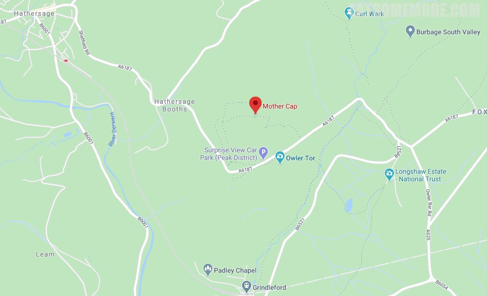

>峰区的哈瑟西奇地区是凯拉奈特利版的《傲慢与偏见》的取景地。

>出发时艳阳高照，走着走着就有些“山雨欲来风满楼”的感觉，这在英国再正常不过了。还好在下雨前见到了峰区奇石。

网站：[https://www.visitpeakdistrict.com/things-to-do/surprise-view-p748951](https://www.visitpeakdistrict.com/things-to-do/surprise-view-p748951)

地址：Hope Valley S32 1DA

