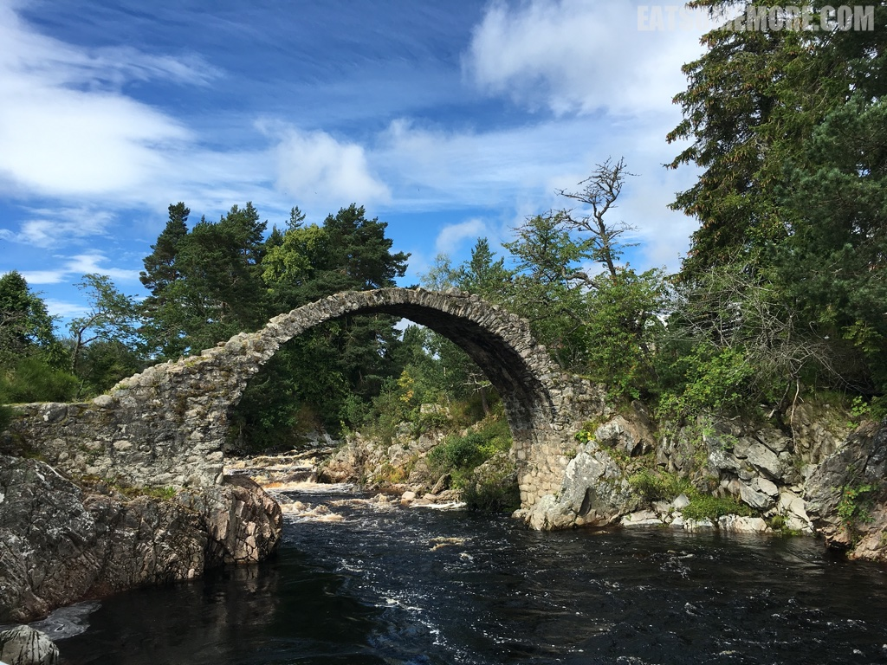
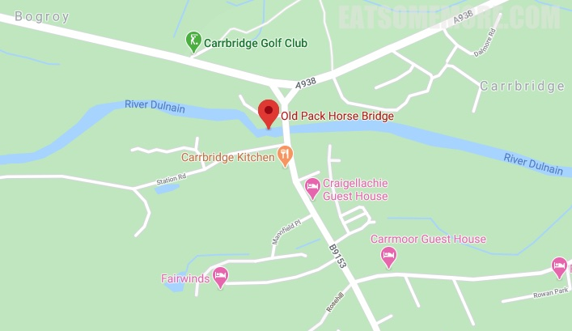

>Built 1717. High single span humpback rubble bridge over River Dulnain; tooled rubble arch springing from natural rock abutment. Neither surfacing nor parapet survive. The bridge was Listed at Category B on 05/10/1971. 'At the beginning of the eighteenth century, to the inconvenience of both travellers and local people, there was no point at which the River Dulnain could be crossed when it was in spate, and burials at the Church of Duthil were often delayed.
Brigadier-General Alexander Grant of Grant, Clan Chief, commissioned John Niccelsone, a mason from Ballindalloch to build a bridge at Lynne of Dalrachney. Built between May and November 1717, the bridge was paid for out of stipends of the Parish of Duthil. Its parapets and side walls were badly damaged in the 18th century and again in the famous flood of 1829, giving the appearance it still has today.'

网站：[https://her.highland.gov.uk/Monument/MHG4627](https://her.highland.gov.uk/Monument/MHG4627)

地址：Dulnain Bridge, Carrbridge PH23 3AB

