>英国最古老著名的大学城之一牛津，位于伦敦西北，溯流而上八十公里处。从伦敦出发，有以下几种方式前往牛津。

- 火车：1小时左右，订票网站http://www.nationalrail.co.uk/
- 大巴：2小时左右，订票网站http://www.nationalexpress.com/home.aspx
- 自驾：1.5小时左右

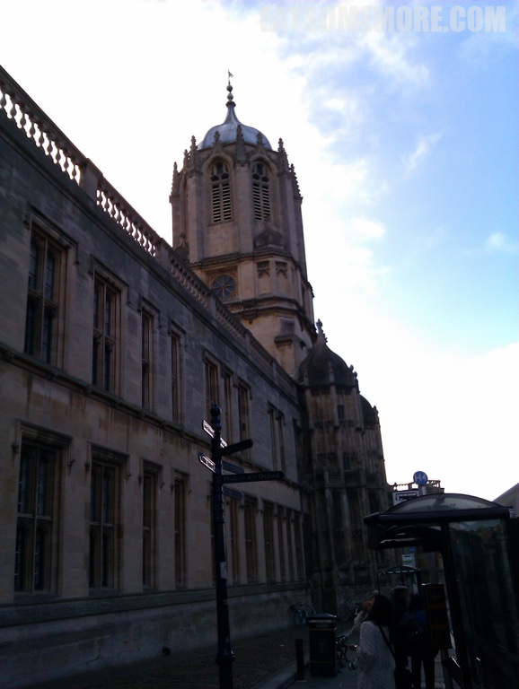

>牛津的街道仿佛特别古典。

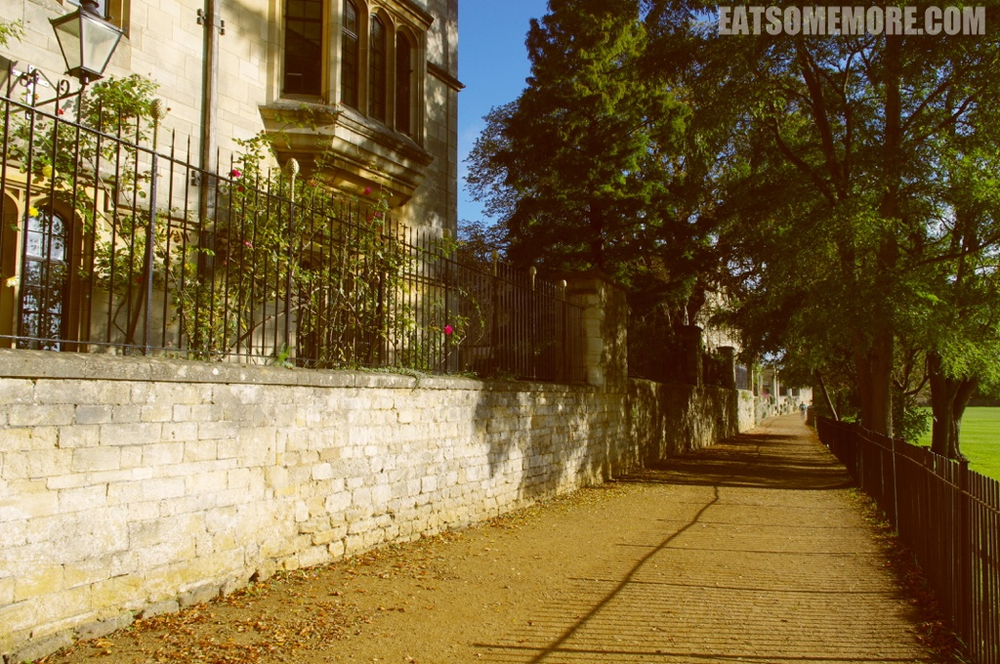

>镇上有许多石灰岩建筑。高大的罗马柱也比比皆是。

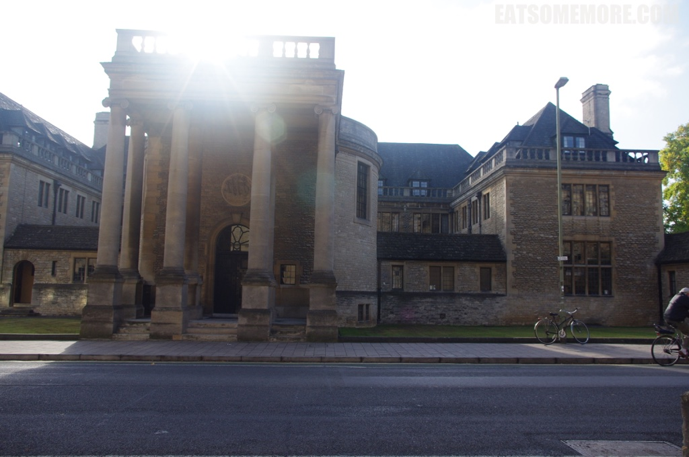

>一些幸运的楼房上密密地盘着红色的爬山虎。

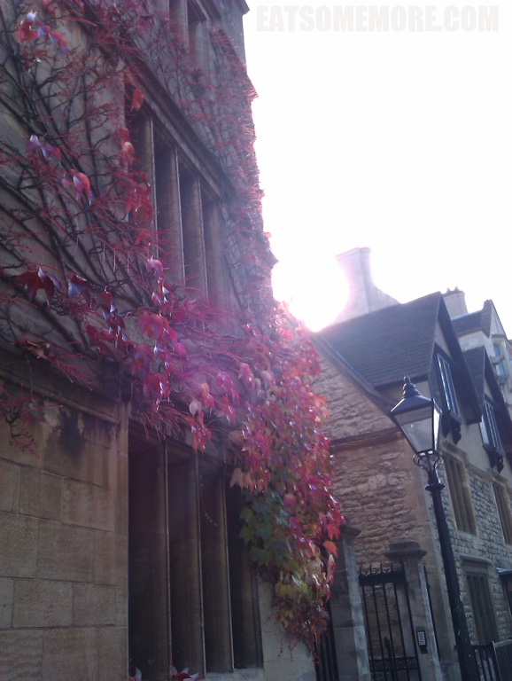

>红色爬山虎簇拥下的牛津大学，令人心向往之。

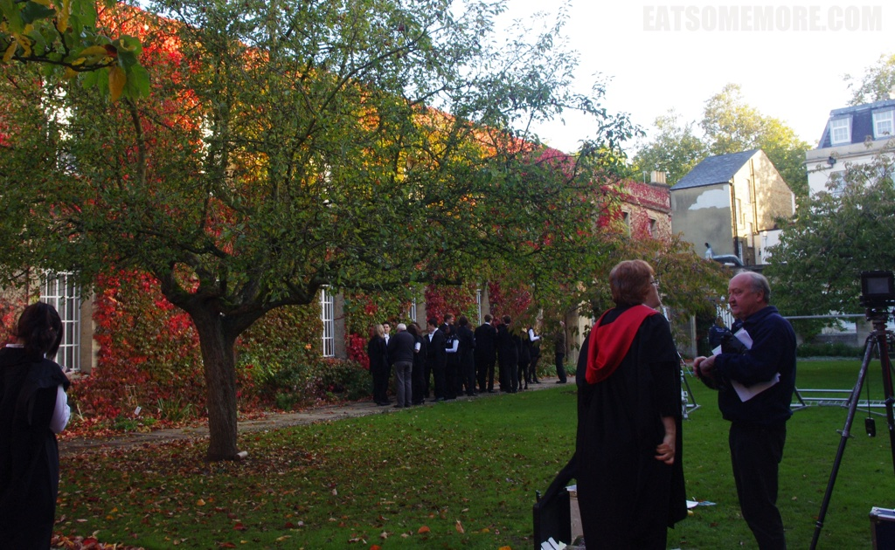

>连其间三三两两穿着校服的师生，也有些不食人间烟火的样子。

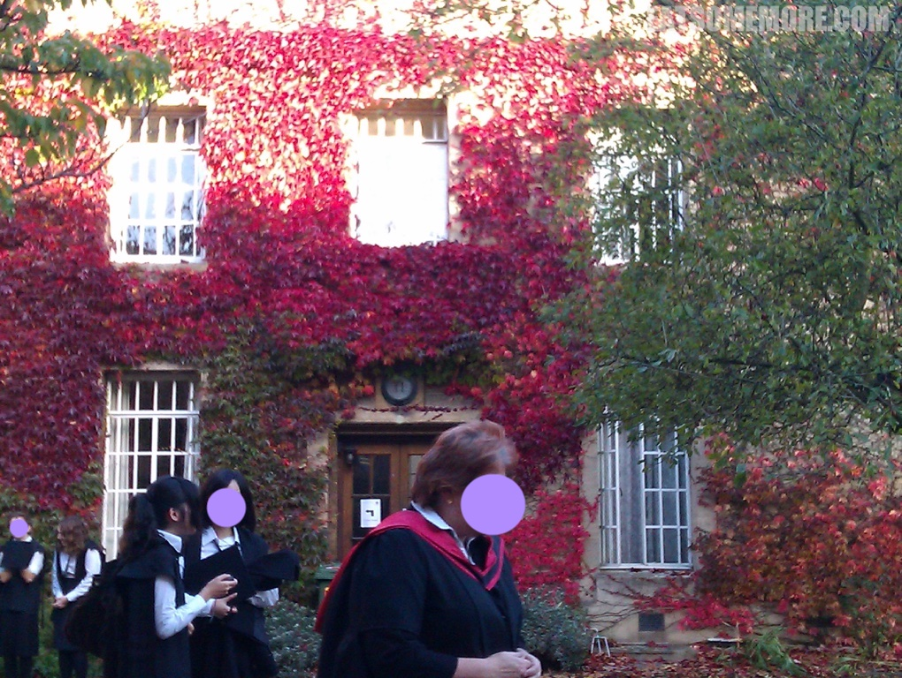

>商店的橱窗里陈列这色彩斑斓颇具英伦特色的帽子。

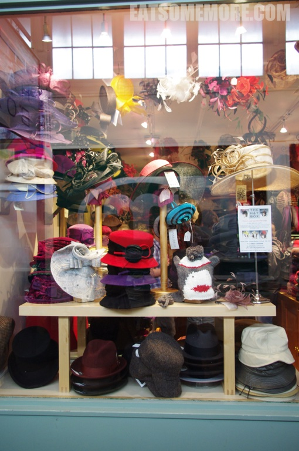

>不知名的小教堂里正在举行小型演奏会。

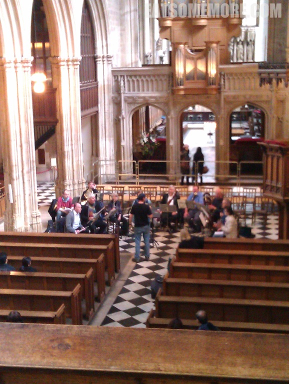

>这天下午下起了瓢泼大雨。我们只好改变计划，前去阿什莫林艺术与考古博物馆。

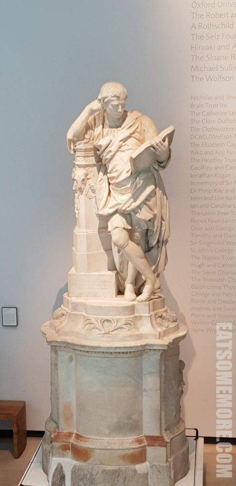

>没想到这里的藏品之众、种类之丰富，令人惊叹。

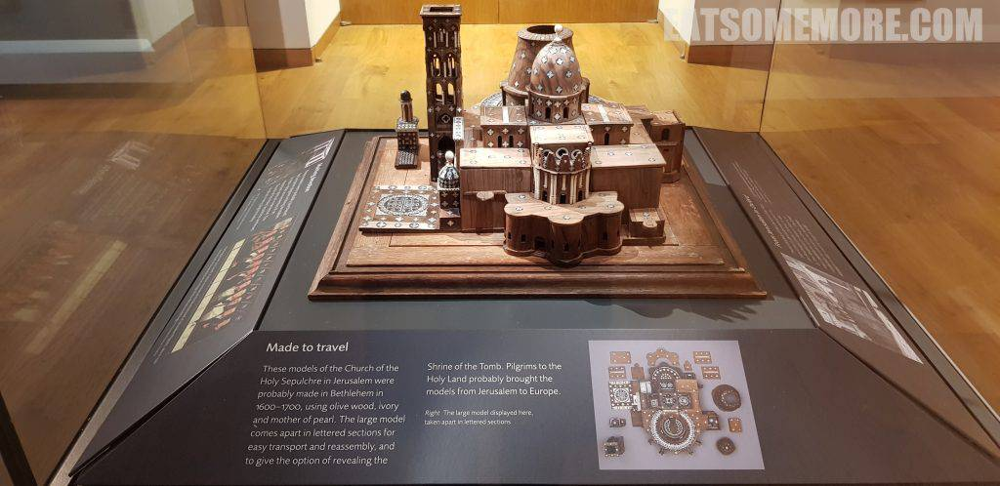

>欧洲油画和红木太师椅的混搭。

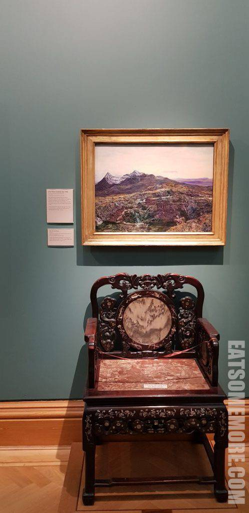

>一屋子的大中小提琴。

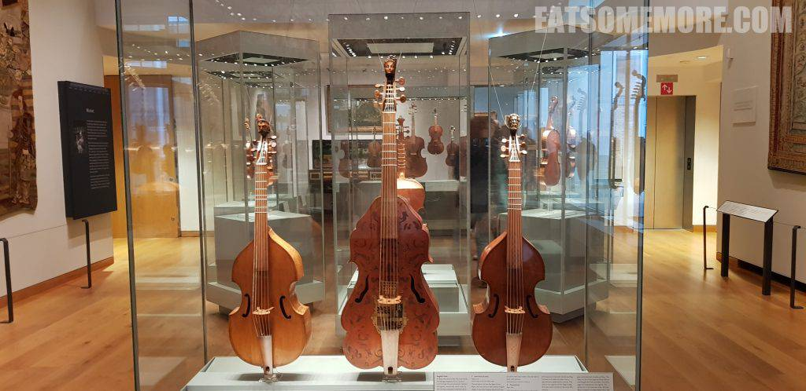

>有些琴的造型竟有点形似琵琶，大开眼界。

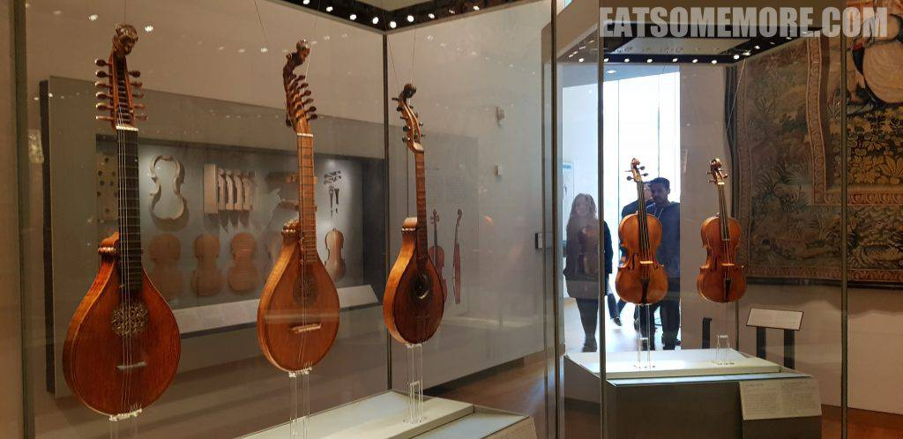

>来自亚洲和欧洲的瓷器更加是玲琅满目。

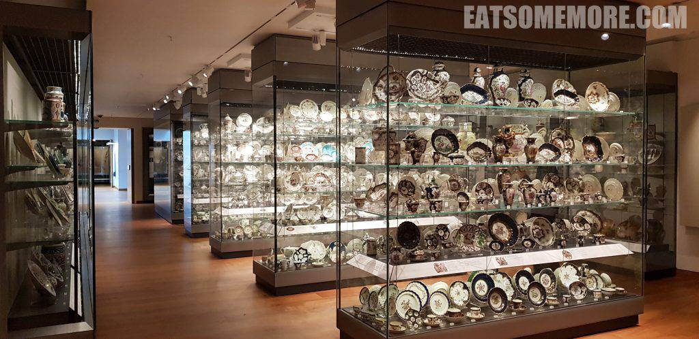

>还学到了唐代诗人陆龟蒙的《秘色越器》，“九秋风露越窑开，夺得千峰翠色来”。

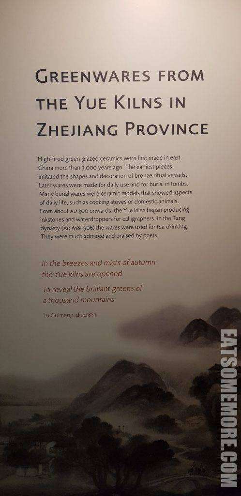

>说的就是这些越窑瓷器。下雨让人涨知识了呢！

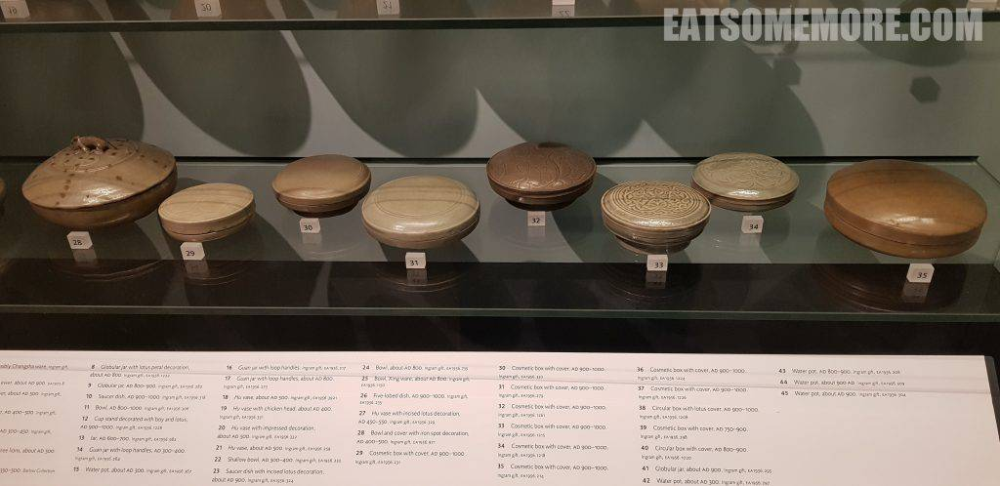
