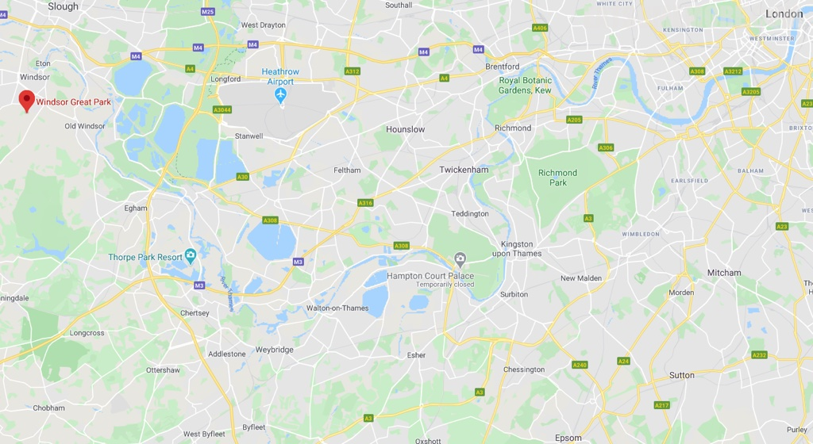

>。

>。

>。

>。

>。

>。

>。

>这天下午下起了瓢泼大雨。我们只好改变计划，前去位于牛津的阿什莫林艺术与考古博物馆。

>没想到这里的藏品之众、种类之丰富，令人惊叹。

欧洲油画和红木太师椅的混搭。

一屋子的大中小提琴。

有些琴的造型竟有点形似琵琶，大开眼界。

来自亚洲和欧洲的瓷器更加是玲琅满目。

还学到了唐代诗人陆龟蒙的《秘色越器》，“九秋风露越窑开，夺得千峰翠色来”。

说的就是这些越窑瓷器。

网站：[https://www.windsorgreatpark.co.uk/](https://www.windsorgreatpark.co.uk/)

