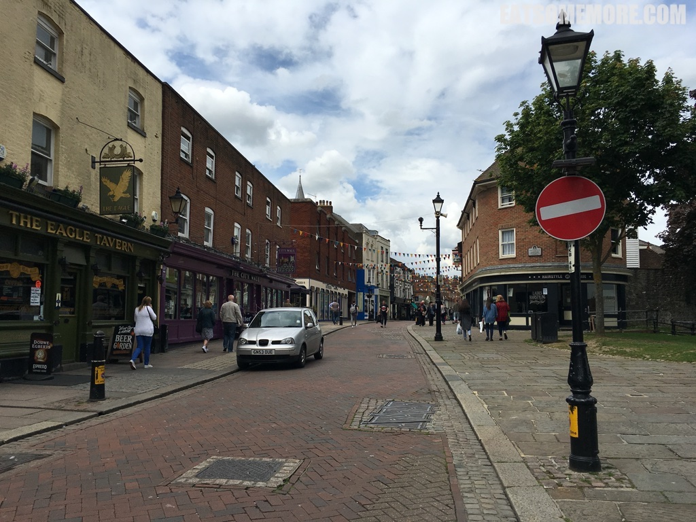
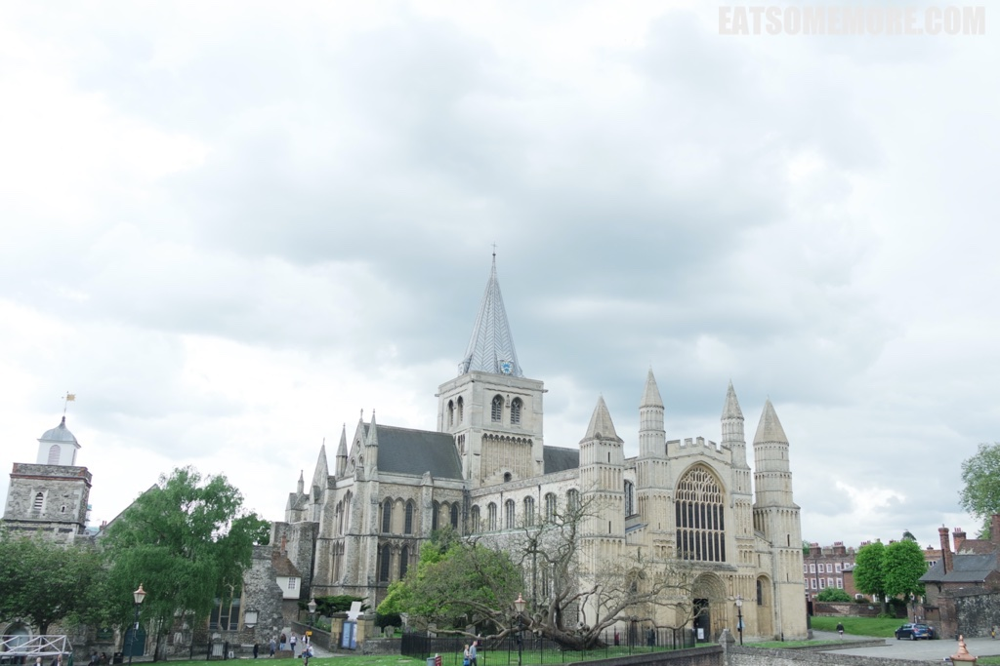
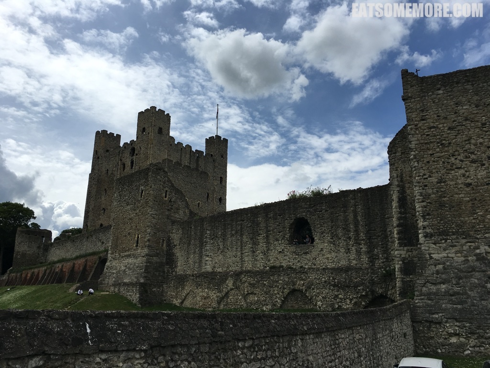
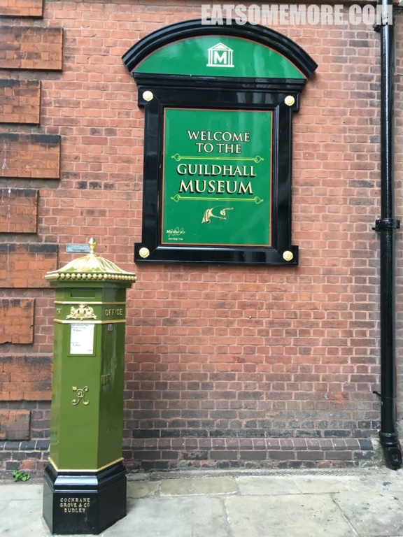
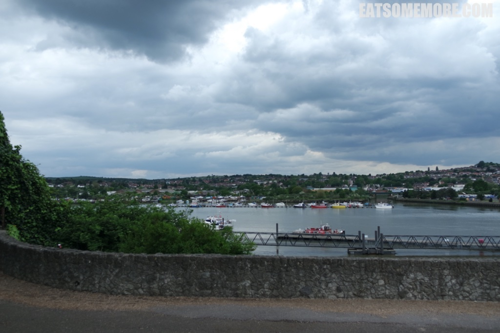

>肯特郡梅德威河东岸有个可爱的小镇，罗彻斯特。

>火车站外很随机地拜访了一架钢琴，上面写着“弹我”。

>一出火车站，就能看见罗彻斯特座堂，是英格兰仅次于坎特伯里座堂的主教座堂。这座诺曼式教堂，也是英国的一级保护建筑。

>罗彻斯特城堡是英格兰最古老地城堡之一，可以追溯到罗马时期在这里地要塞。这座罗马风格城堡的主要建筑师也曾负责伦敦塔的修建工作。如今，它是英国保存最完整的中世纪城堡遗址之一。

>市政厅博物馆由两部分组成，可爱又热闹。其一是关于罗彻斯特的考古发现；其二是关于狄更斯时代的生活方式。在博物馆的门口，我第一次在英国见到了绿色的邮筒。

>再往前就到达了横跨梅德威河的罗彻斯特大桥。

>看着河湾里停泊的各色船只，任河风拂过面颊，心都宁静了下来。

