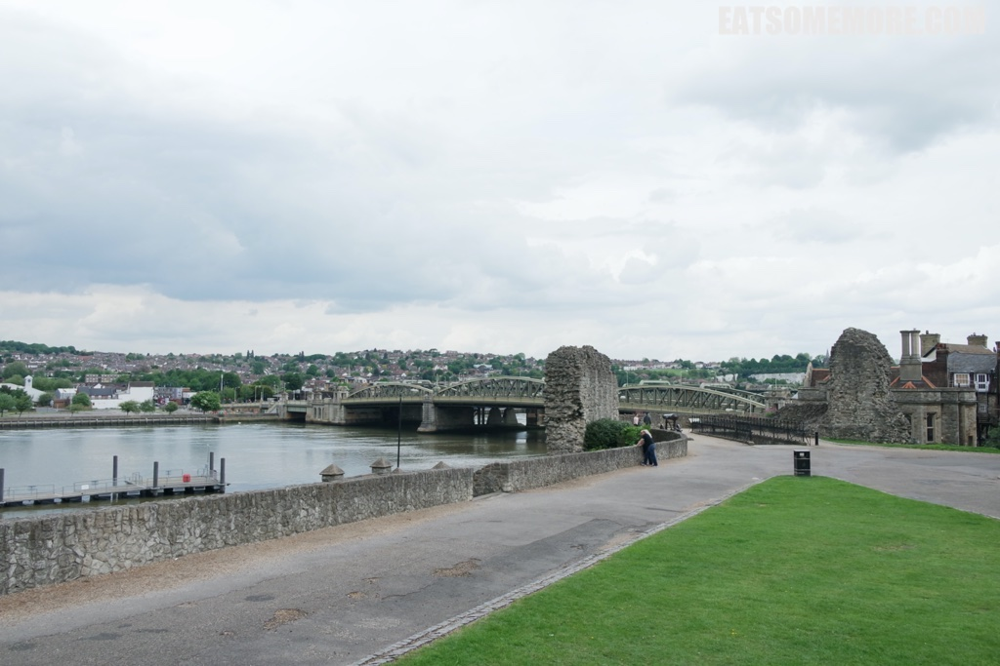

>

>

>A well preserved castle by river - It is a well preserved castle by river and good view point to the cathedral a driver bank. 200 stairs to the top of the castle.

>Lovely and lively museum - The museum is consist of two parts. One is about the archeological discoveries in Rochester. The other is about life style in Rochester during Charles Dickens times.

>

>

>

