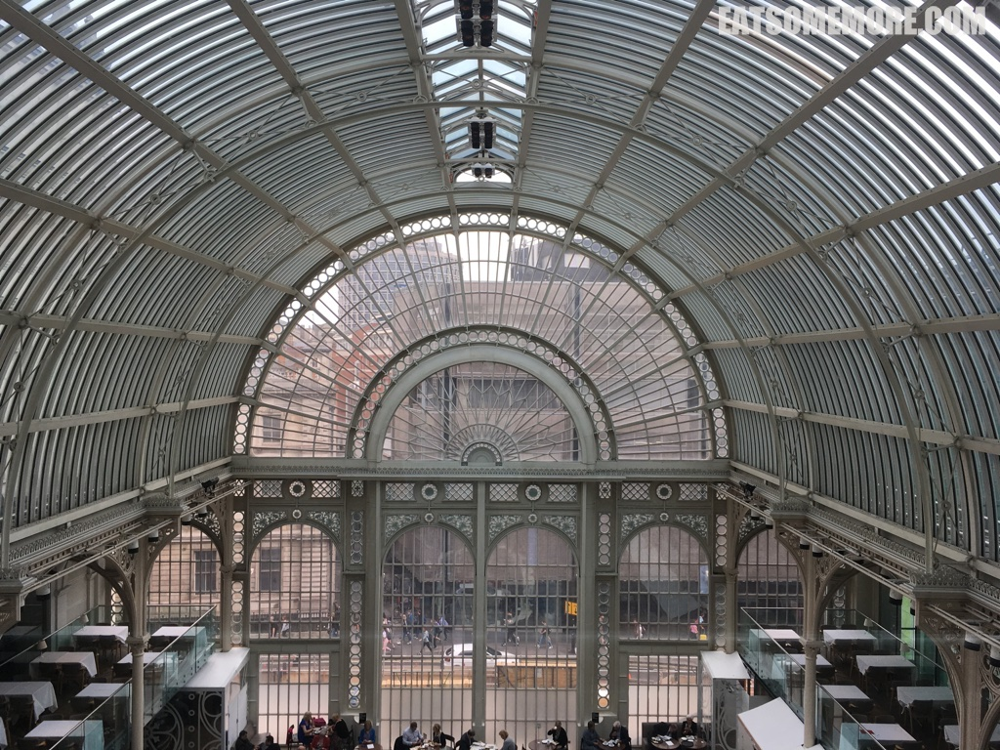
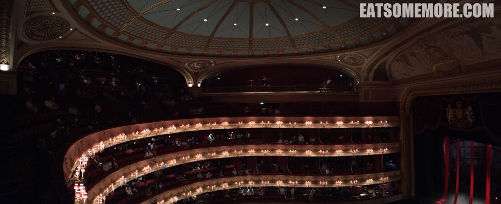
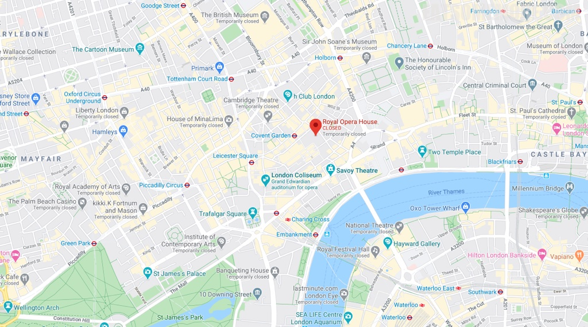

>根据维基百科，皇家歌剧院(Royal Opera House)是英国皇家歌剧团、英国皇家芭蕾舞团和皇家歌剧院管弦乐团的表演主场，位于伦敦西区人气爆棚的科文特花园市场，一年四季都有各种各样的歌舞剧和芭蕾舞剧。

>歌剧院的主观众席部分建于1856年，高四层，呈马蹄形状，被列为英国一级历史遗产建筑物。如果有机会，一定要来这里看一场表演！

网站：[https://www.roh.org.uk/](https://www.roh.org.uk/)

地址：Bow St, Covent Garden, London, WC2E 9DD

