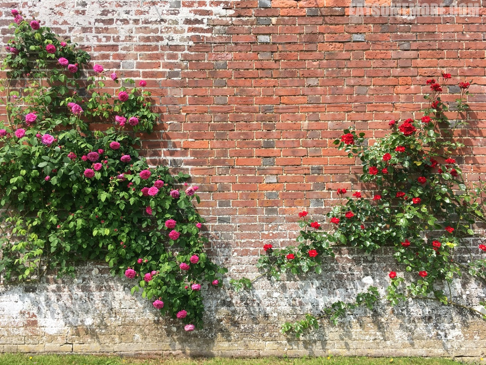
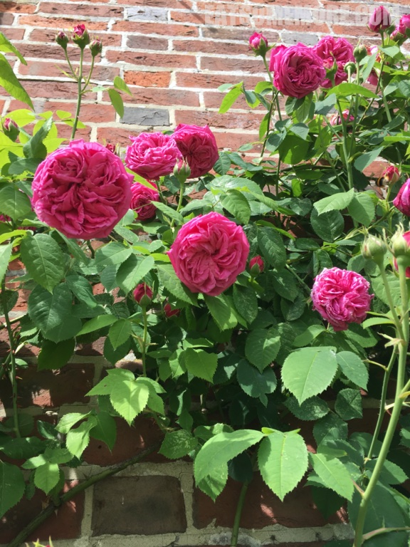
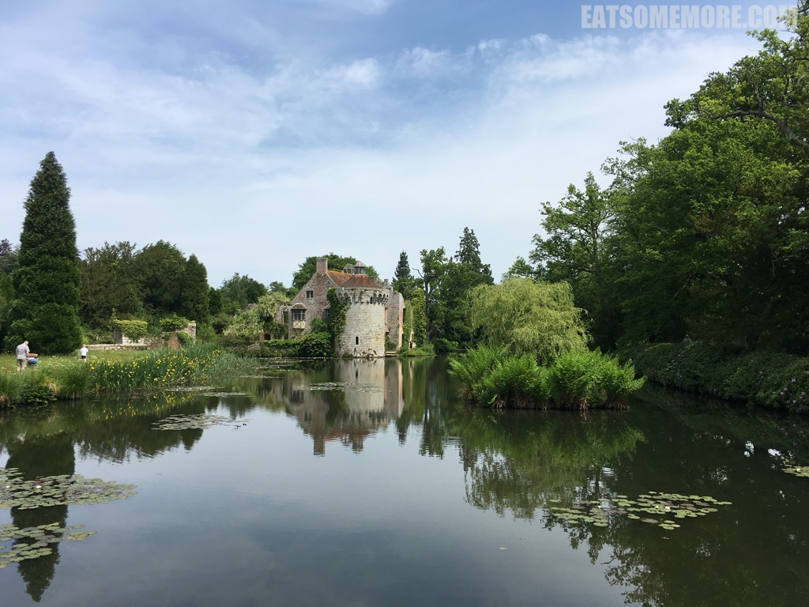
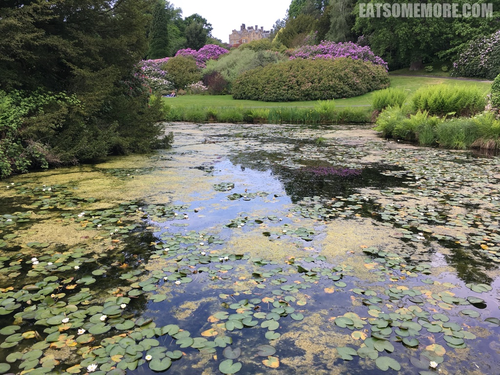
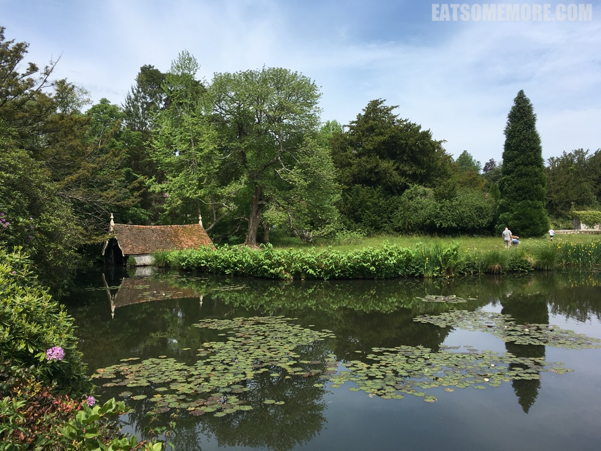
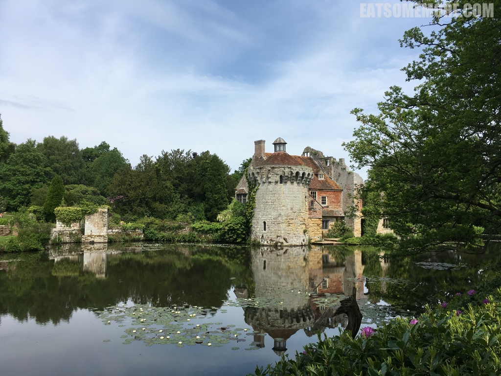
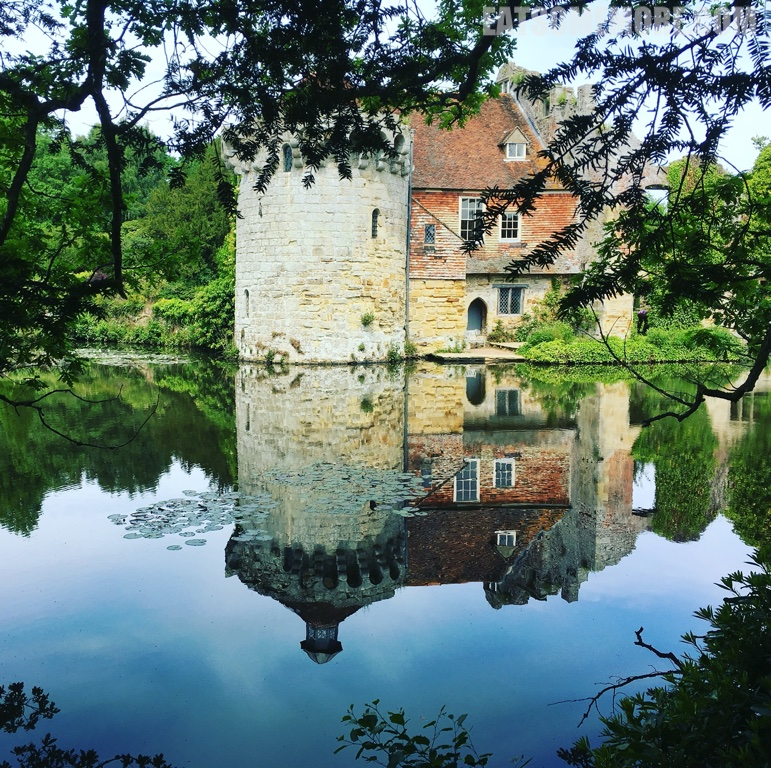
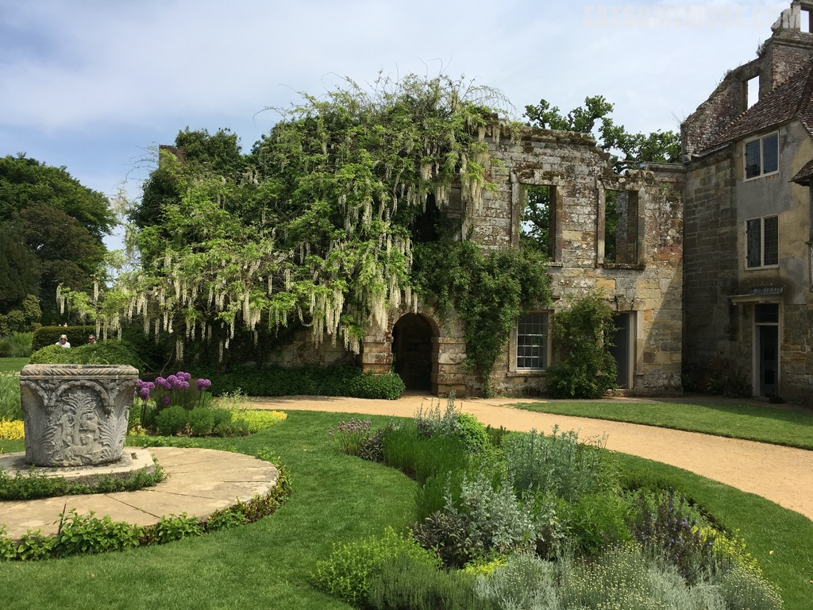
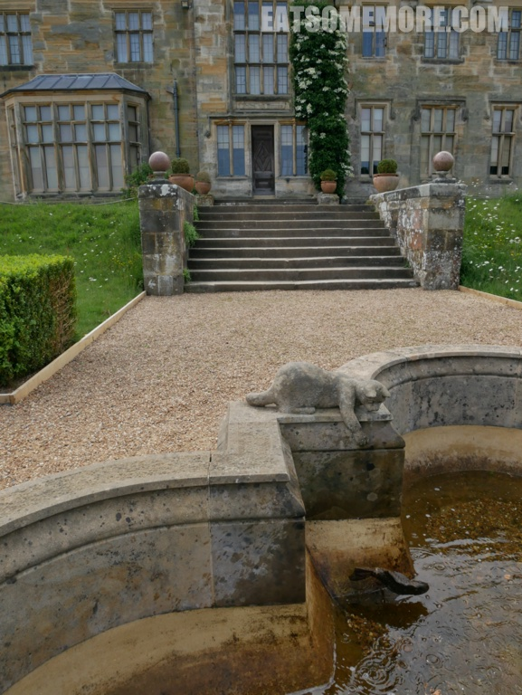
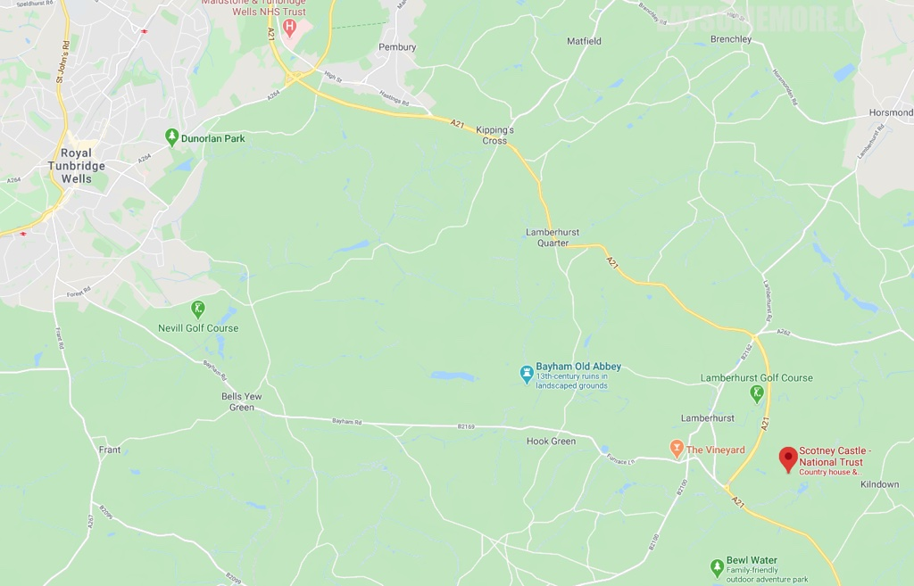

>肯特郡胡瑟家族的乡间别墅如今交由国家信托打理。五月的红色砖墙上开着姹紫嫣红的花。

>层层叠叠的花瓣之间散发着怡人的香味。

>贝尔河 (River Bewl) 边的莲池尽头可以见到这座别墅。

>水中白莲朵朵，陆上花团锦簇。

>河畔还建了船坞。

>天青气朗，风平浪静。所谓伊人，在水一方。

>绿树蓝天和灰石红砖在莲池的投影，可谓风华绝代。

>别墅有些残破的敌方，却和附近的植被无缝地衔接了起来。

>别墅的另一边有一个小池塘，池塘里有一条石鱼，池塘边有一只探头探脑的石猫。这样的巧思也太可爱了吧！

网站：[https://www.nationaltrust.org.uk/scotney-castle](https://www.nationaltrust.org.uk/scotney-castle)

地址：Lamberhurst, Tunbridge Wells, Kent, TN3 8JB

