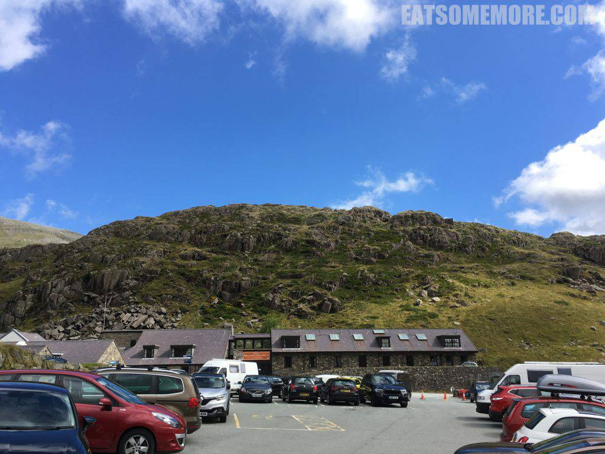
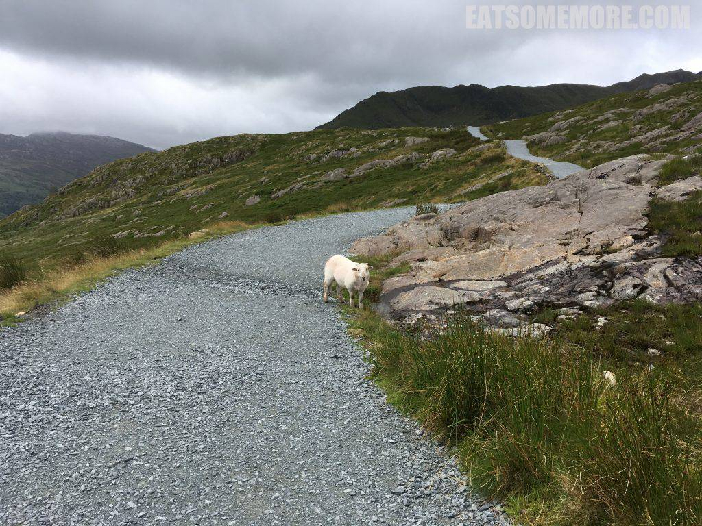
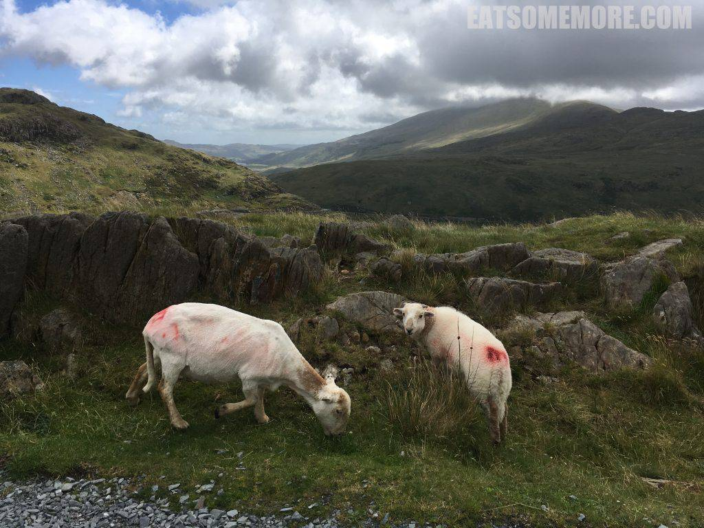
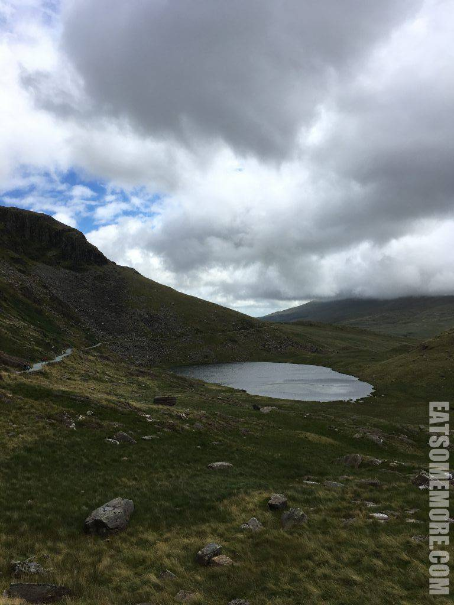
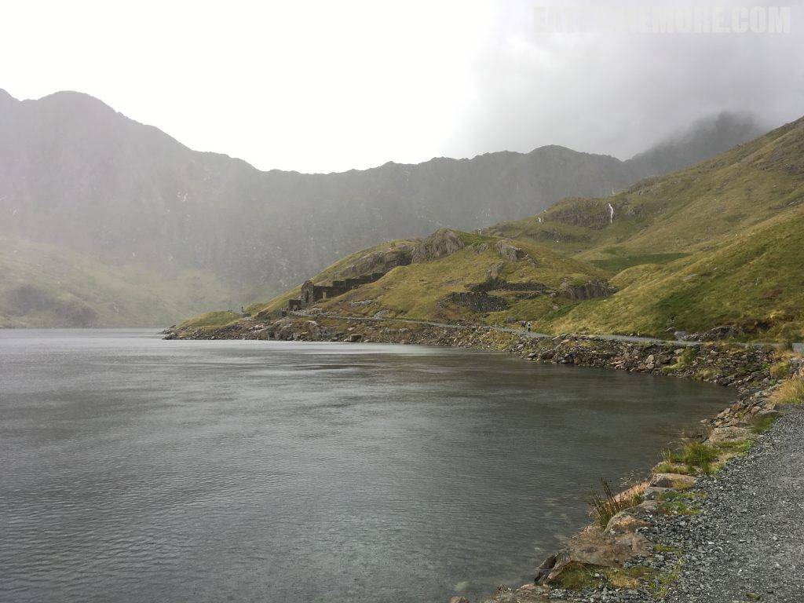

>雪窦尼亚是威尔士最大的国家公园，占地823平方英里，地形地貌多样，不仅有英格兰和威尔士境内最高的山峰，还有威尔士最大的天然湖泊，是健行爱好者的乐园。国家公园内的矿工路线属中等难度，全场12公里，海拔761米，预计须时4-5小时。

>不同于刚出发时的蓝天白云，才走了不多久天就阴了下来。长着犄角的小羊泰然自若地站在蜿蜒的山路边，看着我们这些外来人。

>再往前走，又见到一头刚剪了羊毛的大羊带着小羊在路边吃草。

>风起云聚皱碧池。

>山谷里湖水旁出现了一些废墟。不禁想象过去的人住在这样的环境里该是过着神仙似的生活吧！只是此时大雨倾盆。尽管我还想再往前探索发现一番，但迫于天气终究未能如愿。

网站：[https://www.snowdonia.gov.wales/](https://www.snowdonia.gov.wales/)

地址：Penrhyndeudraeth, Gwynedd, LL48 6LF

