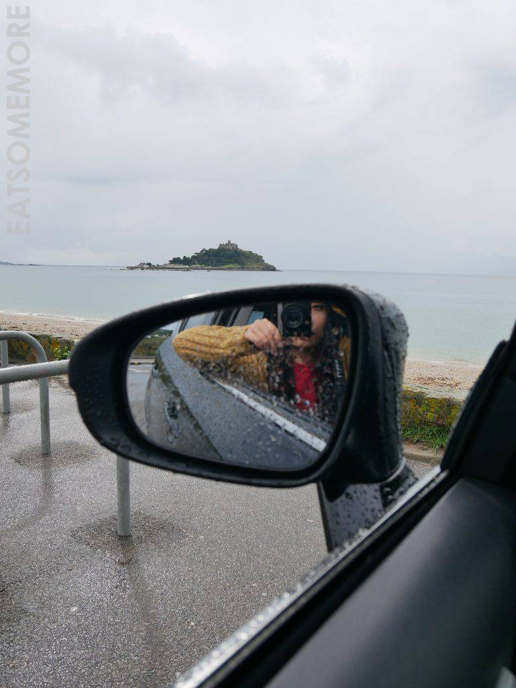
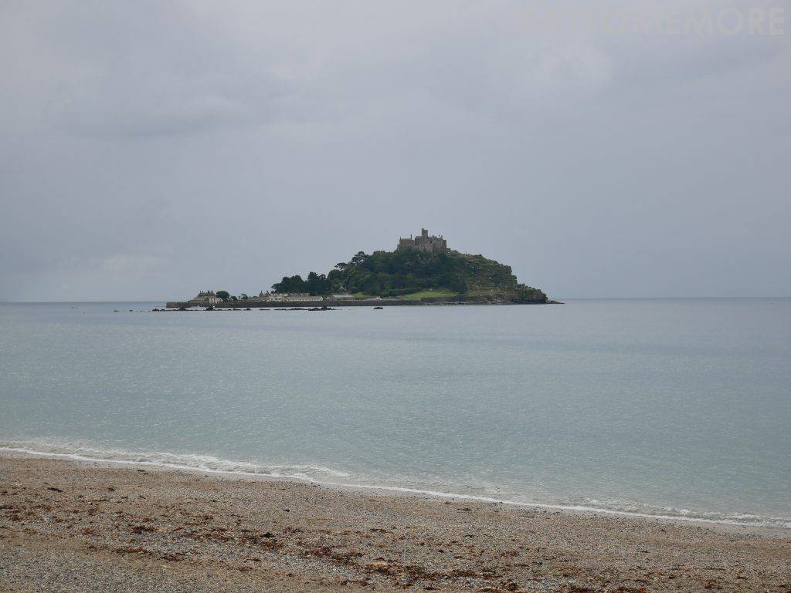
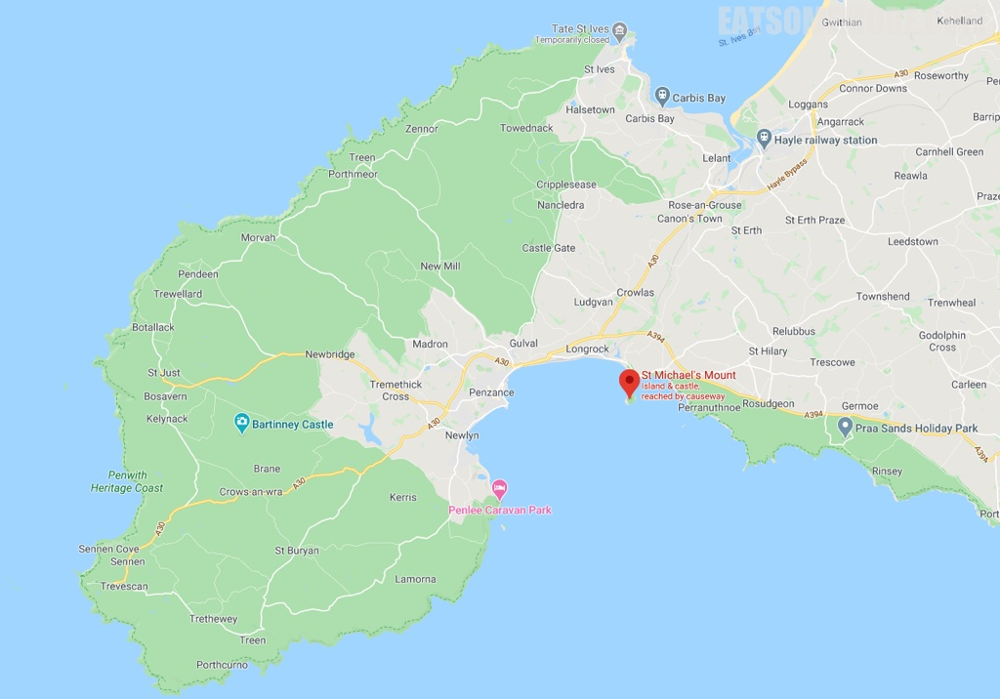

>1066年诺曼人入侵英格兰时，来自诺曼底圣米歇尔山的修道士来到这里，并开始修建教堂及修道院。

>平时游客可以从步道进入圣迈克儿山，涨潮时则需要坐船。城作山时山亦城，潮起为岛落还陆。

网站：[https://www.stmichaelsmount.co.uk/](https://www.stmichaelsmount.co.uk/)

地址：Marazion, Cornwall TR17 OHS

