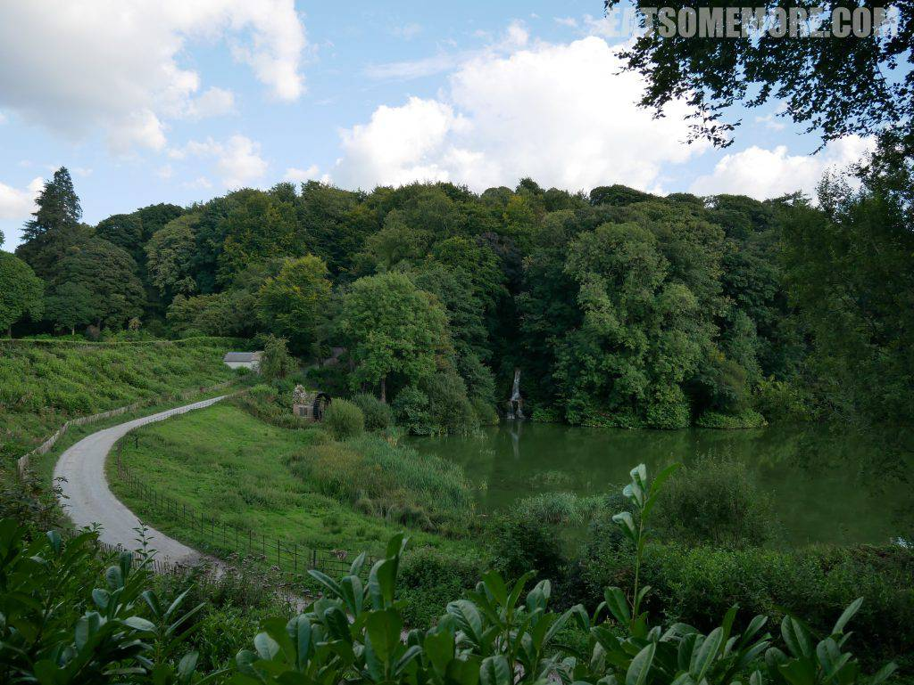
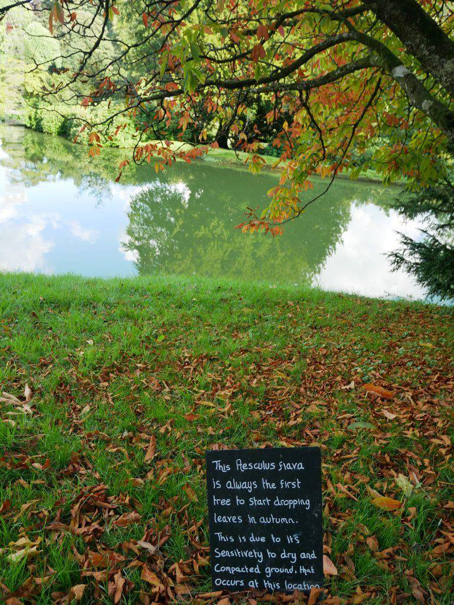
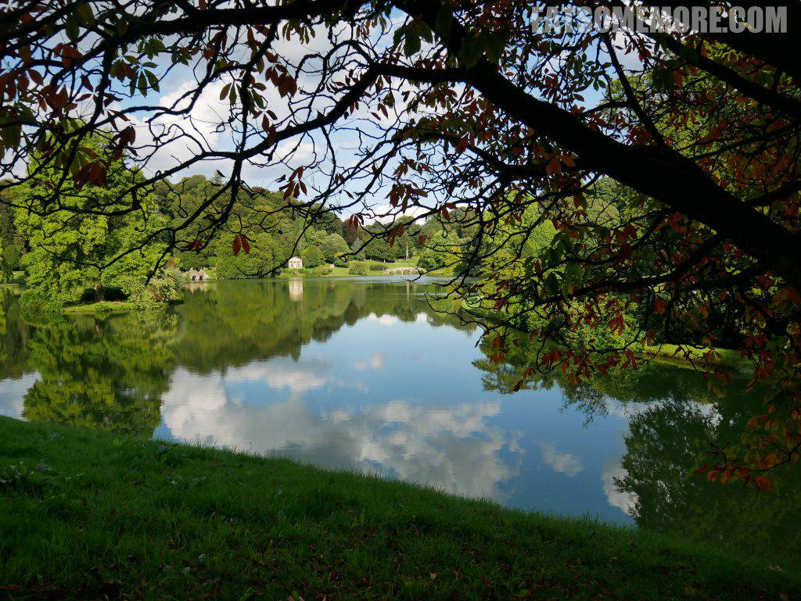
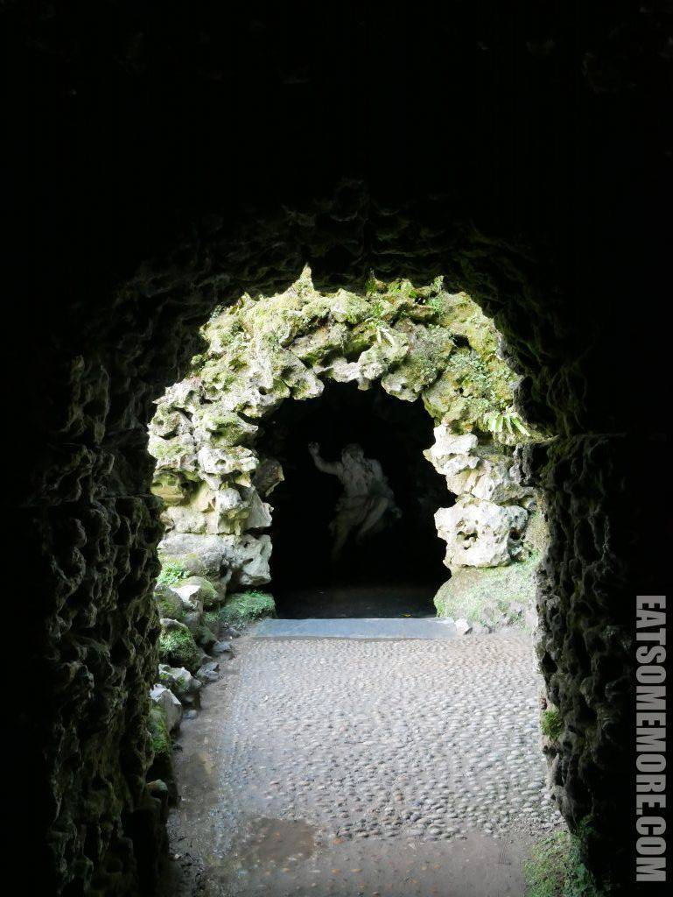
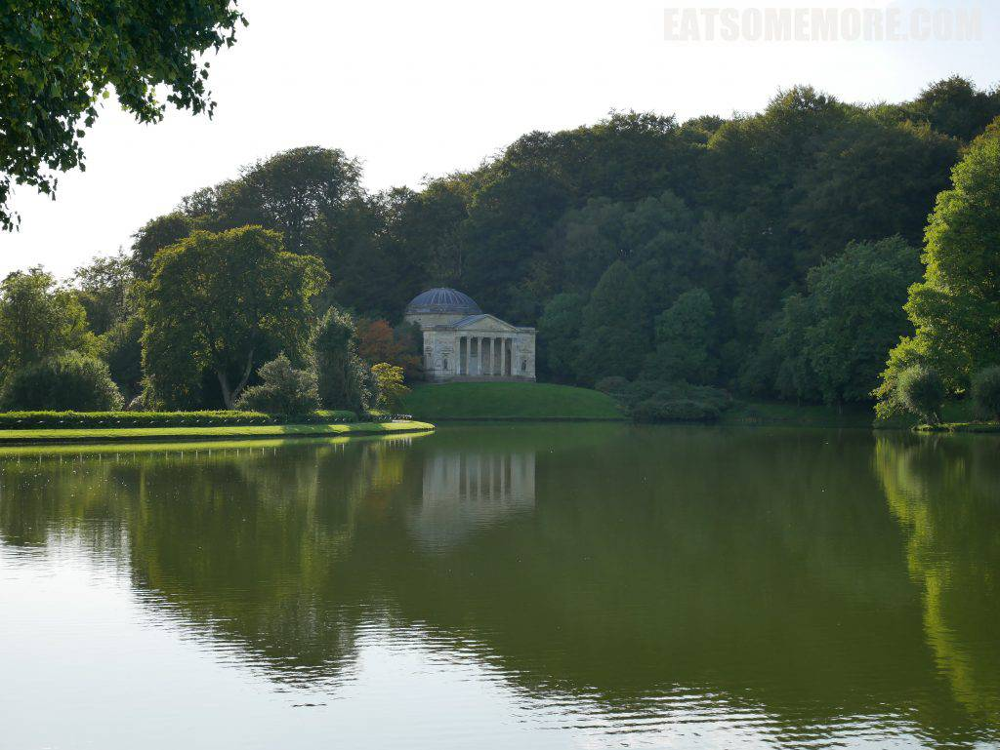
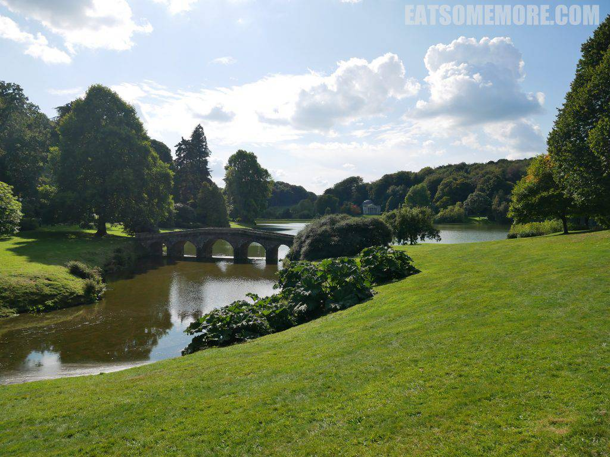
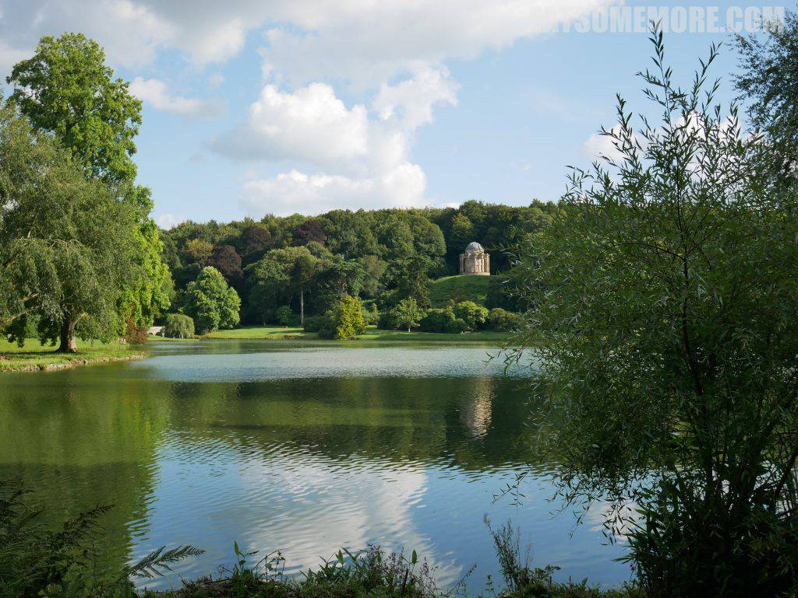
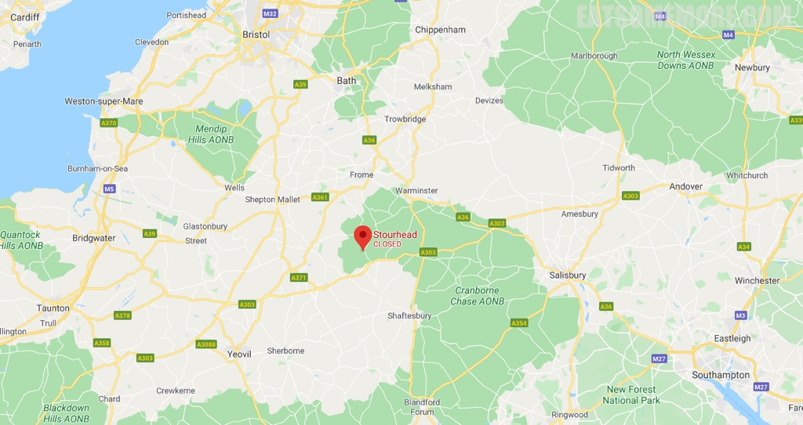

>偶然之间在网上见到斯陶头庄园中阿波罗神殿的照片，觉得好漂亮，这才一路找去。小镇坐落于斯陶河谷，庄园外的小水车和小瀑布有种与众不同的静谧感觉。

#### 布里斯托碑 (The Bristol Cross)

>花园入口处的纪念碑原本在布里斯托，庄园主人用了六辆牛车才将其运回花园。石碑上精妙地雕刻着中世纪的英国国王们。

>八月尾的时节，庄园湖畔七叶树的叶子已经开始转红凋落。据说这是由于七叶树对于土壤的干燥和密度特别敏感的原因。

#### 花之神殿 (The Temple of Flora)

>透过七叶树可以望见湖对岸的花之神殿。

>这是花园里的第一座建筑，为罗马的春天与花卉女神所建。临湖处的托斯卡多立克石柱，尽显古典设计风格。

>门厅上方写着“粗人勿入”。然而那时的庄园主人可能没有想过在将近三百年后的社会当中，粗人是不具备拉丁文技能的。

#### 岩穴 (The Grotto)

>岩穴多见于意大利文艺复兴时期的花园，作为夏日避暑的场所。

>透过岩穴引入眼帘的湖光园景，同中国园林当中的借景手法有异曲同工之妙。

#### 万神殿 (The Pantheon)

>这是花园当中最大的建筑，灵感来自于罗马的万神殿。殿内有多座雕像，包括一尊大理石雕的海格力斯像，希腊神话中最伟大的英雄。

#### 五孔桥 (The Palladian Bridge)

>花园里的另一菲林杀手就是这座五孔石桥，灵感源于十六世纪文艺复兴建筑大师Palladio的设计风格，让人工湖看起来有了动感，更加自然，堪称点睛之笔。

#### 阿波罗神殿 (The Temple of Apollo)

>英国建筑师威廉钱伯 (William Chamber) 在著名的邱园建有圆形的太阳神殿。斯陶头庄园的建筑师亨利费列克罗夫 (Henry Flitcroft) 是汉普顿行宫一名园丁的儿子，他在建筑方面很有天赋，希望建一座比邱园更好的太阳神殿，于是就有了这座背山面水、几乎美得不真实的阿波罗太阳神殿。

>从古典的神殿、中世纪的纪念碑、温馨的茅屋直到具有现代技术的冰块储藏室，这座花园无疑令人大开眼界。用庄园主人自己的话来说，这是工业发展的成果。

网站：https://www.nationaltrust.org.uk/stourhead

地址：near Mere, Wiltshire, BA12 6QD

