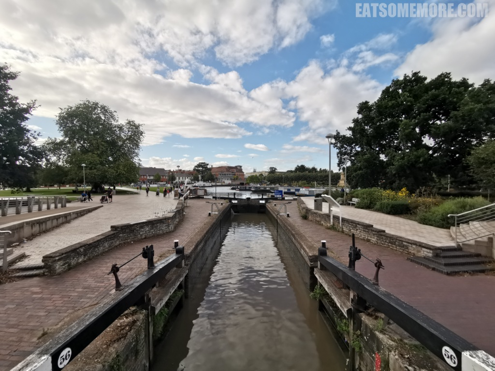
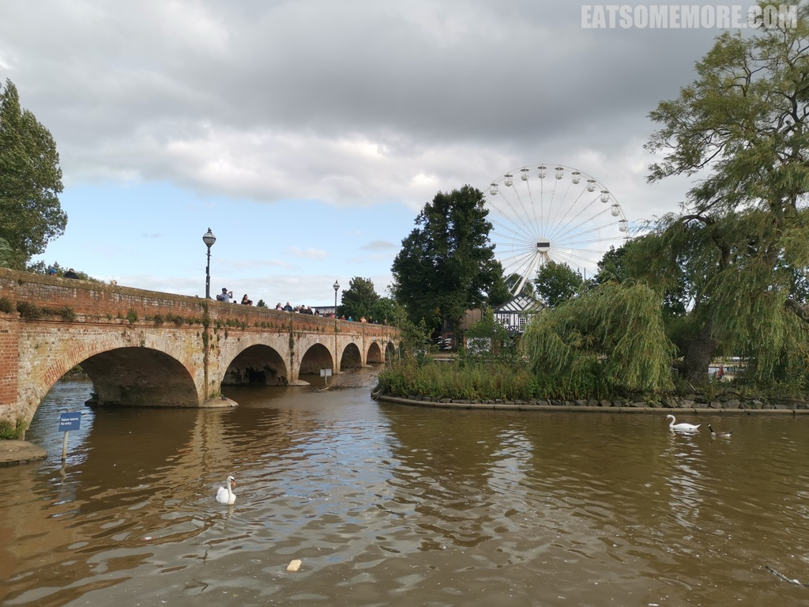
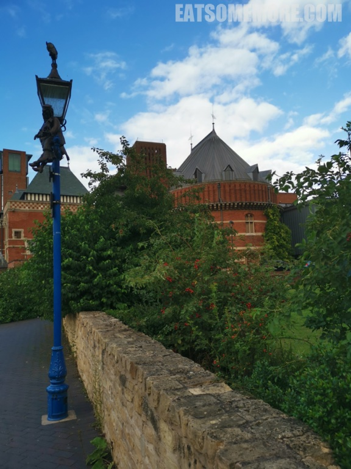

>雅芳河畔斯特拉特福水道纵横，更以莎士比亚故乡之名而蜚声于世。

>河面上横卧着建于1490年初的克洛普敦砖桥，连接着镇中心和游乐场。

>沿着莎士比亚剧院红砖建筑边的木栈道散步，红色的太阳伞与绿树相映成趣，蓝色的船停泊在缓缓转动的摩天轮下。

>蓝色的天倒映在雅芳河里，七彩的游乐设施掩映在绿色的树林当中。

>莎士比亚剧院原来的建筑在1926年的大火中被焚毁，但是其紧邻的天鹅剧院则幸免于难，保留了原来的维多利亚风格。

网站：[https://www.visitstratforduponavon.co.uk/](https://www.visitstratforduponavon.co.uk/)
