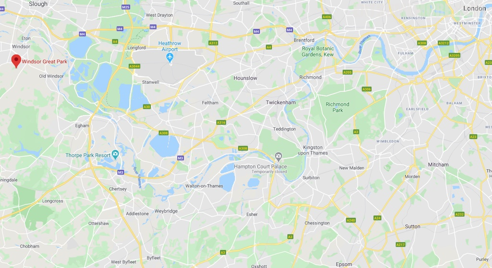

>温莎镇以南有一座占地两千公顷的皇家园林温莎大公园。

>这里曾长期作为温莎堡的狩猎场。

>八月尾声，孟夏之际，公园的树林已经染上了一抹秋的火红色彩，迎风摇曳。

>湖边的树木上停了许多白色的水鸟。

>温莎大公园的景观种类十分多样。公园的东部还有一个巨大的莲池。池中有粉色、桃色、白色和黄色的莲花。

>当时正是莲花盛开的季节。

>如果莫奈来过这里，他一定能教这美景跃然纸上。

>莲叶何田田，“鸭”戏莲叶间。

>莲池的另一头，有一座小凉亭。

>从亭里观赏莲池，又是另一番风味。

网站：[https://www.windsorgreatpark.co.uk/](https://www.windsorgreatpark.co.uk/)

