>天朗气清的一天，要去参观世界上最大、最古老的有人居住的城堡，温莎堡。公元十一世纪，征服者威廉一世成为英格兰国王后，开始修建温莎城堡。至今，已经有包括现任英国女王伊丽莎白二世在内的39个王朝居住在这里。

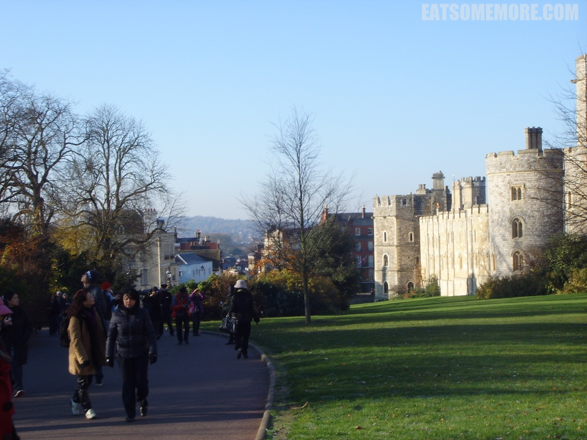

>说到伊丽莎白女王，其王室前身为萨克森科堡哥达王朝。这个德国姓氏在第一次世界大战后，在英国的处境变得尴尬。于是当时的英国国王乔治五世，即当今英国女王的祖父，决定将王室的姓氏改为“温莎”，这个名称便是取自这座城堡。城堡的地标建筑就是人造山丘上的圆塔，将城堡分割为上下两个区。

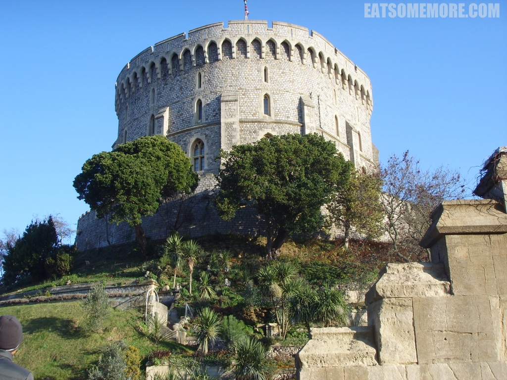

>上区包括皇家私人套房与国家外交大厅，包括圣乔治大厅。

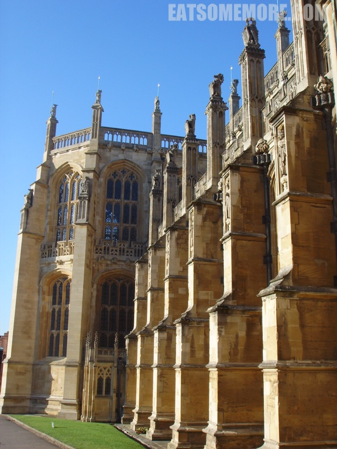

>约克王朝的第一位国王爱德华四世建造的哥特式建筑圣乔治教堂位于下区，呈马蹄形状。

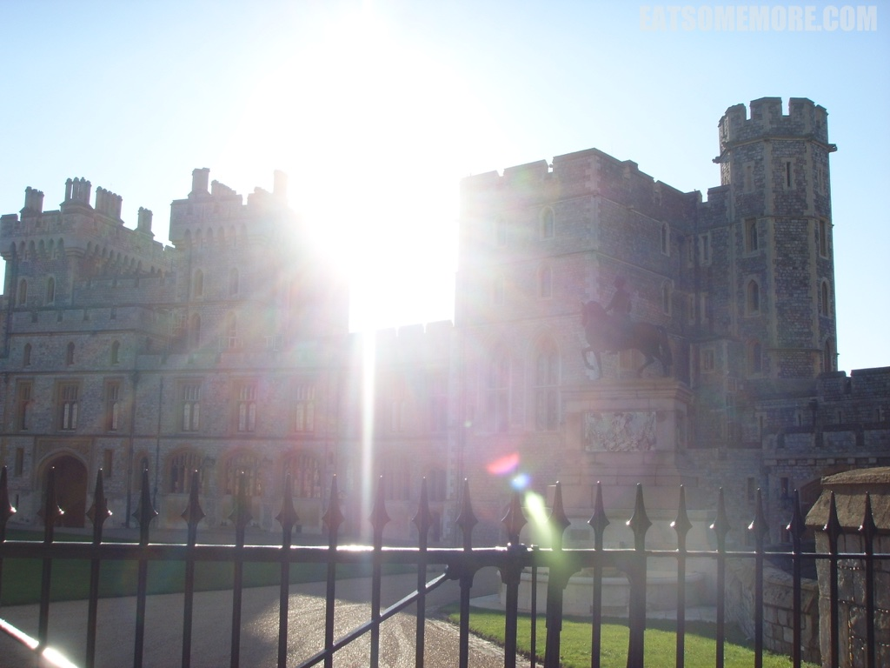

>圆塔背后的小花园有个玲珑喷泉。

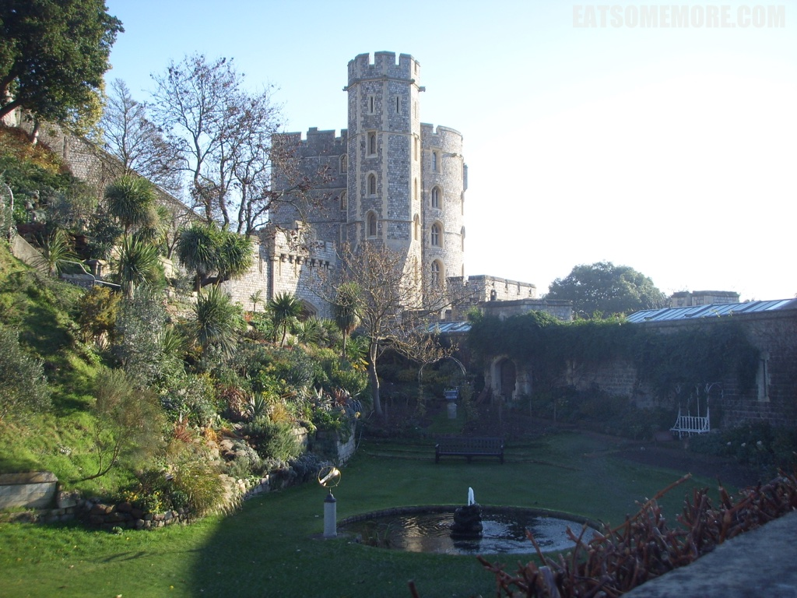

>十分幸运地遇上了皇家卫队换岗。

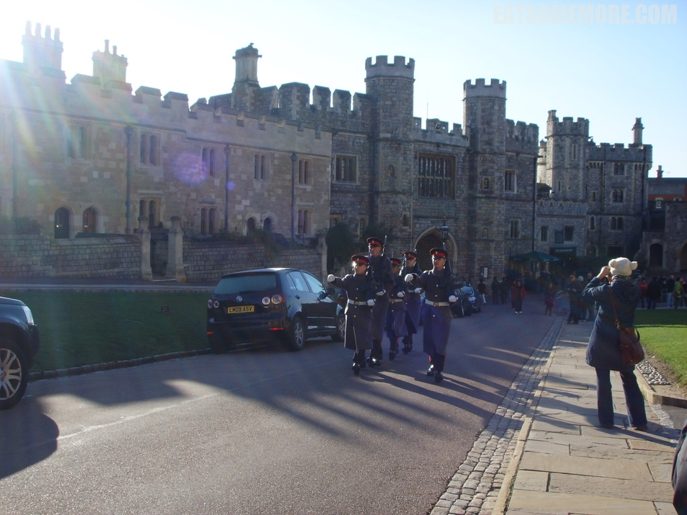

>从温莎堡居高望去，一马平川。

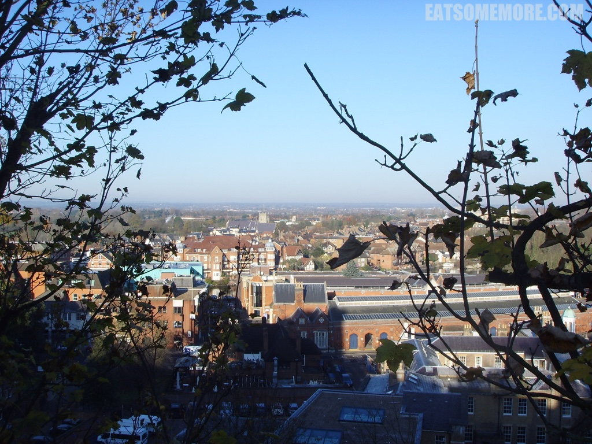

>除了城堡，温莎轮渡码头提供缓慢悠闲的游船活动。伦敦以西水系丰富，泰晤士河蜿蜒曲折穿梭在绿树青草之间。

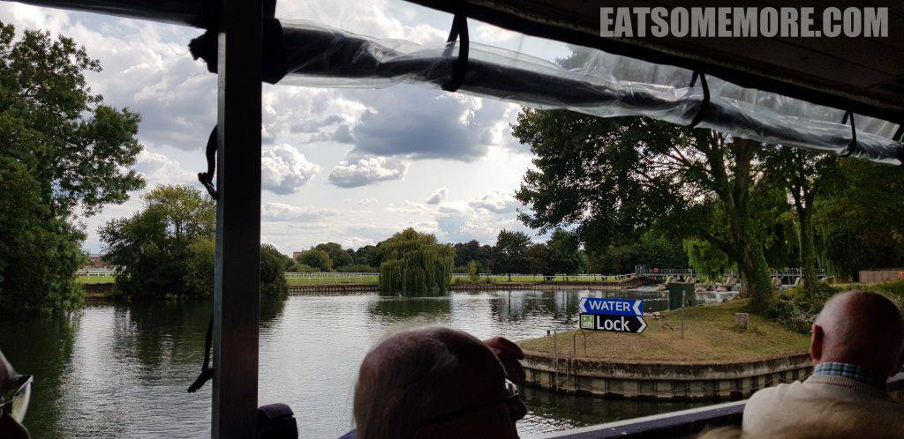

>由于河道水面有高有低，还体验了过船闸——确实非常耗时！

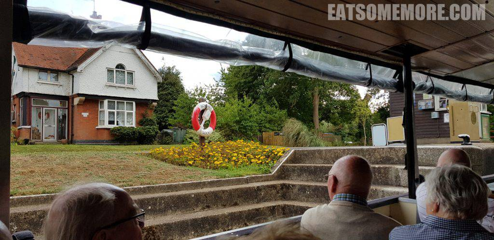

>最后在回程的途中，见到了泰晤士河上的温莎堡，是我所见过的最美的观温莎的角度。

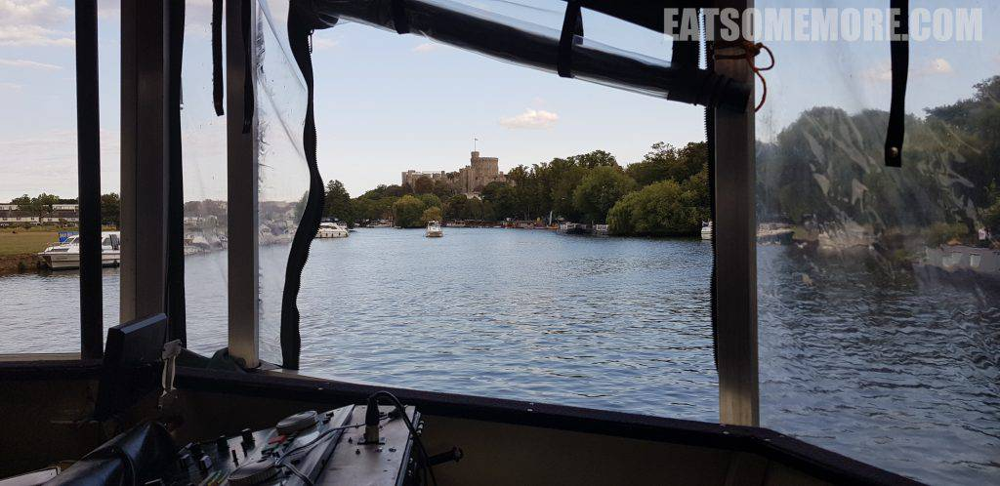

网站：[https://www.windsor.gov.uk/](https://www.windsor.gov.uk/)

地址：Windsor, Berkshire, SL4 1NJ

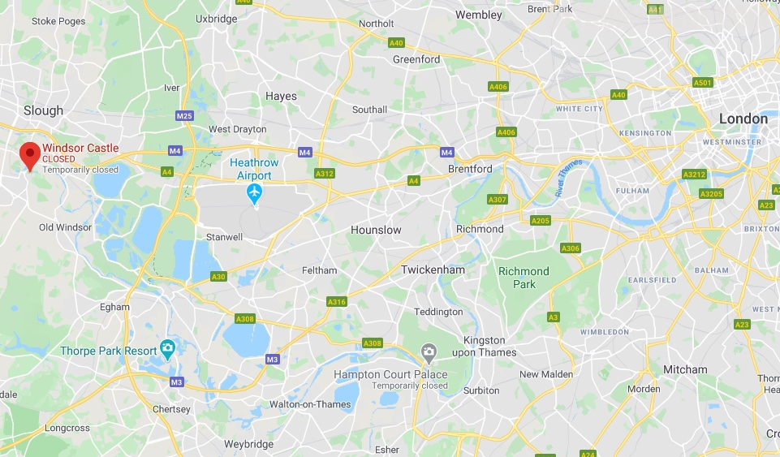