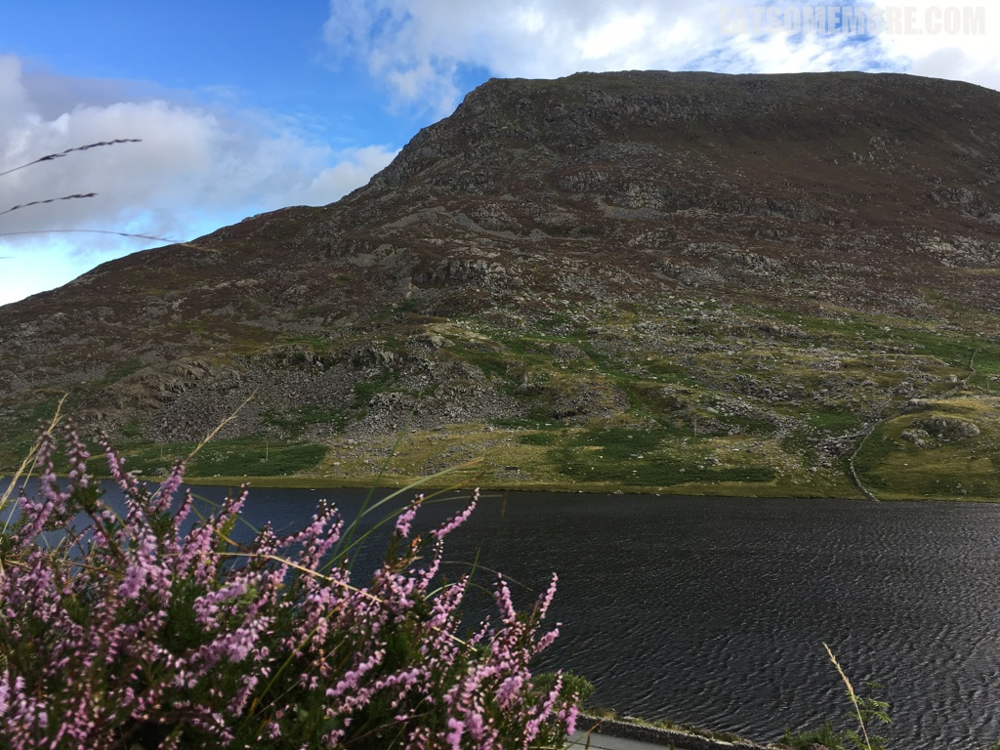
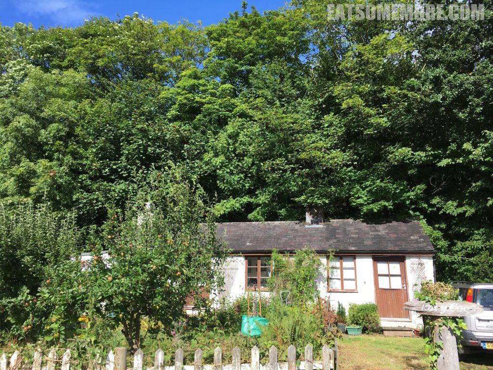
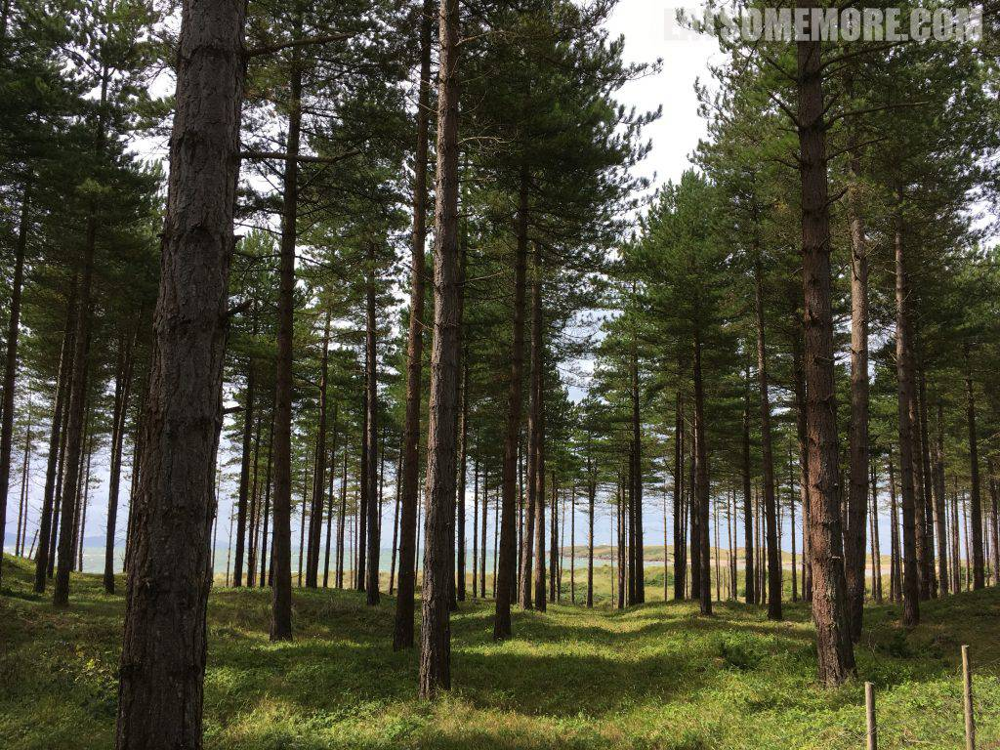
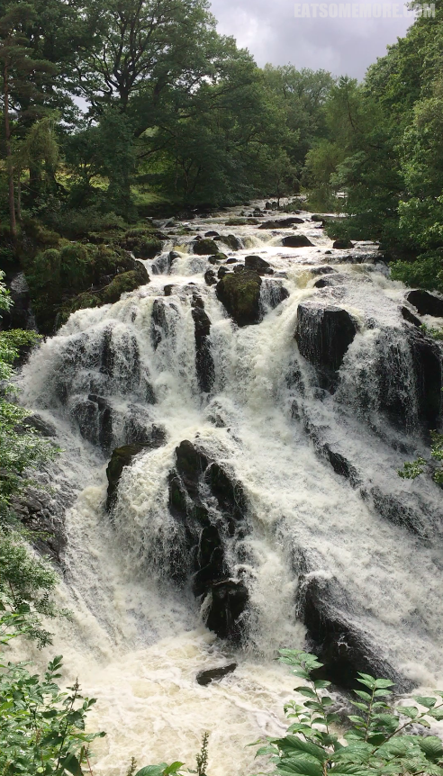
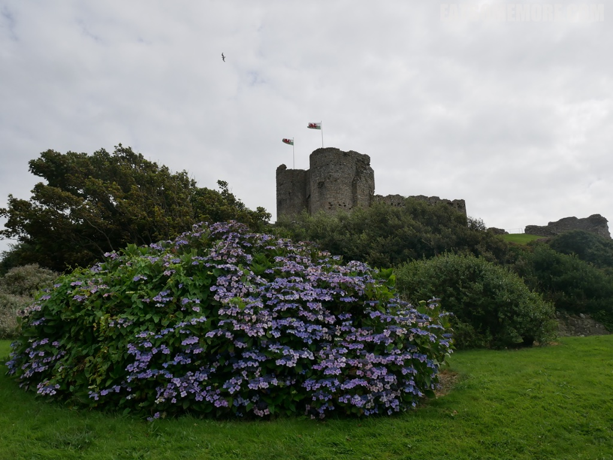
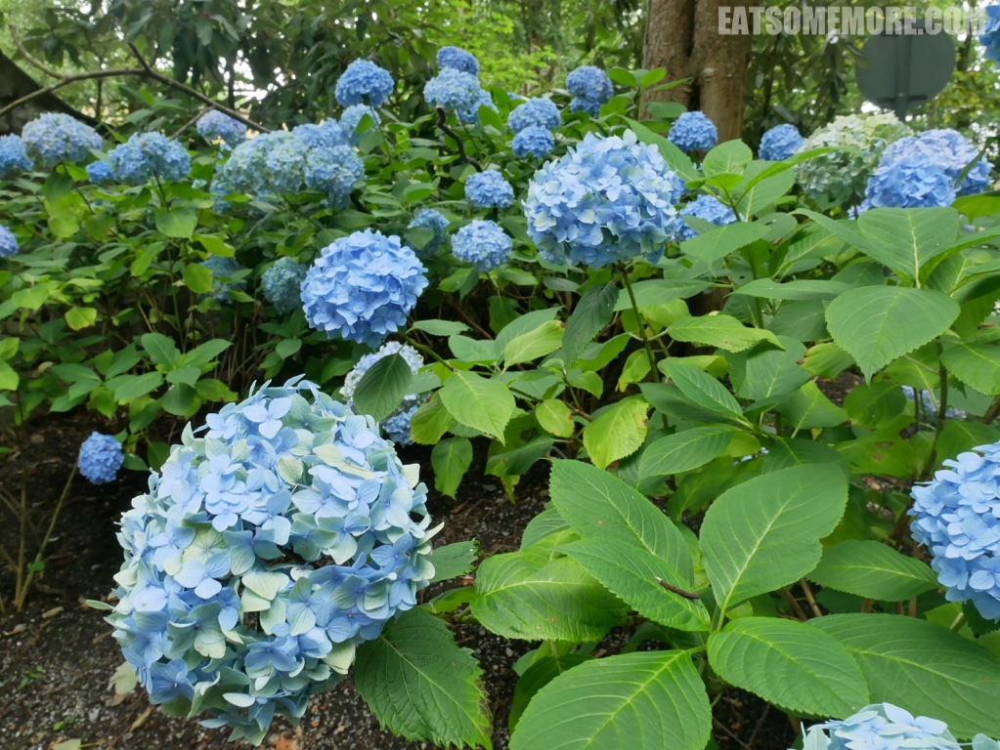
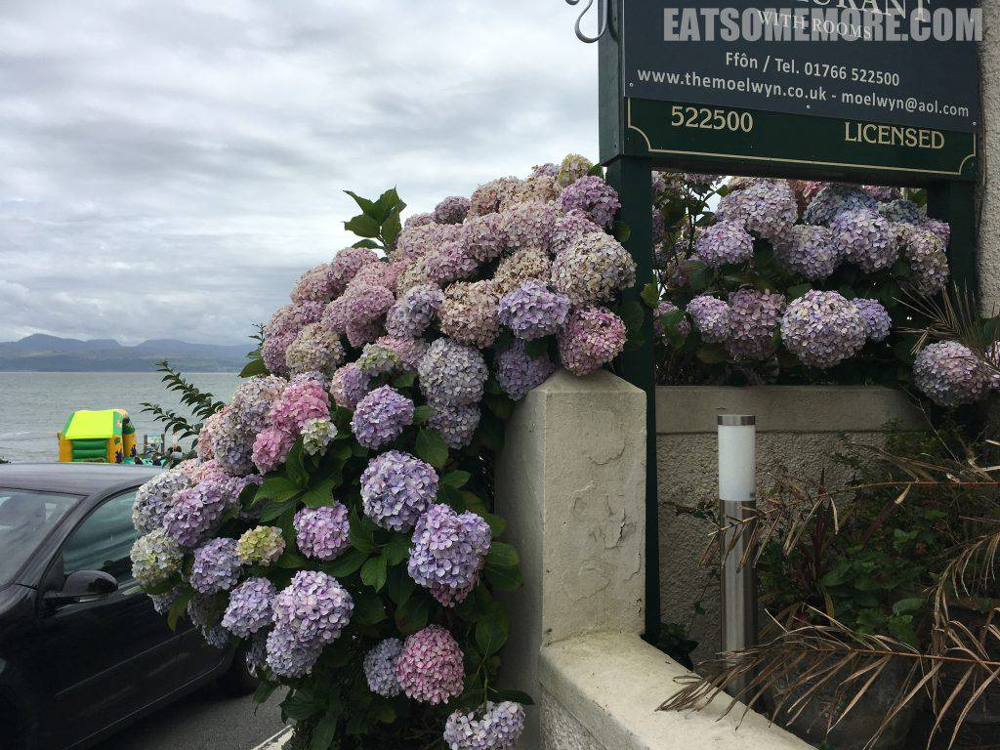

>在山那头海这边的威尔士北部有个健行爱好者的圣地，雪窦尼亚国家公园，占地广阔，地貌多样。



>骤雨初歇也可爱，艳阳当空更迷人。



>这里山脉起伏和缓，植被生机勃勃，自然环境宜人，特别有利健行。



>偶有河流湖泊，甚至是气吞万里如虎的湍急瀑布。



>山色湖光间，堡垒森森。



>繁花密林处，羊懒牛闲。



>就连海边的绣球花也开始充满诗意。
```
紫阳花丛团锦簇，咸酸五味见枝头。
不与百花争春早，偏待夏至望耕读。
```




[点击就看威尔士吃什么](/posts/categories/%E7%BE%8E%E9%A3%9F?pagetype=uk-food&tags=英国,威尔士&extags=)

[点击就看威尔士玩什么](/posts/categories/攻略?pagetype=uk-play&tags=英国,威尔士&extags=)

[点击就看全部上述内容](/posts?tags=威尔士)