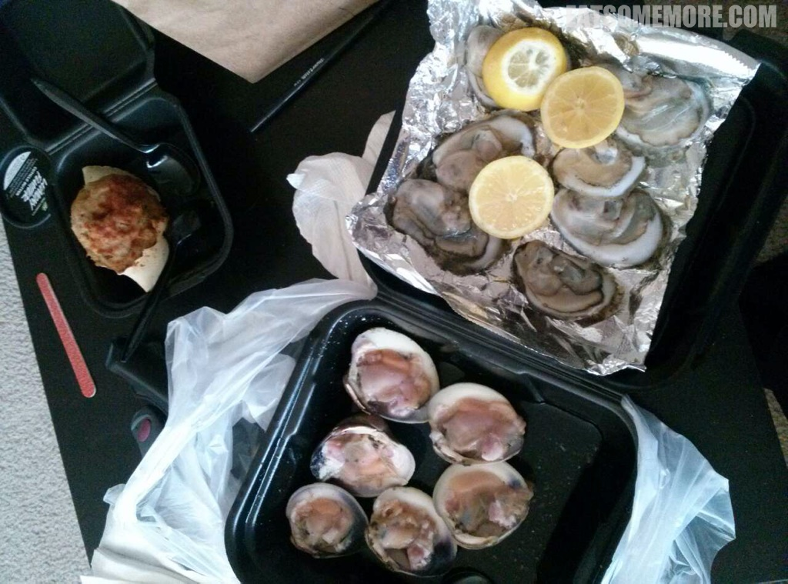
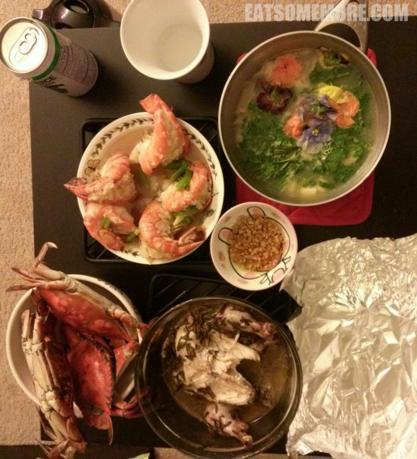
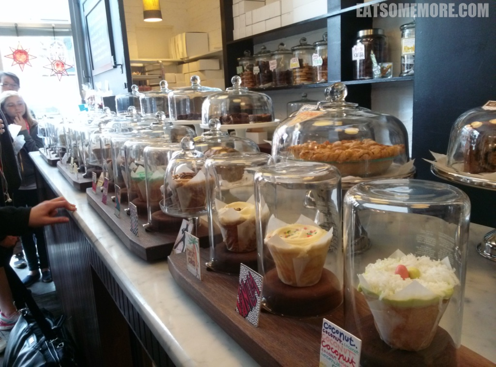

地理位移工具飞机【维珍航空】英国往返美国、【联合航空】华盛顿到旧金山、【entreprise租车】旧金山到圣迭戈。 签证自理。

酒店【priceline】。

好友半打，会开车更佳。 

## 行程总览

## 华盛顿

>乘坐维珍航空从伦敦抵达华盛顿IAD机场正是下午3、4点的时间，海关较闲散，排队较长。初出机场就碰见了飘扬的美国国旗，提醒着我这是第一次来到大米粒尖共和国呢。好友接上我便向海鲜市场驶去，吃货朋友最高！

>于是我就遇见了好多好多各种大小的虾兵蟹将，当然还有马里兰的蓝蟹。朋友一直说蓝蟹肉质不好，但是我这个杭州人的胃觉得，蓝蟹劈开浸在黄酒里一蒸，蟹肉的甜和黄酒的甜融为一体，真是大美味！ 

>周六一大早，好友载我来到了热播美剧傲骨贤妻里Alicia和Will的母校George town，吃了一吃小清新却又很甜的杯子蛋糕。

>传说中的高端汉堡包【因为菜单上的名字都很拉风，比如我吃的这个肉夹馍馅的名字就叫做穿着牛衣服的猪 - 哦，也不知道是谁被黑了。。。】。不过总的来说，面包薯条肉和调味都不错。我还学习了一把美国人吃汉堡要先压一压的技巧。

>下午回到了华盛顿市区。华盛顿的景区相对集中，都在Tidal Basin周围。

>绕湖一圈即可以看见许多地标建筑。

>当然啦以方尖碑的尺寸与高度，想要看不见也难呢。

>众多建筑里我最喜欢杰弗逊纪念堂，远观傍湖亭亭，近看雕栏玉砌。

>到达华盛顿的前一个周末正好是一年一度人挤人的樱花节。我到之前下了一场大雨，本以为和樱花无缘了，不料在公园的一角发现了一大簇樱花的踪迹，太激动了！

>史密森尼国家自然历史博物馆

>华盛顿的自然历史博物馆里头还陈列着大钻石希望之星，观赏的参观者也是人山人海。 

