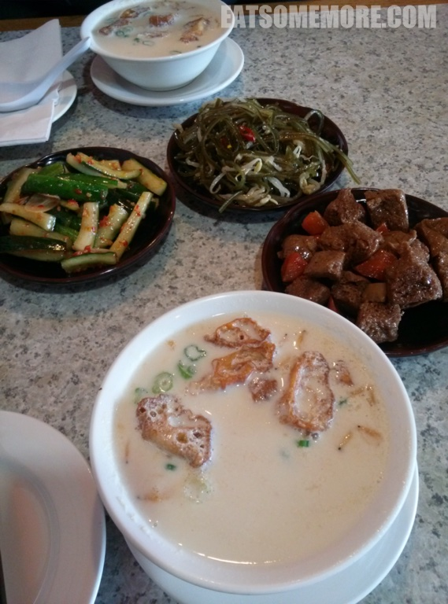

>少时知交，乘着时光，零落天涯。我从英国伦敦去美国华盛顿探望在那里读博士的朋友，想来也是人生难得的相聚。咱们除了在东海岸的主要城市华盛顿和纽约看看，还会去西部的加利福尼亚州自驾。敬请期待。

## 行程总览

- 【维珍航空】飞机往返英美；
- 【联合航空】从华盛顿飞往旧金山；
- 【Entreprise】租车从旧金山到圣迭戈；
- 【priceline】酒店预定；
- 好友半打，会开车更佳。

## 华盛顿

>乘坐维珍航空从伦敦抵达华盛顿IAD机场正是下午3、4点的时间，海关较闲散，排队较长。初出机场就碰见了飘扬的美国国旗，提醒着我这是第一次来到大米粒尖共和国呢。好友接上我便向海鲜市场驶去，吃货朋友最高！

>于是我就遇见了好多好多各种大小的虾兵蟹将，当然还有马里兰的蓝蟹。朋友一直说蓝蟹肉质不好，但是我这个杭州人的胃觉得，蓝蟹劈开浸在黄酒里一蒸，蟹肉的甜和黄酒的甜融为一体，真是大美味！ 

>周六一大早，好友载我来到了热播美剧《傲骨贤妻》里Alicia和Will的母校乔治城大学，吃了一吃小清新却又很甜的杯子蛋糕。

>菜单上汉堡包们的名字高端又拉风，比如我吃的这个肉夹馍馅的名字就叫做穿着牛衣服的猪。总的来说，面包薯条肉和调味都不错。我还学习了一把美国人吃汉堡要先压一压的技巧。

>下午来到了华盛顿市区。华盛顿的景区相对集中，都在潮汐湖 (Tidal Basin) 周围。其中为了纪念美国总统乔治华盛顿而建的华盛顿纪念碑，是世界上最高的石造像。美国政府甚至规定华盛顿特区的任何建筑物都不能高于这座方尖碑。纪念碑倒映在超过两千英尺的林肯纪念堂倒影池里，蔚为壮观。方尖碑后的国会大厦若隐若现。

>林肯纪念堂的北面坐落着由国会设立的无党派美国和平研究所。

>绕潮汐湖一圈，可以看见许多地标建筑。

>当然啦以方尖碑的尺寸与高度，想要看不见也难呢。

>众多建筑里我最喜欢杰弗逊纪念堂。

>远观傍湖亭亭立，近看雕栏玉石砌。

>到达华盛顿的前一个周末正好是一年一度人挤人的樱花节。我到之前下了一场大雨，本以为和樱花无缘了，不料在罗斯福纪念碑附近发现了一大簇樱花的踪迹。碑上刻着罗斯福总统的名言，唯一值得我们恐惧的事情是恐惧本身。

>樱花胜雪满枝头。

>穿过国家广场，我们来到了史密森尼国家自然历史博物馆。

>华盛顿的自然历史博物馆里头陈列着从路易十四手中辗转来到美国的世界现存最大的蓝色钻石，希望之星。

>离开华盛顿之前来到这家半亩园。下图展示的分别是泡了油条的咸豆浆、烤麸、凉拌海带丝、拍黄瓜，没有入相的有糯米包油条以及我一颗贪恋家乡美味的心灵。下一期，就要告别钻石，拥抱“大苹果”了。

