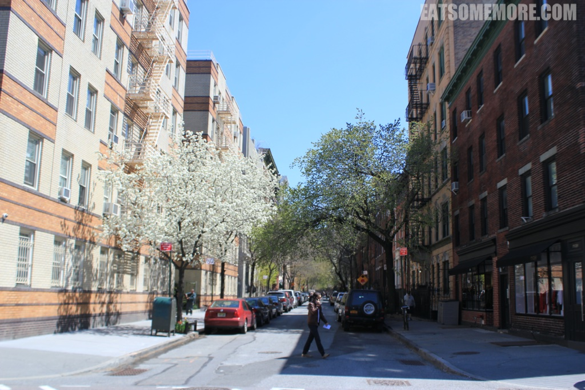

>在美国的第二站是纽约，因为除了华盛顿的博士朋友，我还有离散在纽约的律师和建筑师好朋友。

## 行程总览

## 纽约

>是夜我从华盛顿乘搭Amtrak火车抵达纽约Penn Station。车程一个多小时，尚算舒适。我回程时搭的是巴士，可坐了5个小时左右，经历各种嘈杂吵闹打翻可乐等等，不能算是愉快的旅程。建议大家还是搭乘火车，可以提早订的话票价会比较便宜，跟巴士差得不多。到达车站之后，去到附近的韩国街就餐，体验了纽约人的时间之赶。吃饭前要排长队，排长队时要向匆匆走来走去的服务人员断断续续地点单，还没吃完就好担心餐具被收走，吃完之后即刻需要埋单闪人。饭后咱们去到世界闻名的时代广场感受了一下夜明如昼和人山人海。 

>克莱斯勒大厦璀璨的装饰艺术风格尖顶在纽约的夜空中熠熠生辉。

>走走逛逛之间，到了美剧《绯闻女孩》第一季第一集的取景地，纽约中央火车站。

>我好喜欢关于纽约的这一幅图，陈列在一家打了烊的艺廊的窗口，展示着高楼林立和中央公园二者充满着冲突感的美。毕竟，从二十年代初起，纽约就被视为人人都想咬一口的“大苹果”。

>次日一早，咱们从鳞次栉比的高楼之间出发，去游览哈德逊河以及自由女神像。

>坐在车上感叹河对岸的城市觉得好漂亮。于是朋友向我讲解了纽约人对于新泽西的迷思——纽约人很自豪自己是纽约人，但是他们不喜欢对岸的新泽西，他们甚至不愿住河景的房子，因为“谁要看新泽西呀”。

>纽约有好大一个岛叫做史泰登岛 (Staten Island)。纽约人打趣说如果能用史泰登岛交换属于新泽西的自由女神像小小岛就好了！

>回到曼哈顿后，在高楼当中穿行了一阵子，走过华尔街，这就去唐人街吃早茶咯。正值复活节周日，一些饭店都没有开门，剩下的也都大排长龙，要等2个小时才有的吃。于是我们来到了Red Egg。这里虽然没有小推车，但味道还挺不错，还有真的用椰子装的椰子布甸和真的会流沙的流沙包，超棒！吃完饭去到百老汇，看了一场歌舞剧Once。百老汇的感染力果然名不虚传，舞台在中场休息时还直接变身酒吧，怎一个酷字了得！

>歌舞剧后本打算登个洛克菲勒大厦，可惜最近的登楼时间也是晚上十点，只好放弃转投中央公园，却邂逅了好美妙的景色。

>中央公园视角的纽约天际线都显得没有那么冰冷了。

>晚上本想去一家叫做荞麦的日本餐馆，最后也是因为排队不已被迫放弃，来到街对面的West烧烤店。进门要先脱鞋放在门口与墙齐高的鞋柜里，小噱头也挺有意思。这家的海鲜饼（下图左边已被抢完的）和豆腐味道都不错，寿司平平，烤肉还不错呢。

>在美国的时间过了小半，一早起来去到比较不一样风情的soho和chelsea。这里没有那么多的高楼，反而都是些小清新的小房子，外面挂着一道道的消防梯。我的建筑师朋友说，这才是纽约本来的样子。

>中午来到了Chelsea Market，里面有一个海鲜市场，有卖煮熟的整只龙虾、龙虾三明治、各式海鲜浓汤以及各种寿司。鱼生之新鲜，汤品之鲜甜超乎想象呢！下期就要聊加利福尼亚了，“一壶浊酒尽馀欢，今宵别梦寒”。

 