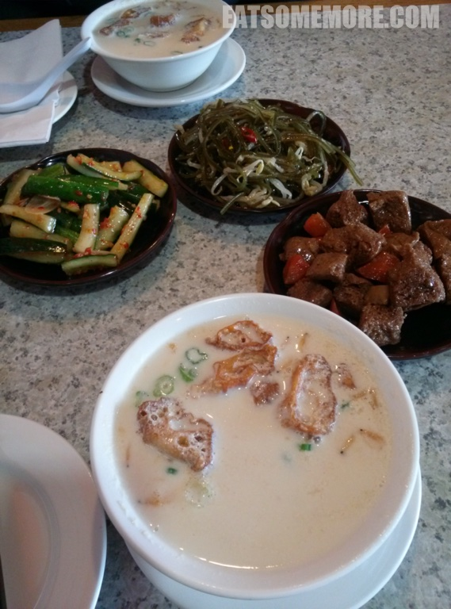

## 行程总览

## 纽约

>前往纽约之前来到这家半亩园，下图展示的分别是泡了油条的咸豆浆、烤麸、凉拌海带丝、拍黄瓜、还有没有入相的糯米包油条。楼主也是有半年没有回国了，贪恋一下家乡美味，各位请轻拍。 

>言归正传，我好喜欢关于纽约的这一幅图，陈列在打了烊的一家艺廊的窗口，展示着高楼林立和中央公园二者充满着冲突感的美。

是夜我从华盛顿乘搭Amtrak火车抵达纽约Penn Station。车程一个多小时，尚算舒适。我回程时搭的是巴士，可坐了5个小时左右，经历各种嘈杂吵闹打翻可乐等等，可不能算是愉快的旅程。建议大家还是搭乘火车，可以提早订的话也会有便宜的票，跟巴士差的不多。

到达车站之后，去到附近的韩国街就餐，体验了纽约人的时间之赶。吃饭前要排长队，排长队时要向匆匆走来走去的服务人员断断续续地点单，还没吃完就好担心餐具被收走，吃完之后即可需要埋单闪人接着咱们又去世界闻名的时代广场感受了一下夜明如昼、人山人海。 

>下图为纽约中央火车站。绯闻女孩第一季第一集的场景【哎呀，是不是暴露了年龄】。

一早咱们便出发去游览哈德逊河以及自由女神像。坐在车上见到河对岸的城市觉得好漂亮。于是朋友向我讲解了纽约人对于新泽西的迷思——纽约人很自豪自己是纽约人，但是他们不喜欢对岸的新泽西，他们甚至不愿住河景的房子，因为“谁要看新泽西呀”。可惜，自由女神像的那个小岛是新泽西的。纽约有好大一个岛叫做staten island。纽约人说如果能用staten island交换自由女神小小岛就好了！

哦，小小的故事里黑了多少人和事，呵呵。 哈德逊河

哈德逊河 回到曼哈顿，在高楼当中穿行了一阵子，走过华尔街，这就去唐人街吃早茶咯。正值复活节周日，一些饭店都没有开门，剩下的也都大排长龙，要等2个小时才有的吃。我们辗转来到了Red Egg，虽然没有小推车，味道还挺不错，还有真的用椰子装的椰子布甸和真的会流沙的流沙包，超棒！

吃完饭去到Broadway，看了一场歌舞剧Once。百老汇的感染力果然名不虚传，舞台在中场休息时还直接变身酒吧，怎一个酷字了得！

歌舞剧后本打算登个洛克菲勒大厦，可惜最近的登楼时间也是晚上10点，只好放弃转投中央公园，却邂逅了好美妙的景色。

中央公园

中央公园

中央公园

晚上本想去一家叫做荞麦的日本餐馆，最后也是因为排队不已被迫放弃，来到街对面的West烧烤店。 进门要先脱鞋放在门口与墙齐高的鞋柜里，小噱头也挺有意思。

这家的海鲜饼（下图左边已被抢完的）和豆腐味道都不错，寿司平平，烤肉还不错呢。 DAY 5返回华盛顿

在美国的时间过了小半，一早起来去到比较不一样风情的soho和chelsea。那里没有那么多的高楼，反而都是些小清新的小房子，外面挂着一道道的消防梯。朋友说，这才是纽约本来的样子。 中午来到了Chelsea Market，里面有一个海鲜市场，有卖煮熟的整只龙虾、龙虾三明治、各式海鲜浓汤以及各种寿司。鱼生之新鲜，汤品之鲜甜超乎想象呢！ 切尔西市场

切尔西市场

吃完闪人回华盛顿，整顿一下明天就要向加州去！ 