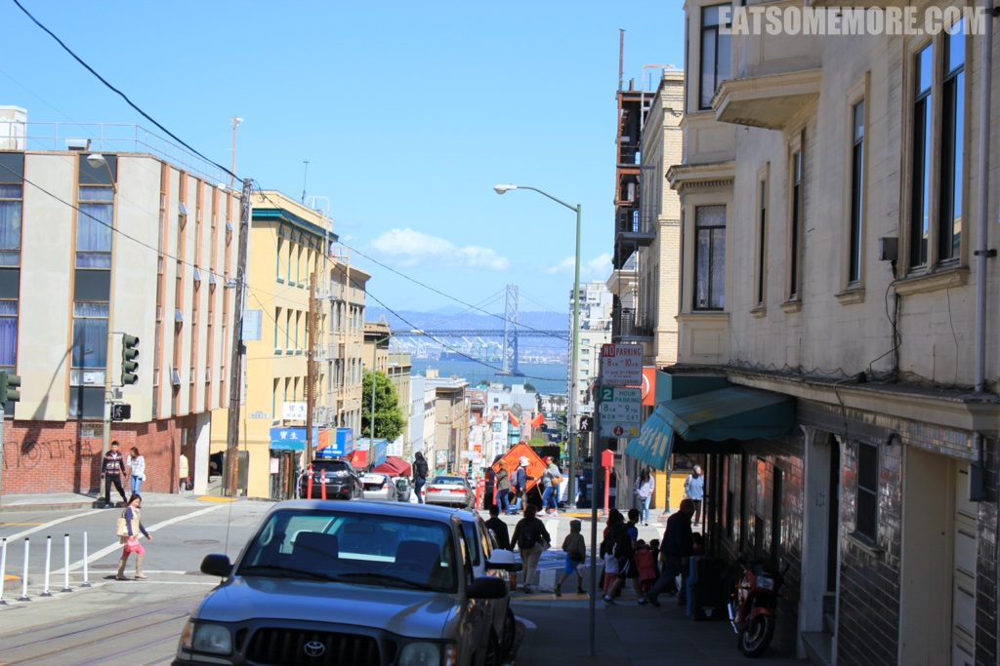

>去旧金山前，朋友反复叮嘱，旧金山好冷啊，记得多穿点。下了飞机以后感觉除了风大了点，气温什么对于常居伦敦的我来说毫无压力。

## 行程总览

## 旧金山

>位于美国西海岸的旧金山，面朝太平洋。

>阳光下起伏的街道看起来非常美！

>街道上运行着传说中世界仅存的Cable car，俗称叮叮车。它通过地下的缆绳牵引车辆前进。乘客可以坐在车里，也可以扒着车两侧的杆子挂在车上，沿途风景秀丽，别有一番风味。

>乘坐叮叮车可以到达大名鼎鼎的伦巴底街。

>据说伦巴底街是美国最弯曲的街道，因此也被称为“九曲花街”，曾出现在多部影视剧中。这里游客熙熙攘攘，不知道街道两边的住户每天是什么样的感想，自豪得意还是不胜烦扰？ 

>来到旧金山，不能错过的地方自然还有渔人码头。

>在39号码头与一大群海狮不期而遇，望着它们湿漉漉的爬上来晒到一身土的效果，同时发出慵懒的咿咿唔唔声，差点没赶上去看监狱岛和旧金山大桥的大船。 

>旧金山海湾内有一座四面峭壁的孤岛，曾是一座军事要塞，也曾被作为监狱。

>本以为旧金山风挺大的了，谁知道船上风更加格外地大！特别是接近金门大桥处，风又大船又颠，不过风景真好。

>虽然在船上颠到要吐，一下船还是记挂着吃的，快看大螃蟹！还好餐厅配备了工具，要不然还真打不开这些壳。咱们中国人吃蟹沾姜醋，美国人在蒸蟹的时候就已经撒上一些香料，吃的之后沾的是化了的黄油，别有一番滋味。

>晚饭后来到举办了第一届万国博览会的艺术宫。艺术宫的圆形大厅由八组粉色科林斯式圆柱承托著上方黄色的巨大穹顶，更精巧的是每一对圆柱和穹顶又形成一个拱门，而以圆形大厅为中心的弧形柱廊又围绕着大厅面前的人工湖。

>次日启程自驾游之前，照例要大吃一顿。咱们这次去的是美国早餐店，吃的是酸奶油欧姆蛋。

>除了吃，当然还有购物。旧金山的尼曼百货，真是漂亮得没话说。

>飞机云划过湛蓝天空，新人走过市政厅，都是生活中可遇不可求的美好时刻。这样的时刻，接下来的旅程当中还会遇到吗？

