>一号公路是沿太平洋的南北走向州级公路，以其沿太平洋的优美景色著称。

## 行程总览

## 一号公路

>从旧金山出发的一号公路开头段有接连不断的盘山公路加发夹弯加骤上骤下加各种急转弯，是考验车技的好地方。

>不过这一路上总是环山绕海的，风景美不胜收。

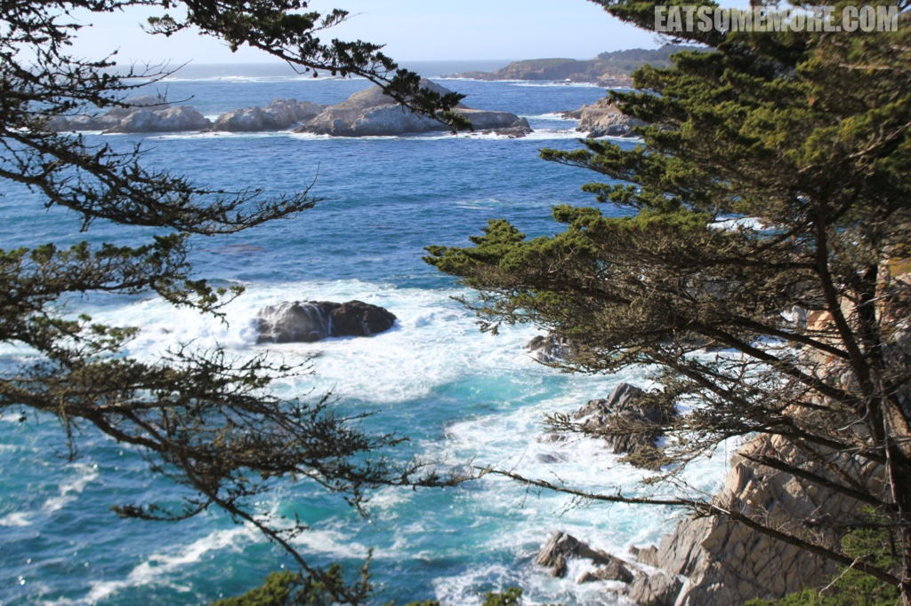

>蓝天下的青山延伸进蔚蓝的太平洋。

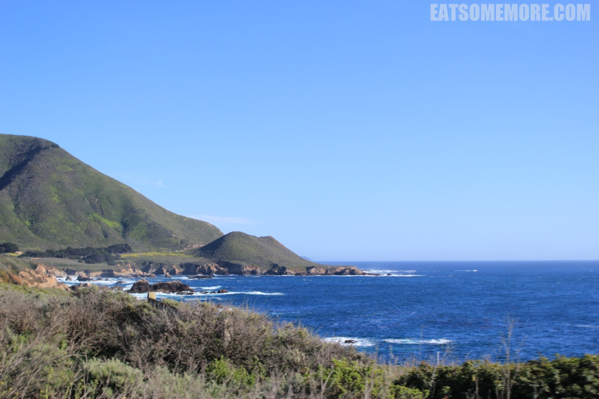

>海水前赴后继地奔向岸边，撞出白色的浪花，翻腾起波子汽水的清凉浅蓝。

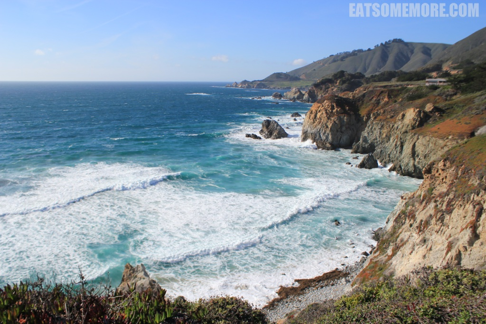

>滨海隧道像是电影里出现的场景。

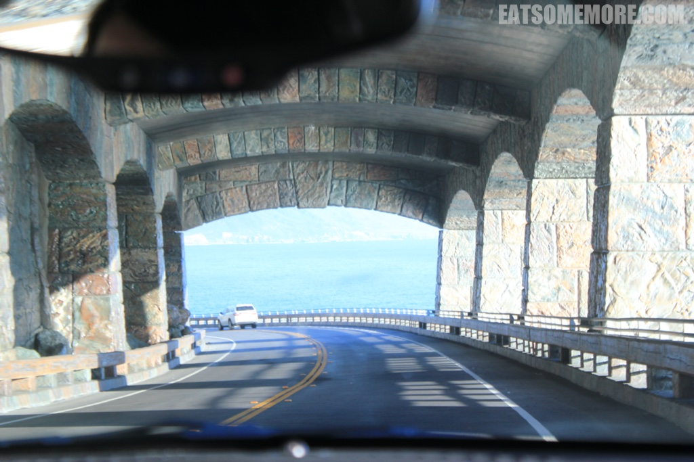

>在加油站遇上了全美连锁快餐店 IN-N-OUT。点完单拿着单子等叫号，生意不是一般的兴隆呢！芝士汉堡味道不错，芝士饱满、肉饼多汁、蔬菜新鲜、面包松软，对于一个汉堡来说还夫复何求呢。

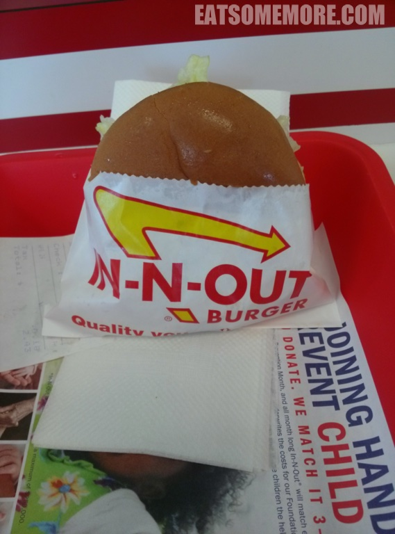

>我们就一路开呀开，开呀开，开到太阳都下山。太平洋的日落也是转瞬倏忽之间，好震撼。

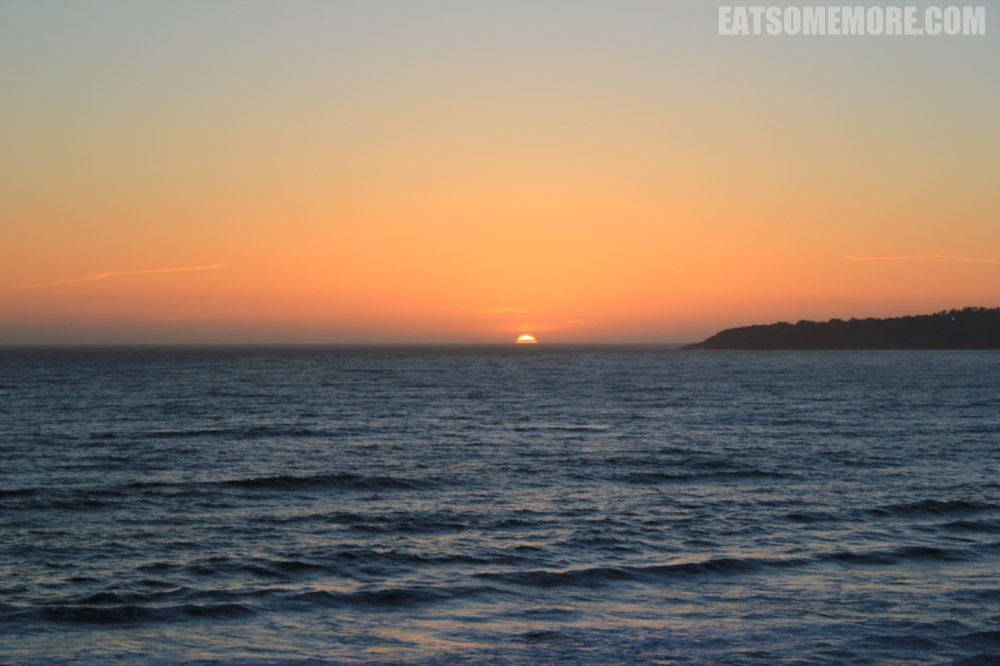

>说时迟那时快，咱们就抵达了这晚预定的海景酒店。左手边的角落还有一个真的、在使用中的壁炉。一个房间有两张超级大的床，卫生间很多部分是用大理石砌的，顿感生活质量大大提高呢！ 

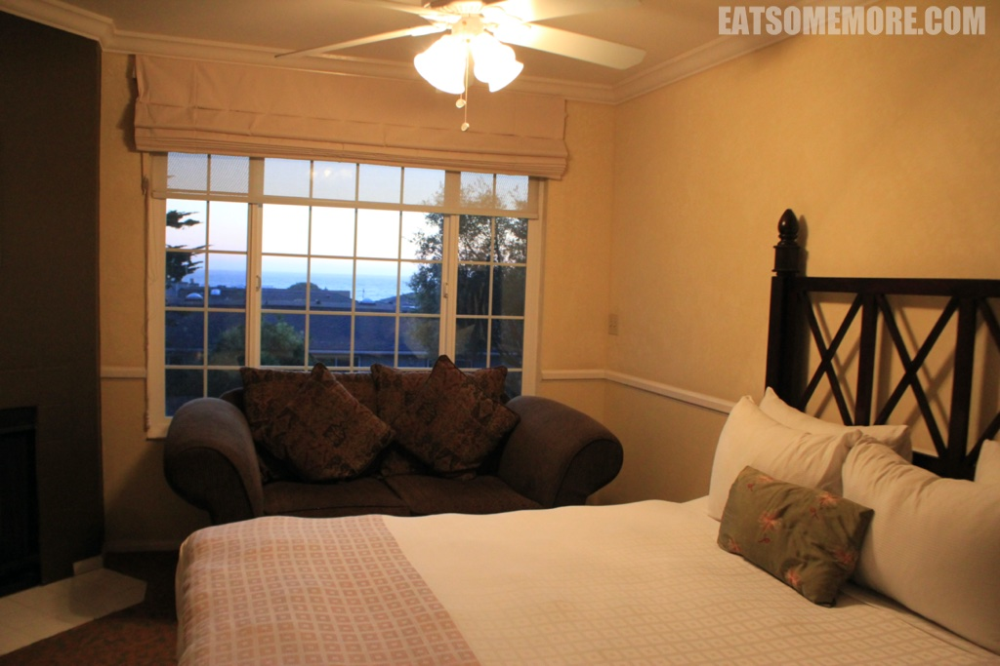

## 索尔万 (Solvang)

>一路向南来到了圣芭芭拉县被称为“丹麦村”的索尔万。

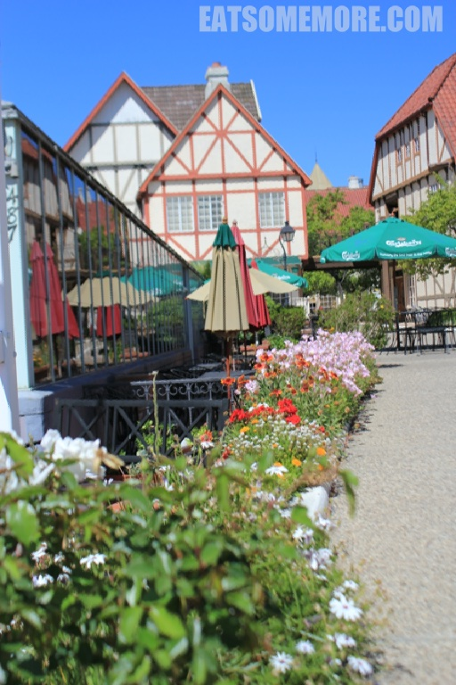

>据说索尔万在丹麦语当中是阳光明媚地方的意思，名副其实。人行道上竟有这种“人工降雨”的造像。

>小镇有着丹麦式的整体建筑风格。

>街口的大钟也像是童话书里的样子。

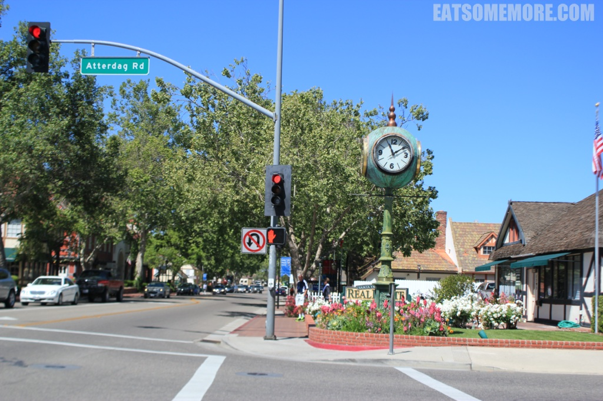

>用橡木桶搭成的酒庄招牌很有说服力。

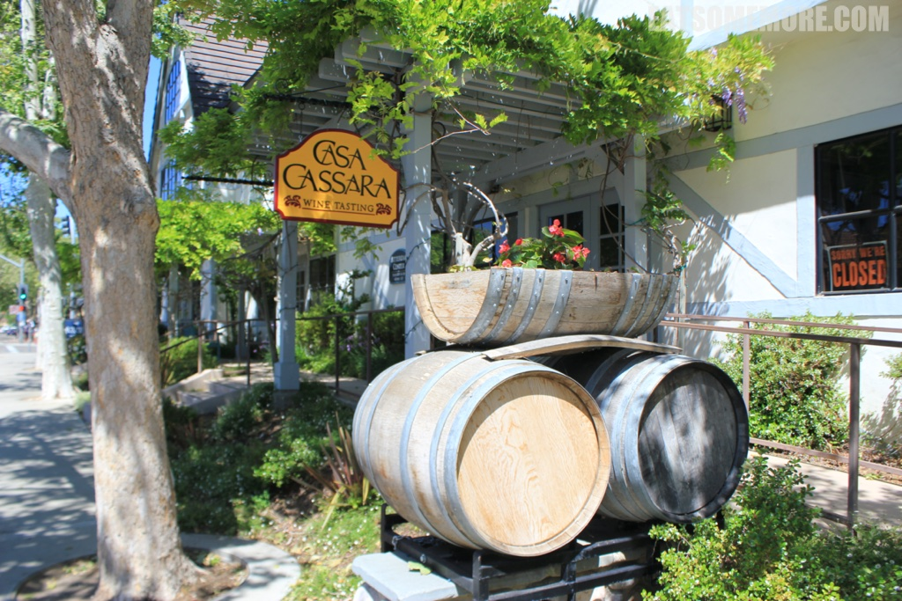

>在这里还可以见到在丹麦十分流行的荷兰型水平轴风车。

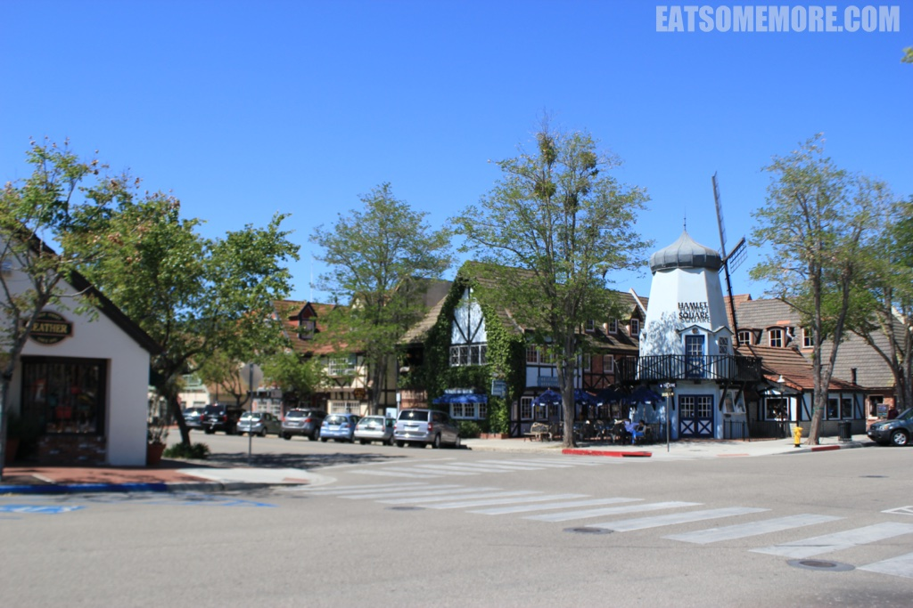

>据说这个具有鲜明丹麦特色的小镇，是由来到新大陆丹麦移民建设起来的。

>告别彩色的童话小镇，下期更多精彩内容。

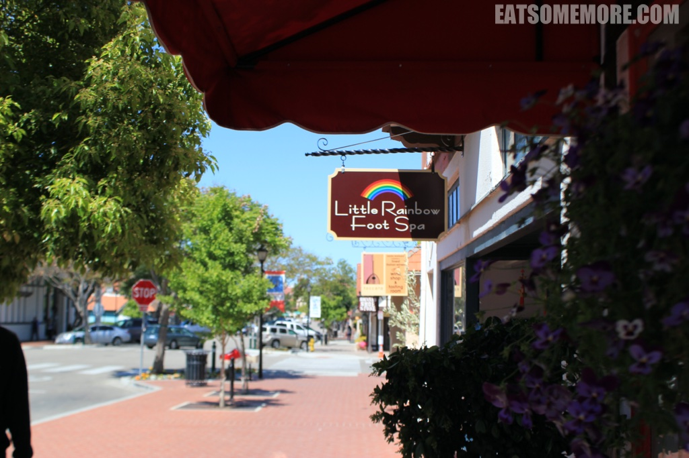
