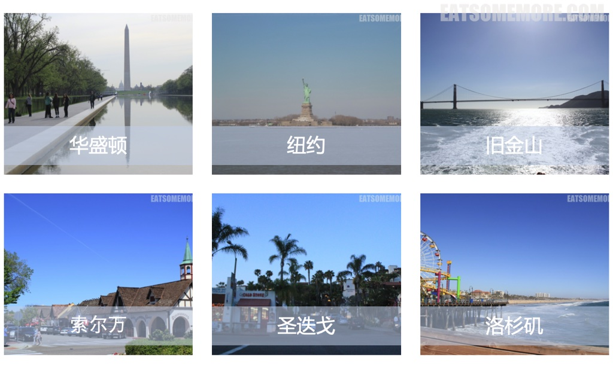
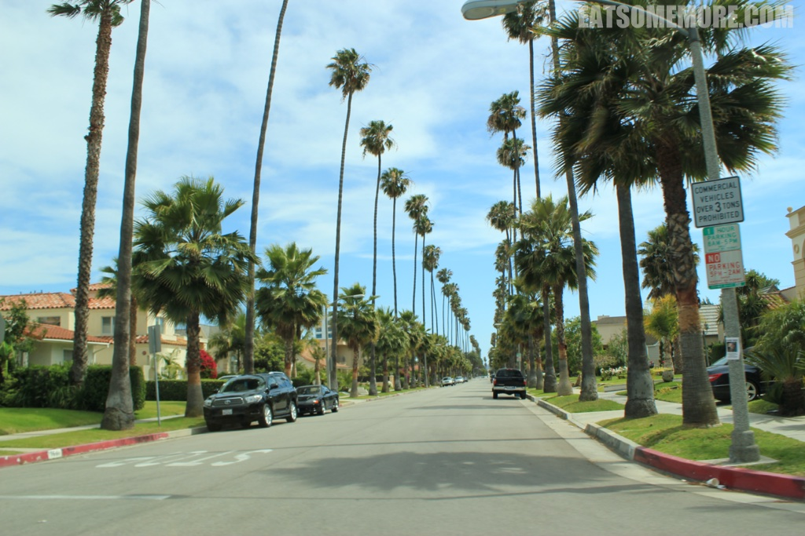
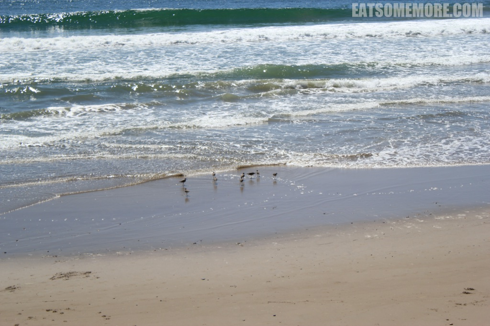
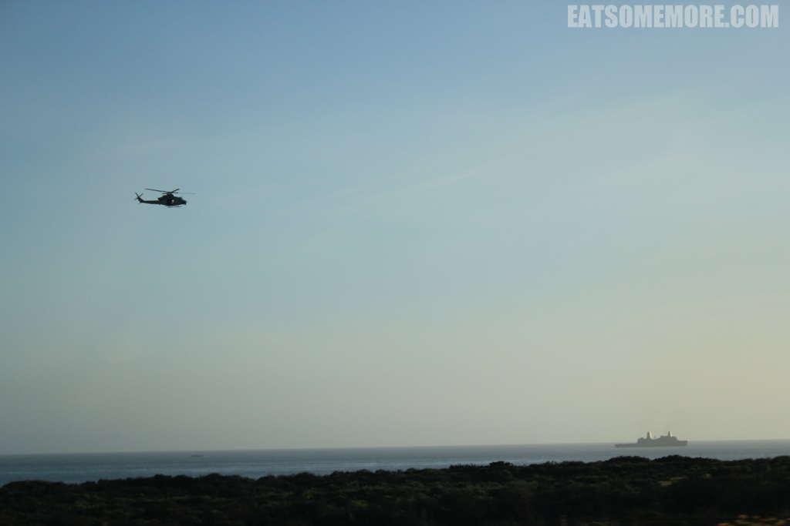
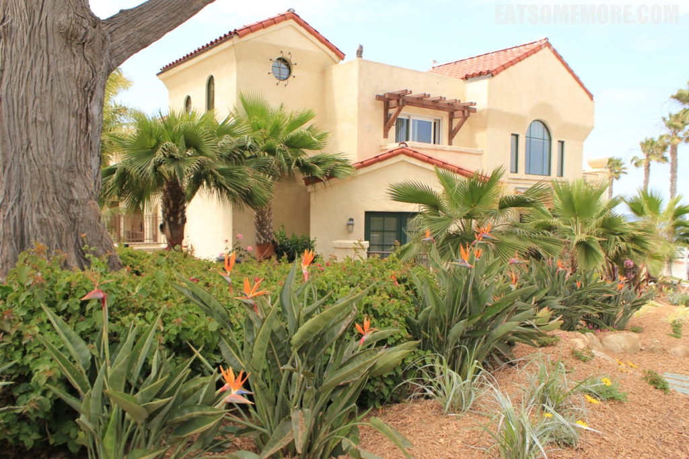
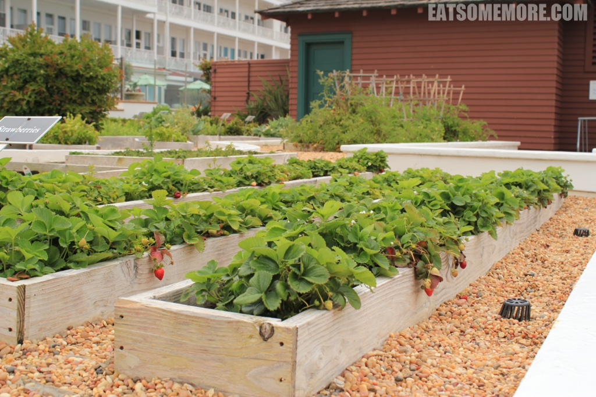
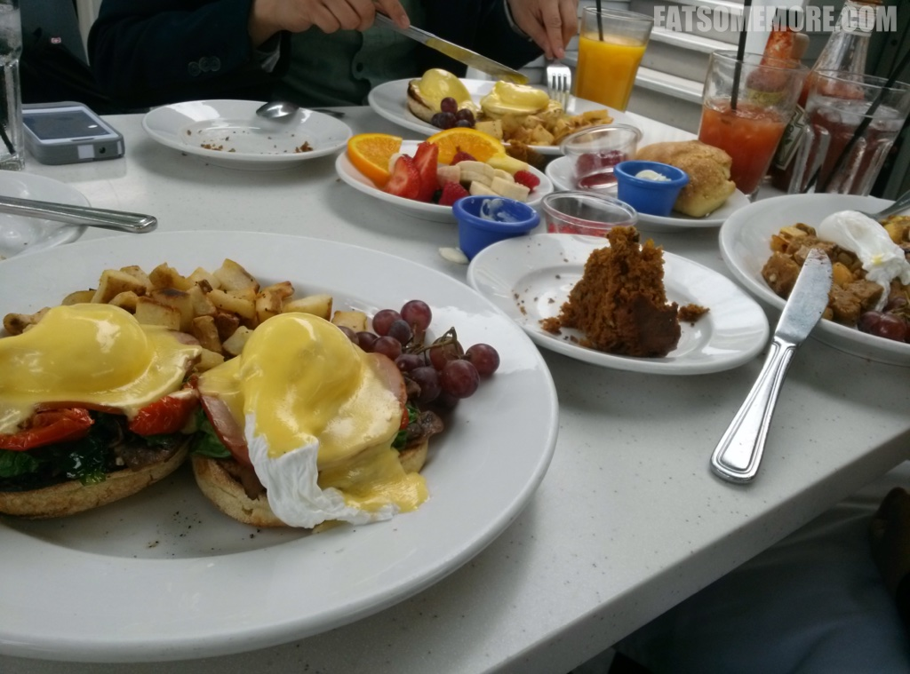

>一号公路的自驾行还在继续。

## 行程总览

## 一号公路

>四月末行驶在一号公路，感受海天一色浪打浪，铁轨旁的小黄花，惬意极了。

>越往南，开始出现许多的棕榈树。

>这种好天气才会有的植物让我觉得好激动，心情雀跃得像是赶海的小鸟。

>很快又到了日暮时分。 

## 圣迭戈

>傍晚时分到达加利福尼亚州南端，紧邻墨西哥的圣迭戈。

>在老城吃墨西哥菜，喝杯比脸还大的玛格丽塔。

>圣迭戈有个好地方叫做拉荷亚 (La Jolla)。

>一边是海军基地，另一边能望见货运码头。

>一头有海狮在日光浴，另一头则面对着城市的天际线。

>第一次见到长在地上的天堂鸟，和小洋房配极了！

>我以为是绿化带的地方，种的竟然是草莓。

>最重要的是，这里有很好吃的brunch！果然是阳光充足、温度适宜的加州，就连葡萄柚汁都比别处的甜，蓝莓也比较大个，草莓也比较甜。

>以一对我至今不知道是什么生物的小动物作为圣迭戈篇的结尾。下期真的要去童话世界了哦！

