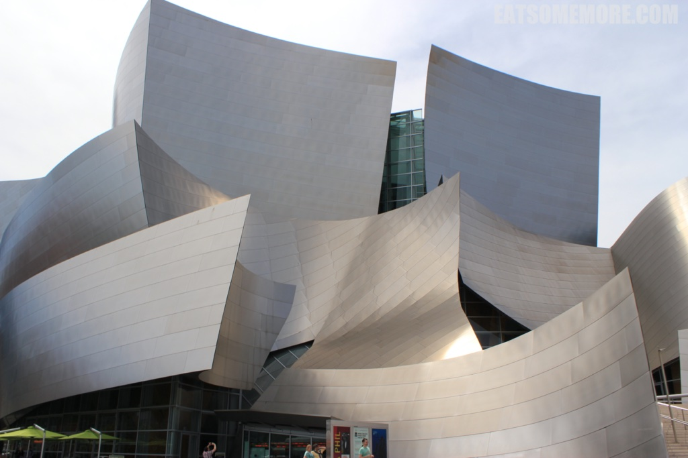

>这次美国之旅的最后一站是加州最大的城市，洛杉矶。

## 行程总览

## 洛杉矶

>洛杉矶因为好莱坞，在影视创作业颇有一番地位。

>好莱坞大道上的中国戏院曾是奥斯卡金像奖颁奖典礼举行的地方，直到二十世纪中叶，颁奖典礼才移至附近的杜比剧院举行。这条好莱坞大道镶着对影视行业作出贡献的人的星形奖章，因此又称“星光大道”。

>建成于2003年的迪士尼音乐厅，是由普利策克建筑奖得主法兰克盖瑞设计的解构主义建筑，音响效果也广受赞誉。

### 迪士尼

>恕我粗鄙，二十多年来从来没有去过迪士尼玩，还常把迪士尼说成迪尼士，根本不了解迪士尼究竟有什么好玩的，为什么大家一说起迪士尼就眼睛放星星。然后我就去了迪士尼。加州的迪士尼有两个园：一个是迪士尼乐园，适合阖家偕行；另一个是加州冒险乐园，适合喜欢刺激活动的朋友们。由于时间和胆量都有限，我毅然决然只选择了迪士尼乐园。一进门有一个迪士尼火车站。

>走进大门那一刻开始游客和工作人员的情绪就有了质的变化，好像真的来到了一个虚构却又活生生的架空世界。大家都是小朋友。然后长出毛茸茸、很好摸、价值约30刀的耳朵。

>然后去坐坐小火车、坐坐主题车、坐坐小木马、坐坐叮叮车……怎么感觉真的好快乐哟！

>另外不能错过的自然还有老少咸宜的旋转木马。

>让人掐准了时间，等好了位置的一项重要活动，是迪士尼人物大游行。

>人间真实的白雪公主款款而来。

>飞不上云霄的小叮当仙子挥舞着她的魔法棒。

>带着牛仔帽的唐老鸭正朝我们挥手。

>狮子王正要去夺回属于它的领地。

>甚至还有些我认不出来的人物，暴露了我不完整的童年。

>这阴沉的一天，到了晚上突然下起瓢泼大雨。城堡上的烟花因此被取消了，真遗憾！

>再见了，夜幕下的迪士尼。我们还会再见的！

