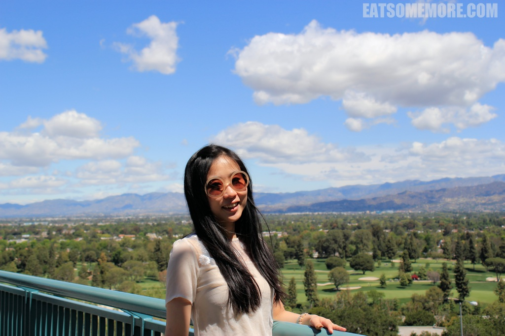
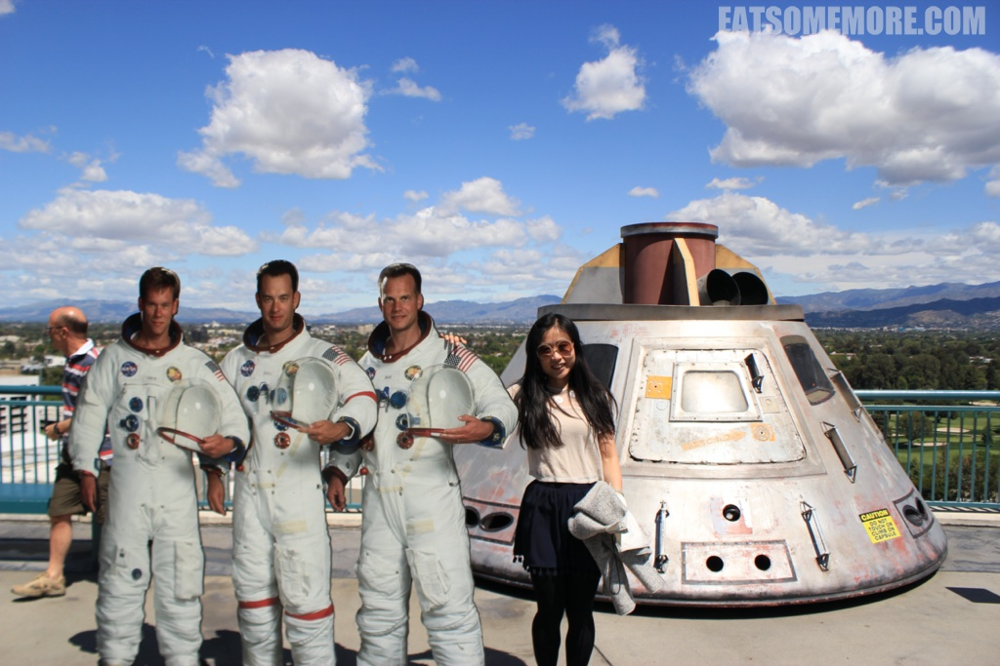
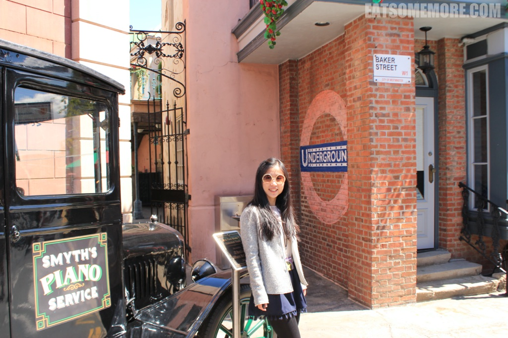
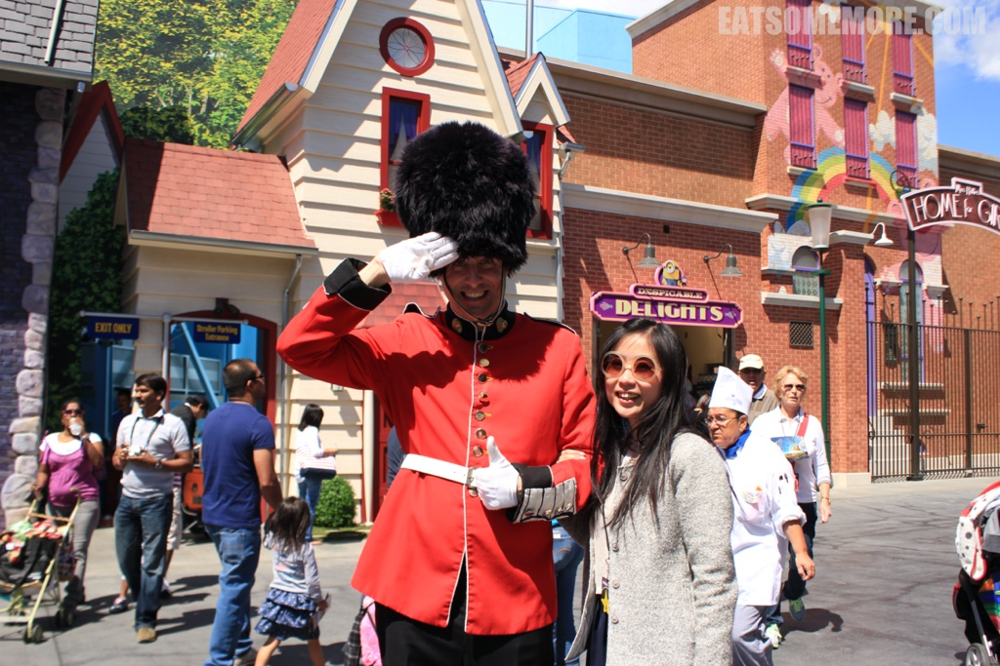
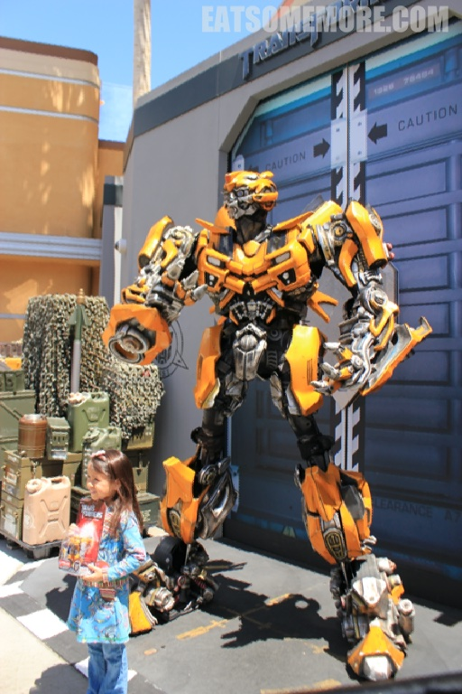
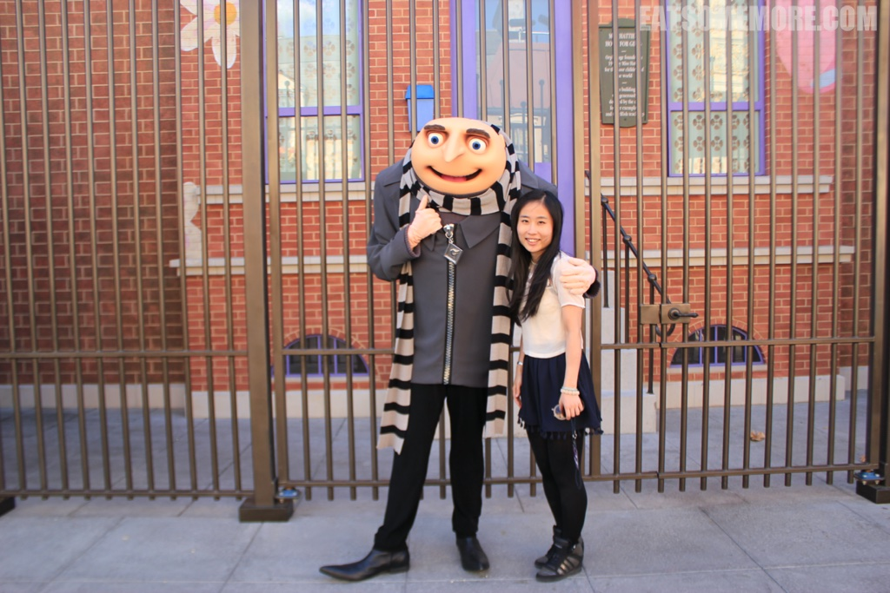
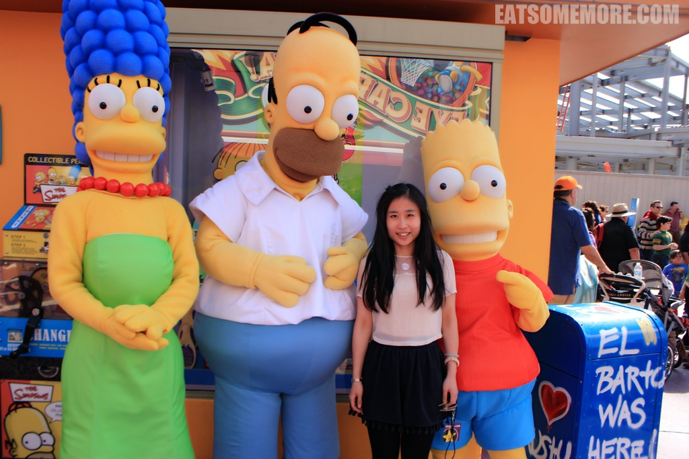
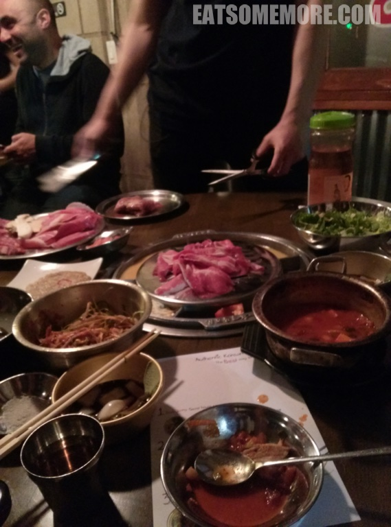

>旅程接近尾声，精彩一如既往。

## 行程总览

## 洛杉矶

>在洛杉矶的第二天，我们去了好莱坞电影制片厂、主题公园环球影城。

### 好莱坞环球影城

>这个天气，真的是好到不拍电影都浪费了吧！

>环球影城里同卡通及电影人物合影的机会非常多。请查好自己喜欢的明星的位置，走过路过不要错过了哟！

>黑色英式出租车停在“伦敦贝克街”。

>穿着红色英式制服的卫兵一边敬礼，一边比“棒”。

>黄色变形金刚变换着姿势和萌娃合影。

>史瑞克和他的驴做起了小本生意。

>你可以做神偷奶爸的女孩。

>你也可以混进辛普森家族。

>环球影城里的快餐店，虽然味道一般，但胜在可以速战速决。

>游乐设施当中包括砖房、木房和稻草房的三只小猪故事主题项目。

>搭乘园区游览车还可以去看到更多的制片厂布景。

>在这里可以看到模拟飞机失事现场的场景。

>这里甚至还有模拟暴雨下洪水淹没村庄的动态场景。

>晚上慕名前去传说中的姜虎东韩国烤肉店。餐厅周围是一个非常大的韩国城，人们穿着拖鞋、拎个塑料袋走在街上，完全就是去三温暖的样子。咱们到达后，店外热闹非凡，拿号足足等了两个小时才坐下。这家店的烤炉很特别，除了中间烤肉的区域以外，四周还有四个格子，分别放了鸡蛋液、玉米芝士和其他两种配菜。点了肉之后，服务生会来帮忙烤肉、翻面，直到烤熟、剪成小块可以食用，火候的确比咱们自己掌握得更好。烤肉跟生菜、豆芽和其他配菜一起吃，味道很奇妙呢！然而，洛杉矶的精彩并不仅止于此。

