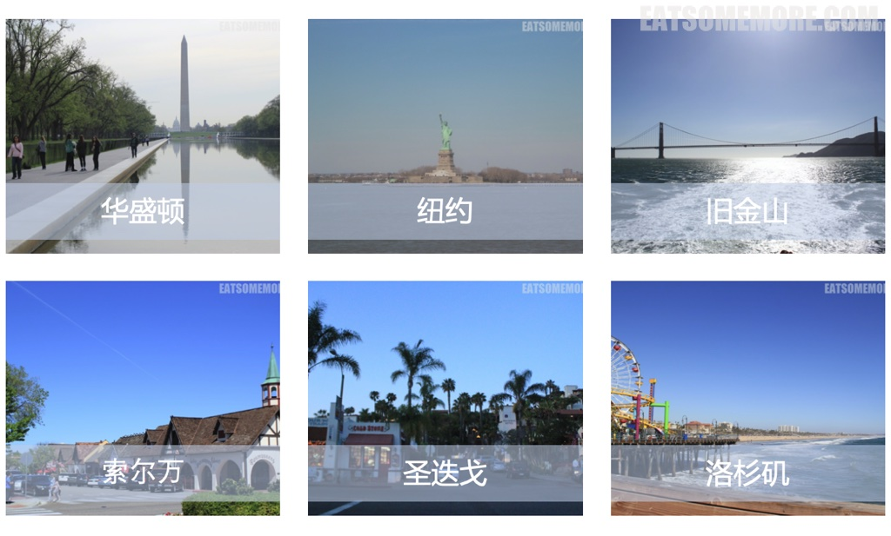

## 行程总览

## 洛杉矶

1

### 比佛利山 圣莫妮卡

虽然前一天晚上吃得非常heavy，第二天还是有精力和胃口去大吃一顿brunch，这就是吃货的精神！这天点的有french toast和crepe with scrambled eggs。scrambled eggs搭配生火腿和harsh brown。

french toast搭配草莓、香蕉和糖浆。我超级喜欢这个french toast! 在英国的时候我印象中的french toast就是吐司烤一烤。美国brunch里面的french toast更厚，而且是是先泡过牛奶，再煎两面，搭配上新鲜水果也太好吃了吧！

咱们吃早餐的地方位于景区santa monica附近。吃完饭，咱们就去四周逛了一下拍了一点照片 下午在附近3街购物区处感受了一下大美利坚的购物环境和打折力度。 晚上乘坐酒店接驳车到机场，搭夜机依依不舍地离开了可爱的美国西岸返回伦敦。 我想我还会再回来的吧！为了这样的天气和美食

送别
李叔同
长亭外，古道边，芳草碧连天。
晚风拂柳笛声残，夕阳山外山。
天之涯，地之角，知交半零落。
一壶浊酒尽馀欢，今宵别梦寒。
长亭外，古道边，芳草碧连天。
晚风拂柳笛声残，夕阳山外山。
情千缕，酒一杯，声声离笛催。
问君此去几时来，来时莫徘徊。
草碧色，水绿波，南浦伤如何？
人生难得是欢聚，惟有别离多。
情千缕，酒一杯，声声离笛催。
问君此去几时来，来时莫徘徊。