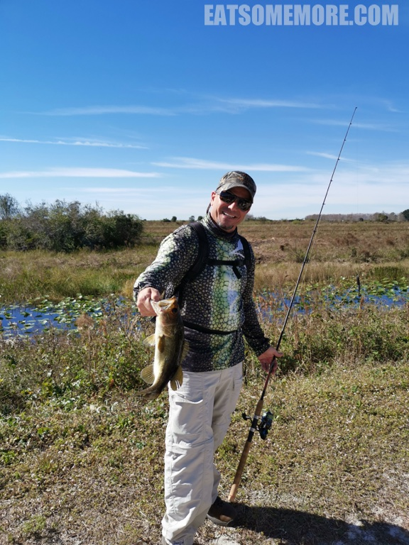

>在冬天寻找暖和的去处已经是我的一个习惯。正好爸爸想去美国看看，我就计划起带爸爸妈妈去美国本土最南端的“花之屿”佛罗里达州度个轻松温暖的假。

## 旅程小结

## 旅程的开始

>从伦敦出发的我们直飞迈阿密只需要大约不到十小时，比从中国出发需要转机的爸爸妈妈幸福太多。同时我的另一个担心是爸爸妈妈到了美国转机语言不通、孤立无援。于是我冒着跟他们“反目”的风险，千劝万劝、连哄带骗地帮他们订了公务舱，希望他们的旅程能顺利一些，让坐在经济舱的我也能安心一些。

>除了标准餐食，维珍航空还提供英式下午茶。桃红色的盒子，太可爱了。

>盒子里面有马苏里拉番茄三明治、司康饼、奶油和果酱。

## 迈阿密

>一路吃吃睡睡地在傍晚时分到达迈阿密机场。取了车就直奔机场附近的 Cajun Boil 去吃一些融合了西非、法国、西班牙料理风格的卡津风味虾蟹。即使是重口味，海鲜食材的新鲜还是最最重要的，我在这一家吃到的，就欠缺一些，不太推荐了。

>由于第二天凌晨要去机场接爸爸妈妈，我们饭后来到了机场附近的迈阿密斯普林斯智选假日。虽然酒店整体略显陈旧，房间还是整洁宽敞的。

>洗手间的空间也很充裕。短暂的洗漱休息后，就去机场等爸爸妈妈啦！

>接上了爸爸妈妈，首先去体验一下美式的早午餐。其中的特色酒精类饮料是由伏特加、番茄汁、塔巴斯科辣椒酱、芹菜、橄榄、柠檬、盐、黑胡椒调制成的迷人血玛莉。

>

>牛油果土司

>美式早餐

>烟熏三文鱼贝果

>早午餐后，我们来到了佛罗里达大沼泽。这里被联合国教科文组织和国际湿地公约列为全球三个最重要的湿地之一。

>这片湿地始于奥兰多附近的基西米河，最终流入广阔清浅的奥基乔比湖。其中有大片的草地沼泽，生长着热带树木，红树林和大量水草，因此被称为“草的海洋”。

>为了保护大沼泽的生态系统，美国政府设立了一个综合恢复计划项目。如今我们在这里可以见到很多珍稀生物，例如过去为了制作贵妇们争奇斗艳的羽毛帽子而濒临绝种的白鹭。

>一群乌龟在草垛上晒着太阳。

>佛罗里达短吻鳄伺机而动。

>一条大鱼上了钩。

>一只蝴蝶在枝头。

>结束了愉快的游览后，我们来到了接下来几天要住的北棕榈滩海景智选假日酒店。夕阳西下，椰林树影，何其美哉。

>酒店的前台还给了我们一份地图，方便我们把车停在离房间最近的地方。

>房间非常宽敞，里面有两张大床，一个书桌，一只茶几，落地窗外甚至有阳台。冰箱彩电一应俱全。

>从阳台望出去就是一望无际的大西洋。

>稍事休息后从酒店出发步行大约五分钟就到达了 Juno Beach Fish House 吃晚餐。三文鱼沙拉

>油炸渔获

>马赛鱼汤

>海鲜意面

