>时差使人早起，诚不我欺。这天我们来到了朱庇特附近的乔纳森迪金森州立公园和杜布瓦公园。

## 旅程小结

## 朱庇特

>乔纳森迪金森州立公园是佛罗里达州南部最大的州立公园。公园一天有四班游船，咱们掐着点赶上了十一点的船。乘船的票价为每人24美金，不包含公园门票和小费。

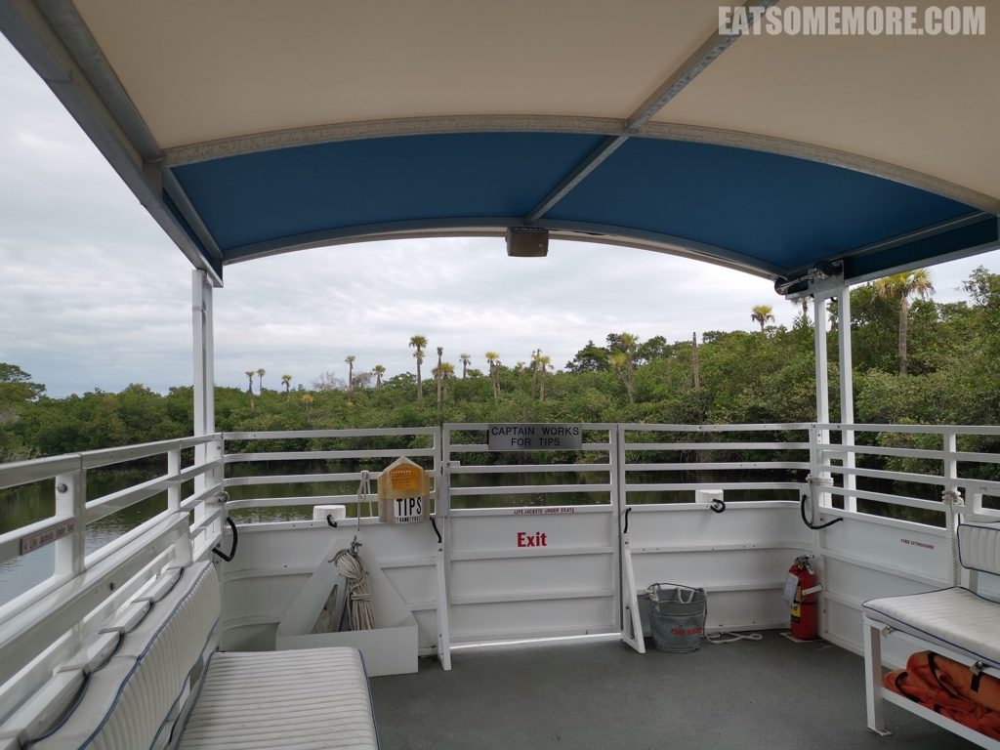

>乘船徜徉在 Loxahatchee 河上，看着两岸风景变换，吹着亚热带和煦的风，好不惬意。

>河面时而宽阔，时而狭窄。

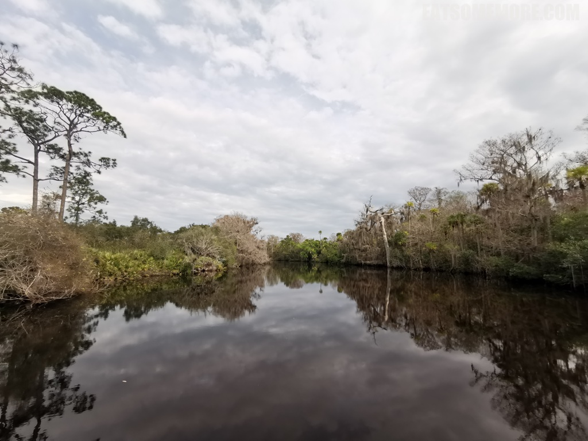

>风平浪静处，河水高清倒映着天空和岸边的景色。

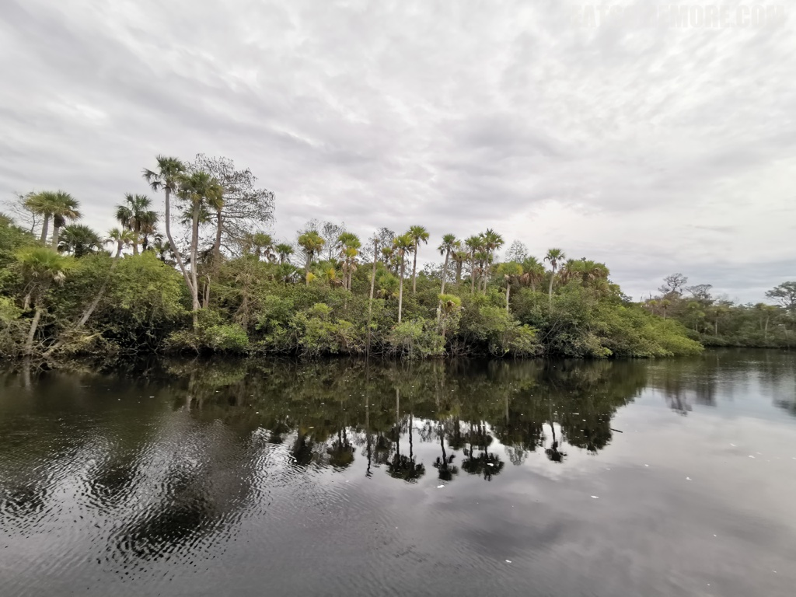

>当风吹皱水面时，又是另一派景象。这里还有由猎人 Trapper Nelson 于上世纪30年代在自家宅基地上创立的动物园遗址。

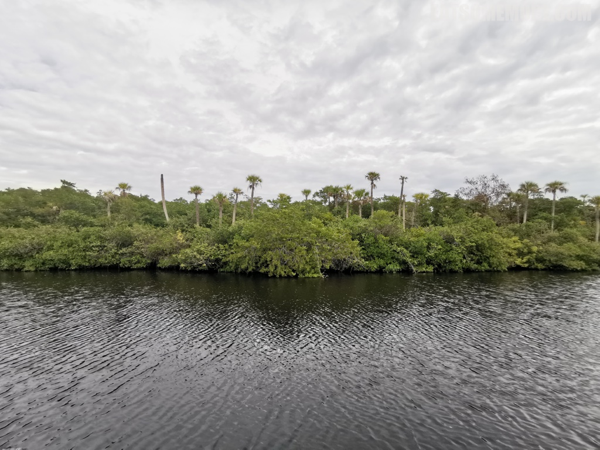

>公园附近的小酒馆 Brass Ring Pub 连续获得了四年猫途鹰 Tripadvisor 网站的卓越奖，在北棕榈滩所有的餐厅当中排名第二。小酒馆内环绕播放着各类体育赛事，其间也有一些诙谐可爱的画作，例如套着救生圈正在钓小龙虾的鲨鱼。

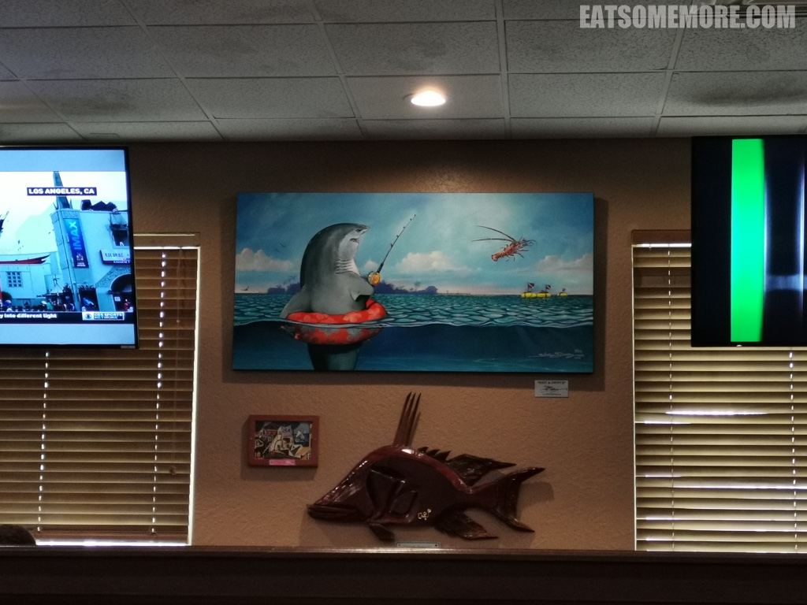

>食物的分量惊人的大。

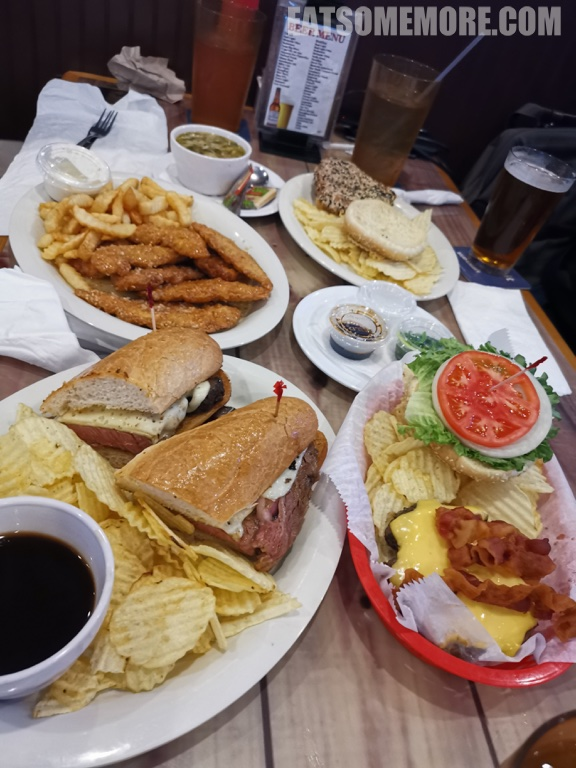

>腌菜肉片汤，看起来太像杭州的片儿川了吧！

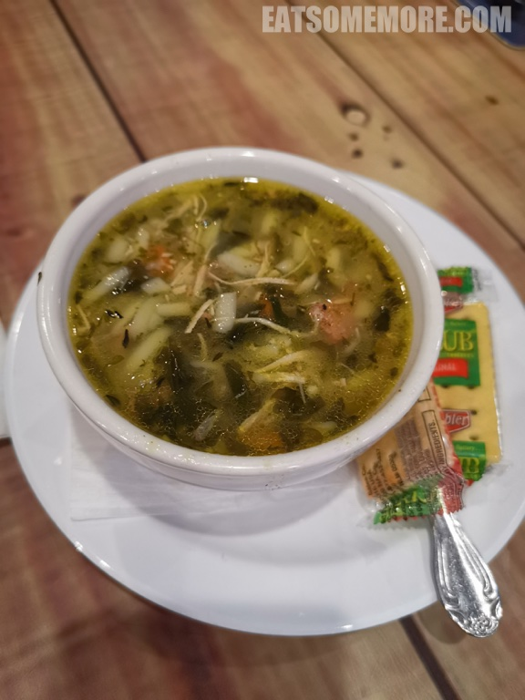

>特选肋眼牛排三明治是当之无愧的明星菜品。牛排大约煎得五成熟，瘦肉部分鲜嫩多汁，肥肉部分甘香滋润，三明治也无法掩盖它的光芒啊！

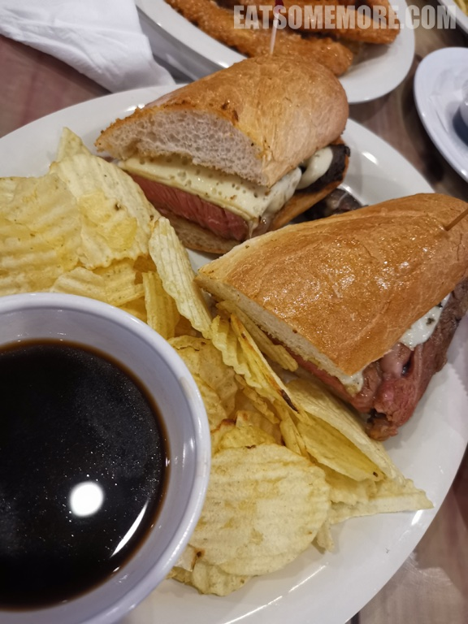

>美式培根汉堡平凡中透露着不平凡。

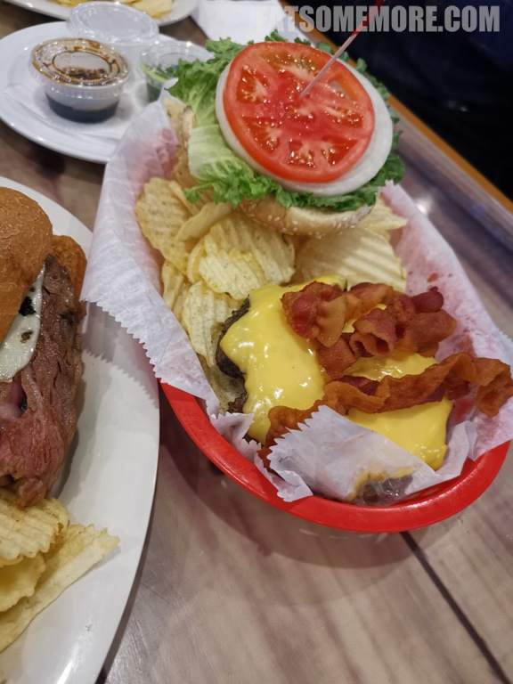

>点餐的时候不知道什么叫懒人鸡翅，吃了才发现它是鸡翅形状的炸鸡肉饼，外面裹着酸甜的酱汁。

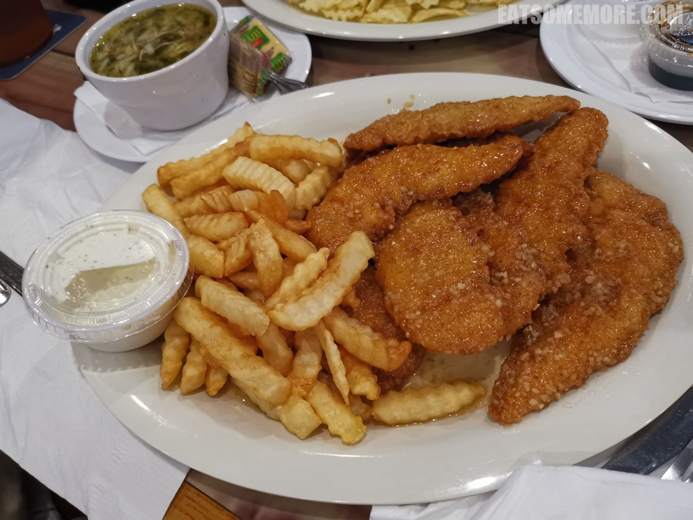

>吞拿鱼排三明治里的鱼排两面稍稍烤熟，并洒满黑白芝麻，搭配日式酱油，是鲜香霸气的海味。

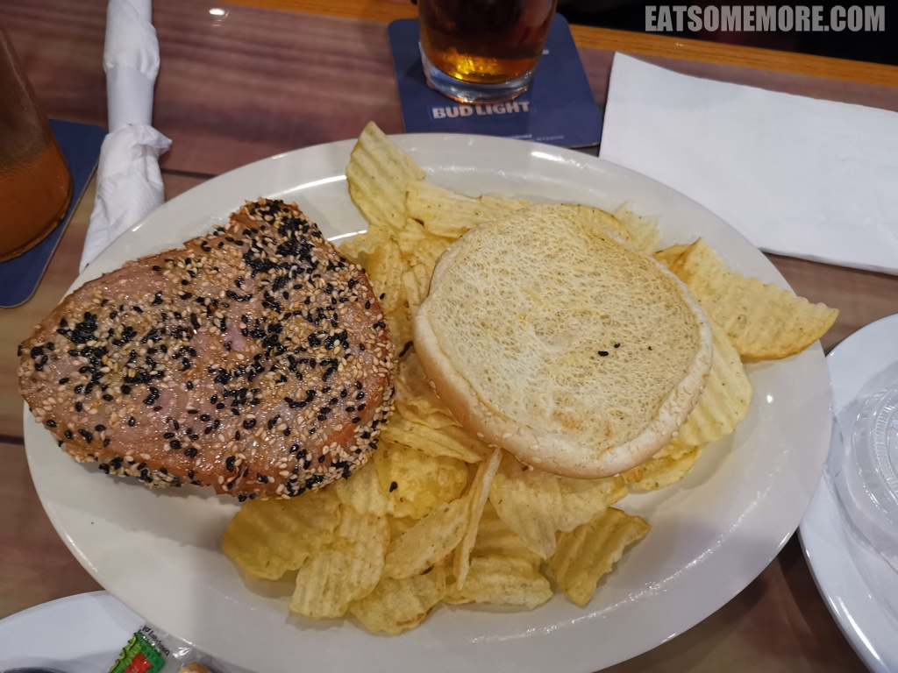

>饭后我们来到了 Loxahatchee 河入海口处的杜布瓦公园。远处红色的是朱庇特入海口灯塔。

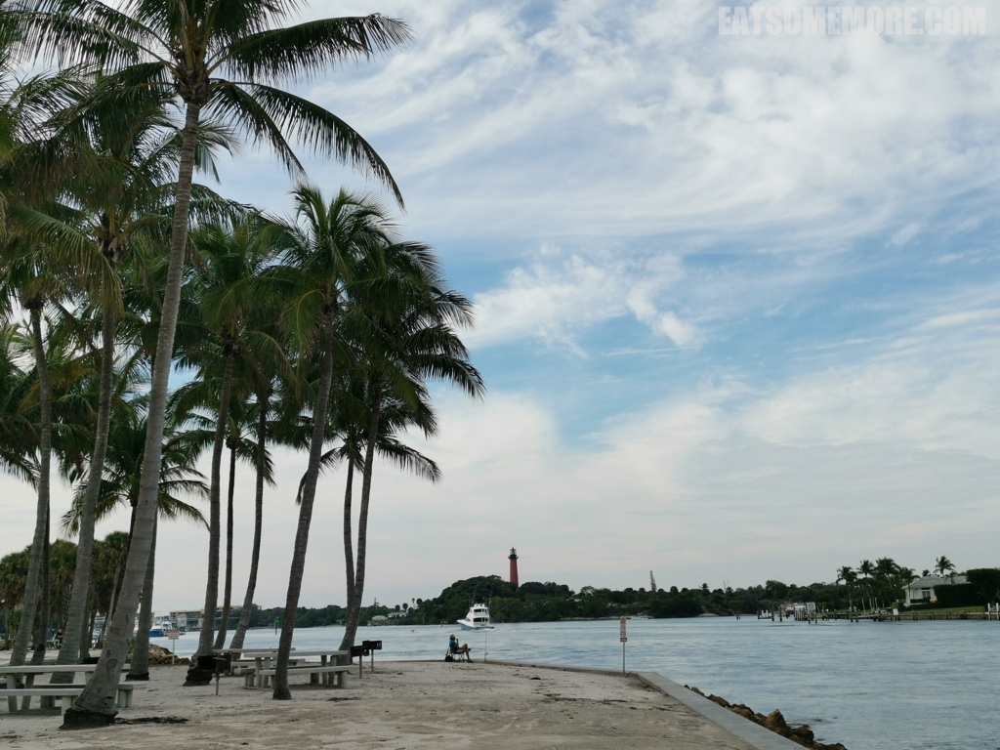

>浅滩处的海水呈冰蓝色。有人在钓鱼，有人在游泳，这样真的可以吗？

>远处的桥缓缓打开，让船只好通过。

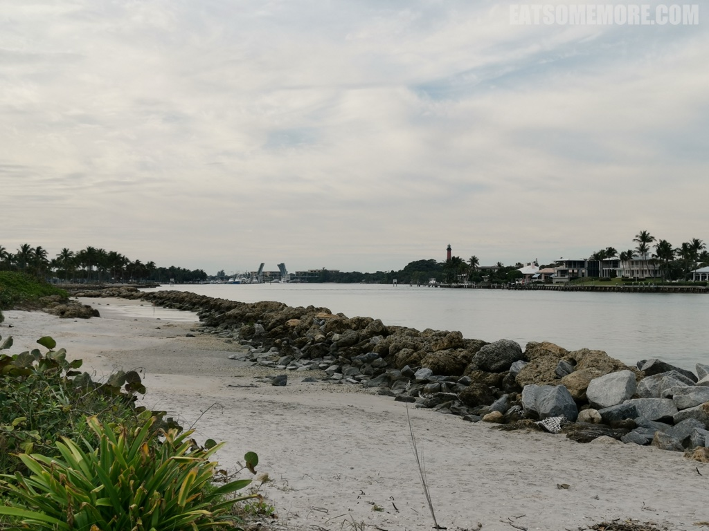

>能把鱼存在脖子里的海鸟，正虎视眈眈、蓄势待发。

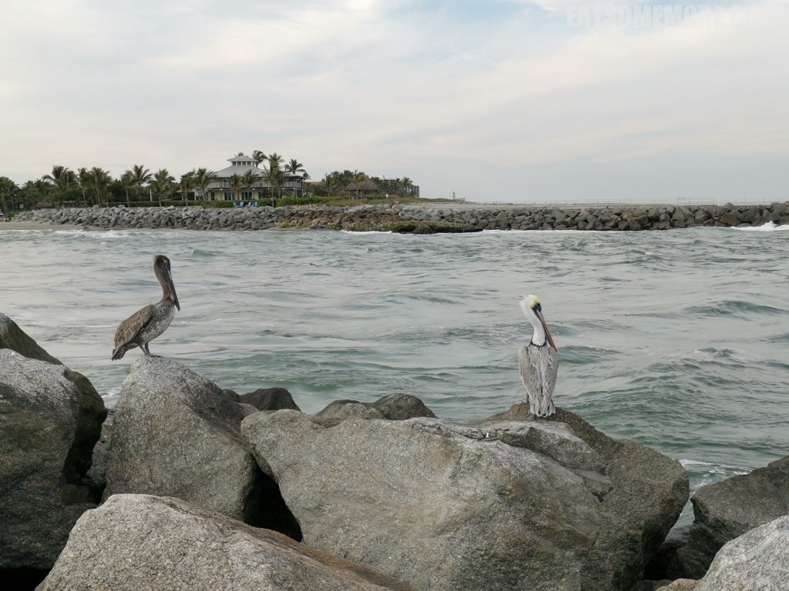

>在海边的大岩石上，还发现了一身花衣的变色龙。神奇归神奇，不知道是因为吃得太饱，还是时间不早，被时差突袭的我们只好结束了一天的游览，回去休息了。不过明天也很精彩，值得期待哦！

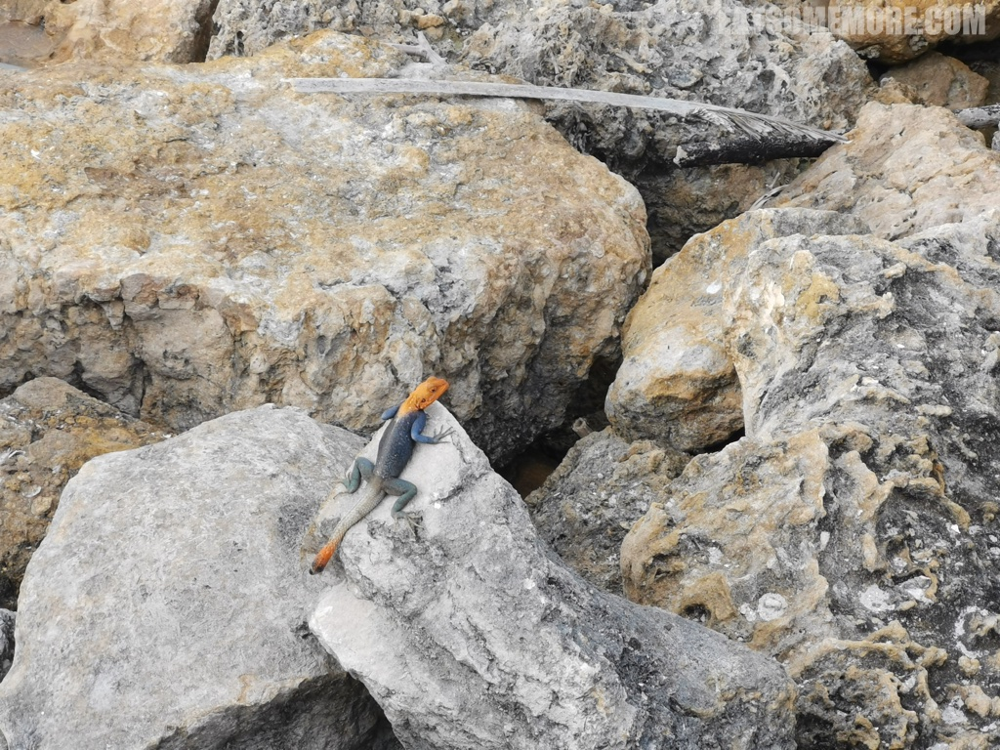
