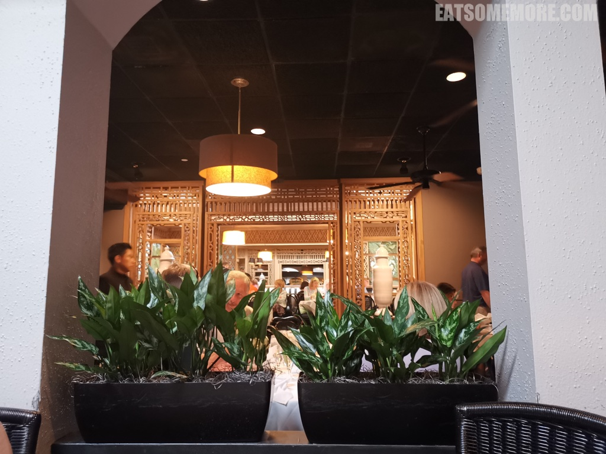
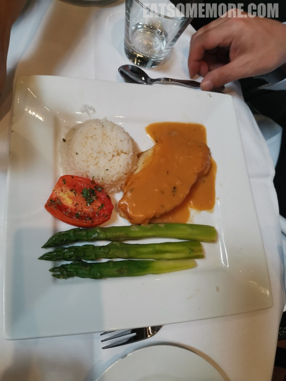
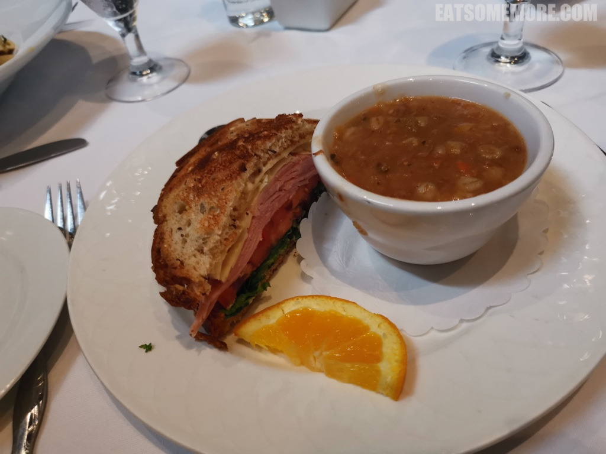
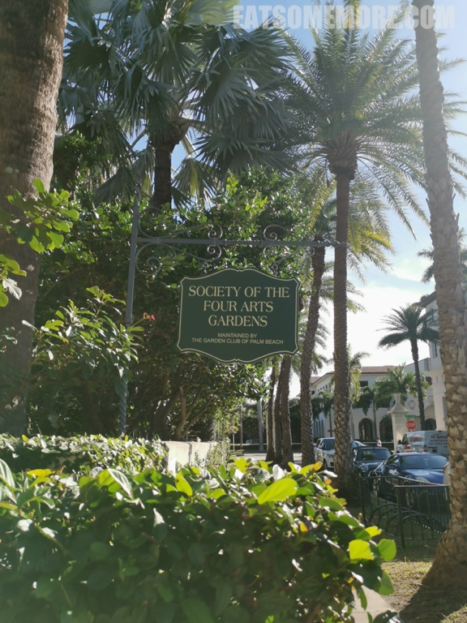
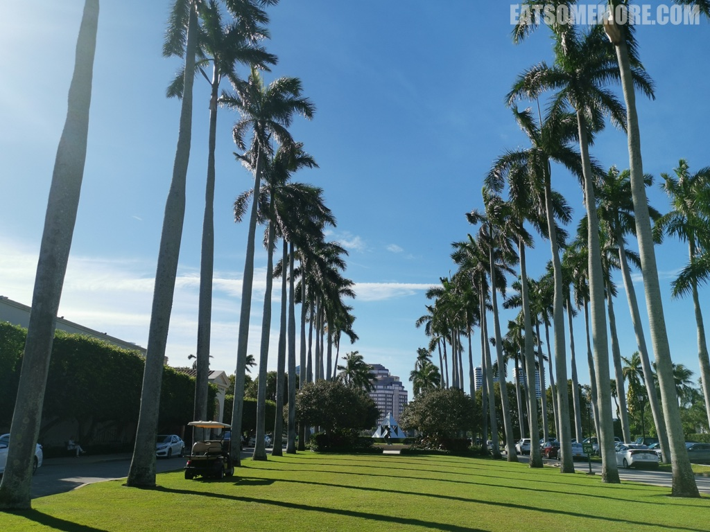
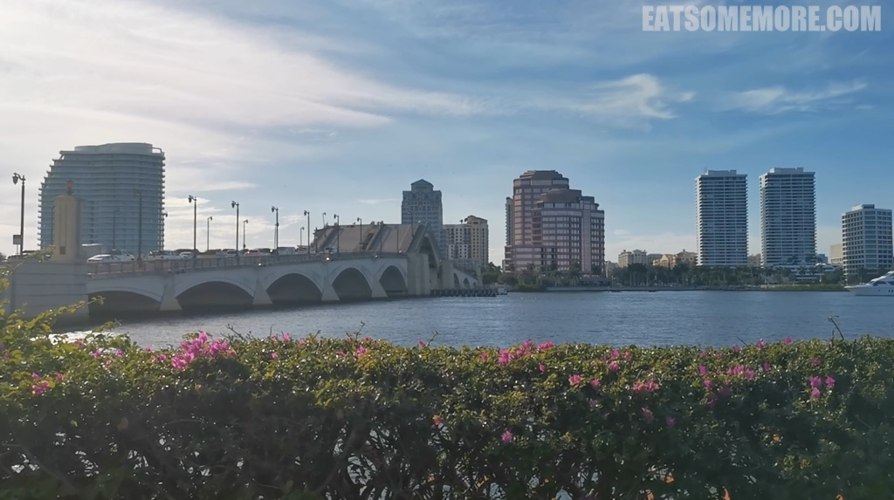
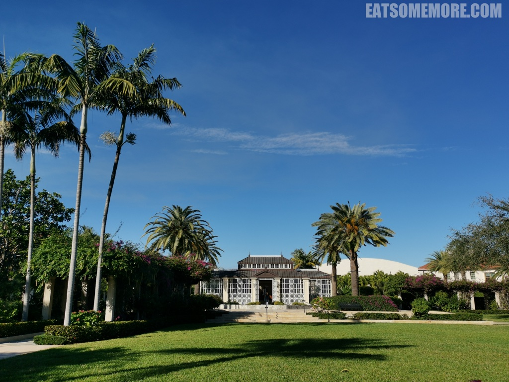
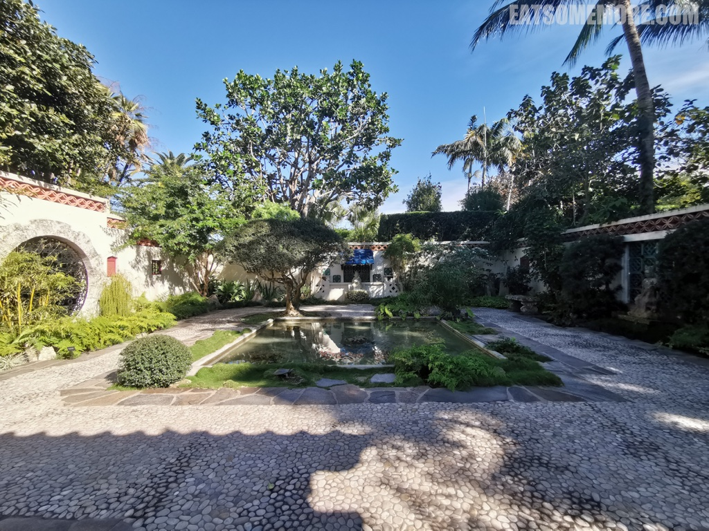
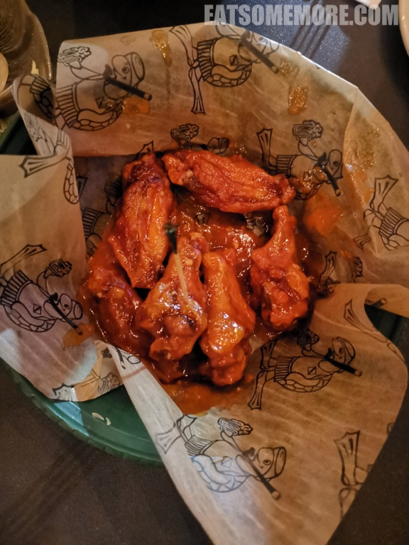
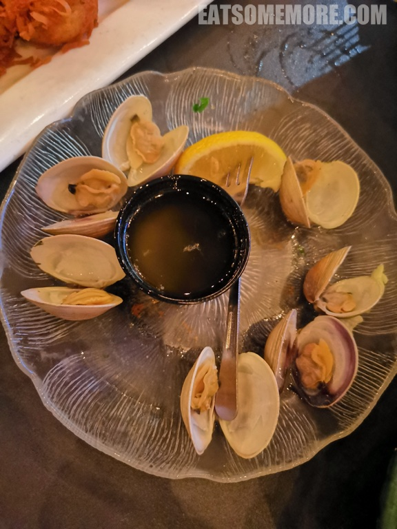

>在大自然里玩了几天后，这天我们打算去热闹一些的西棕榈滩小镇看看。

## 旅程小结


## 西棕榈滩

>西棕榈滩繁华的沃斯大道上有一间曾接待过约翰肯尼迪、温莎公爵和夫人等名人的餐厅 Ta-boo。更有传说说这间餐厅的调酒师在第二次世界大战期间，应当时红人芭芭拉伍尔沃斯赫顿的要求，创制了迷人血玛丽鸡尾酒。


>餐厅的内部装修非常漂亮。



>香煎智利海鲈鱼上盖着一层浓浓的香槟龙虾酱，搭配芦笋、番茄和茉莉香米。



>沃斯大道沙拉看似平平无奇，其实深藏不露，生菜叶和白煮蛋下埋着满满的虾仁、蟹肉和培根，以酸甜口味的法式油醋汁调味。


>烟熏培根和蘑菇恰如其分地融入在芝士奶油通心粉当中。


>牛肉大麦汤和厚度惊人的火腿芝士谷物三明治是一个组合。



>从餐厅离开步行大约十五分钟后到达四艺协会。



>猝不及防的“诗兴大发”。
```
棕榈镇上棕榈路，棕榈路边棕榈树。
棕榈树上棕榈果，棕榈树下你和我。
```



>皇家棕榈路的尽头有一座可以打开的桥。



>严谨对称的建筑和恣意张扬的棕榈树在同一片蓝天下。



>园区内还有一座有着翠瓦红门的中式花园。


>僻静的花园里有一座幽幽的迷你喷泉。



>中式建筑和热带植物的混搭毫无违和感。


>晚餐时回到了酒店附近，Thirsty Turtle Seagrill 酸甜微辣的烤鸡翅永远也不会出错。



>白煮蛤蜊甘鲜弹牙。



>椰丝炸虾配果酱，香脆鲜甜。


>糖醋大扇贝香甜鲜嫩，配菜红薯泥甘香绵密。吃美了再休息休息，只待来日继续玩。


