>旅程来到了尾声。我们也回到了迈阿密。

## 旅程小结

## 迈阿密

>碧绿透亮的海湾里面停着各色船舶，远处是迈阿密的天际线。

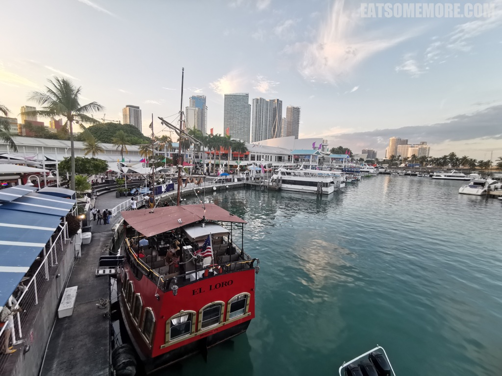

>海湾市场里有一间布巴甘虾餐厅。它是由电影《阿甘正传》制片方的股东维亚康姆建立的连锁虾食餐厅。在电影的尾声，阿甘听取了布巴的建议，在越南战争后创立了布巴甘虾业公司。这也成为了现实中餐厅的名字，好像是现实与电影的一个连结。原味鲜虾桶的虾去头开背，啤酒烹之，香蒜调味，脆嫩鲜甜。

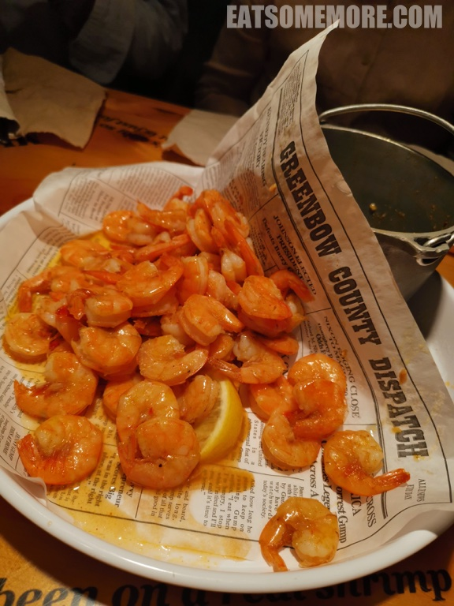

>卡津风味的虾比原味更多一些酸辣滋味。

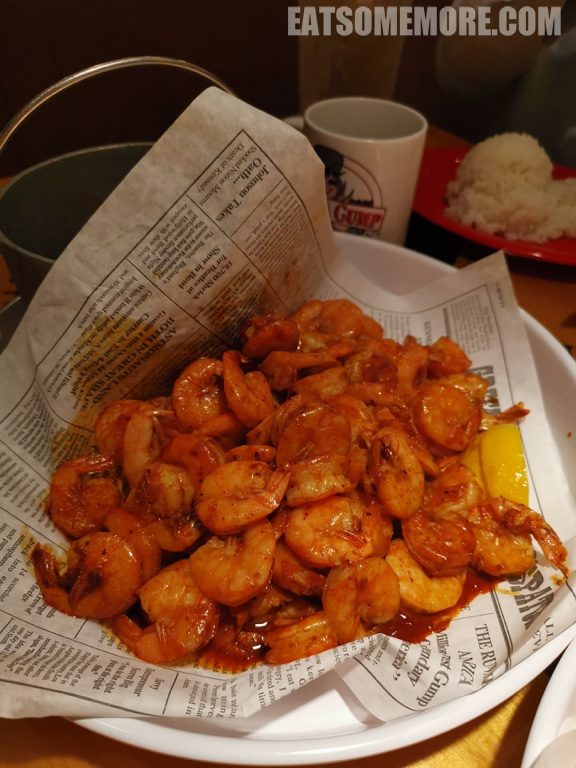

>香料大蒜蒸雪蟹腿，食材的新鲜度未能成功地表达出来。

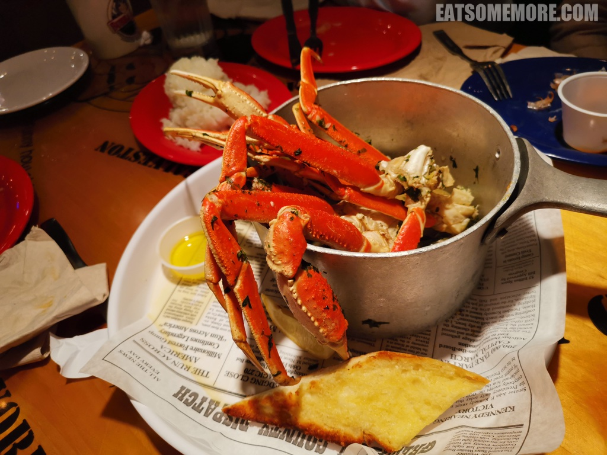

>从海湾南下来到椰林区。周遭都变得有意思起来。

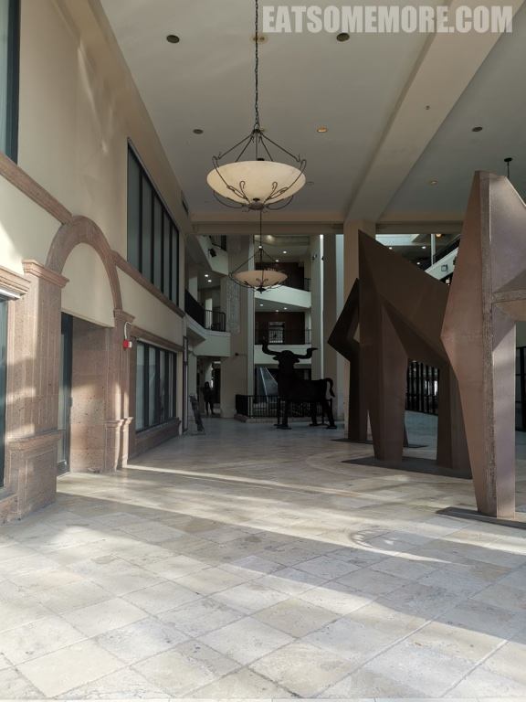

>空中有一瓣大西瓜。

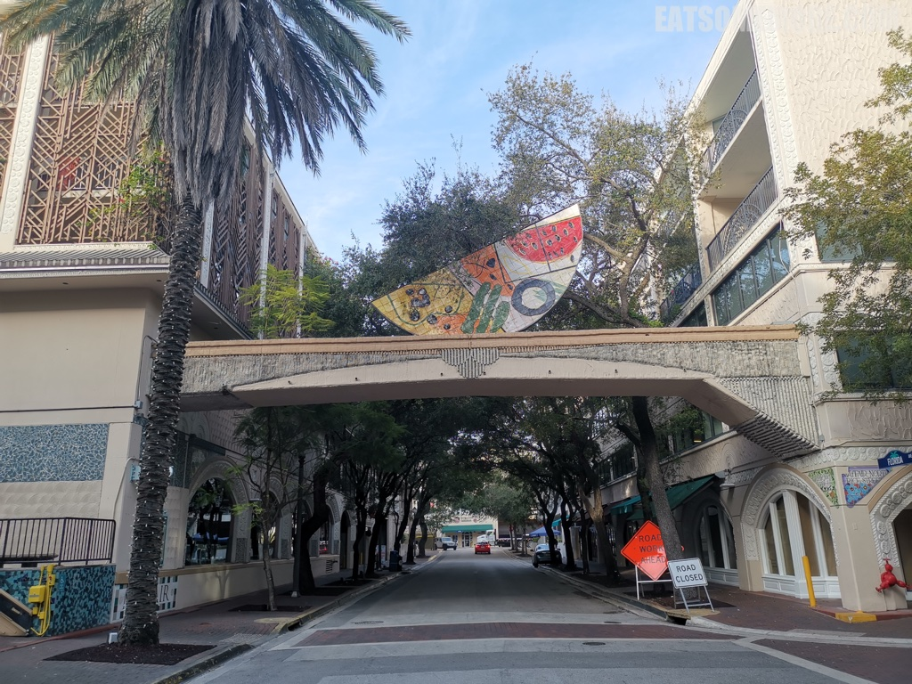

>绿化带里的塑像好像是从毕加索的画里走出来的。

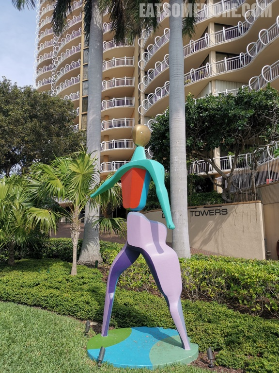

>马赛克装饰色彩缤纷，令人眼花缭乱。

>自行车停车处很有设计感。

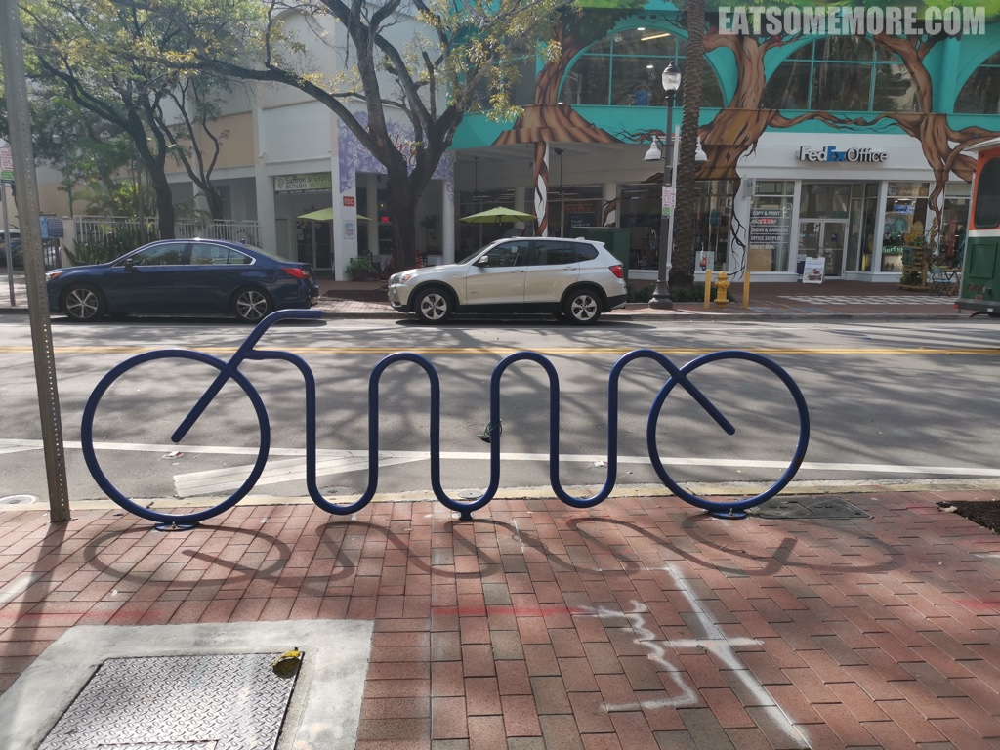

>椰村绿树靠绘画。

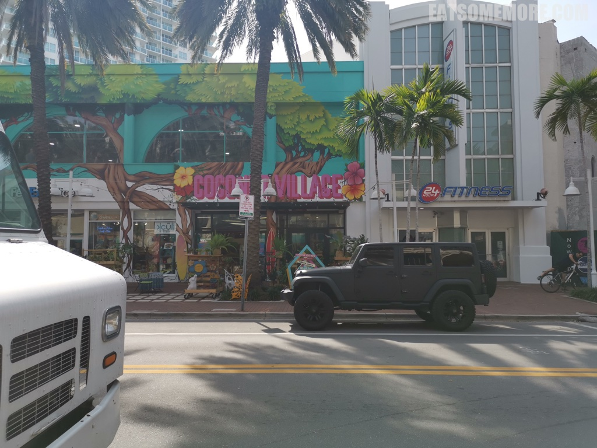

>当看到猛虎与蝴蝶的彩绘墙，我们就来到了猫途鹰 Tripadvisor 网站卓越奖四连得主猛虎拉美餐厅。

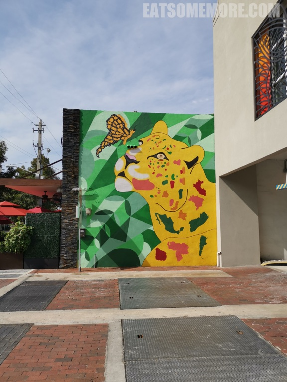

>特色果汁冰饮，消暑解渴，但说实话并不如纯果汁好喝。芭蕉片香脆微甜，而杂粮薄饼则最好搭配酱料食用。

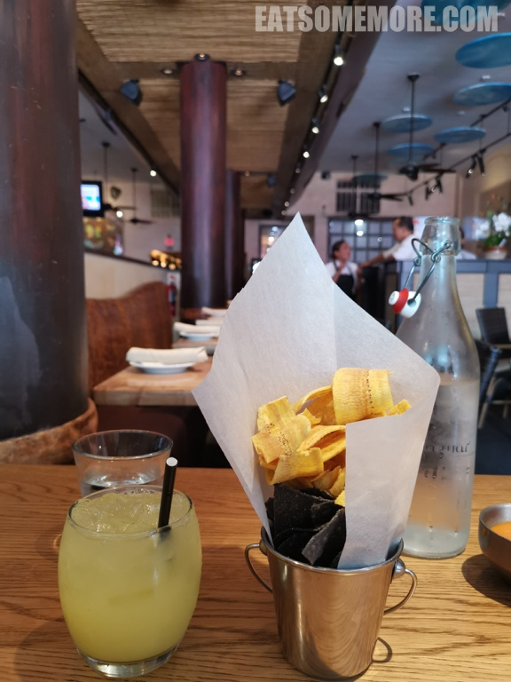

>酸甜鱼排堡的各个元素都很过硬，面包烤到有微微的焦香，鱼排有鲜有甜有汁水，豆苗和番茄带来一些清香，法式薯条细长酥脆。

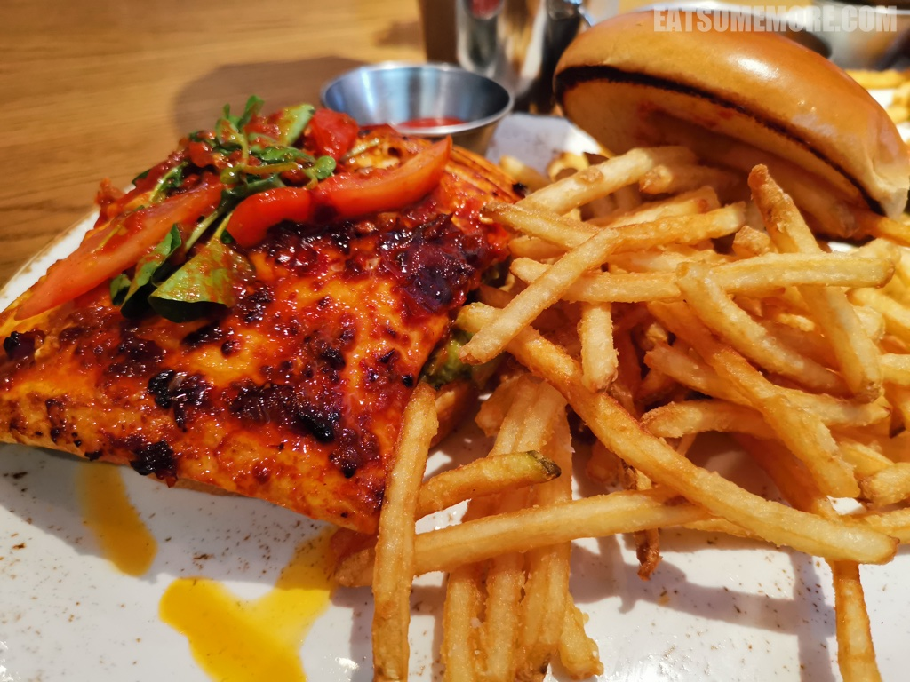

>牛肉汉堡同样优秀，牛肉饼咸鲜多汁。

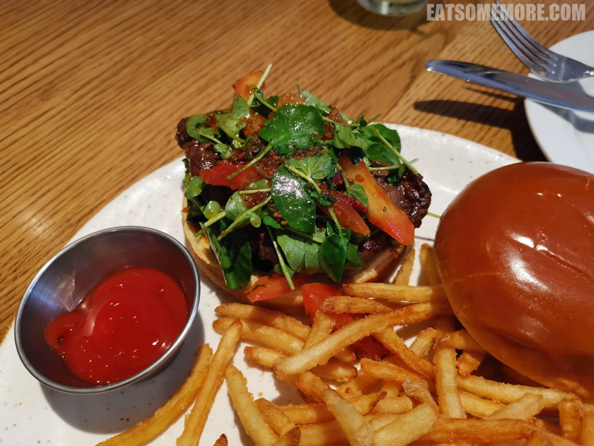

>甜点是巧克力榛果仁碎蛋糕，香甜兼有空气感。

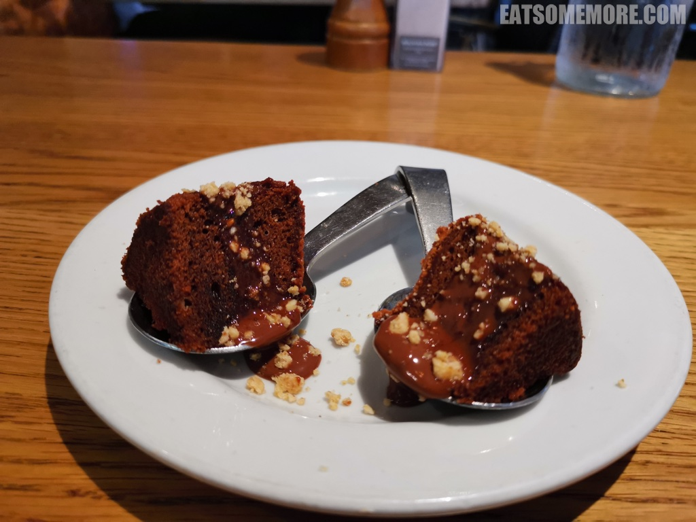

>接下来是在迈阿密最后也是最期待的行程——滑翔伞。从市政厅附近的九号码头乘游艇出发大约五分钟后，我们就坐上滑翔伞，像放风筝一样，被放上天空。比起在空中起起伏伏的刺激，我感受到的更多是舒服惬意，温暖的海风轻柔拂面，深深浅浅、清澈透明的海水尽收眼底。船员说他们摄影技术绝佳，可是专用相机坏了，一张照片都没有留下。如此，旅程中常常会有这样或者那样的遗憾，而正是这些遗憾鼓舞着我们不要停下自己的脚步。再见迈阿密，下一个旅程，不见不散！

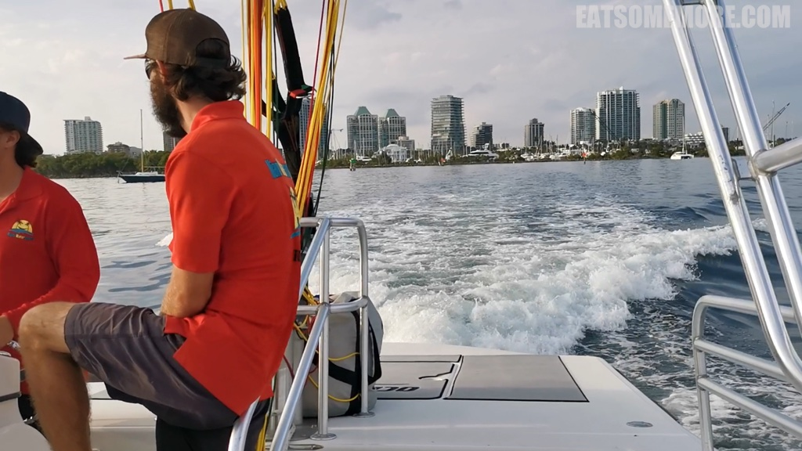

